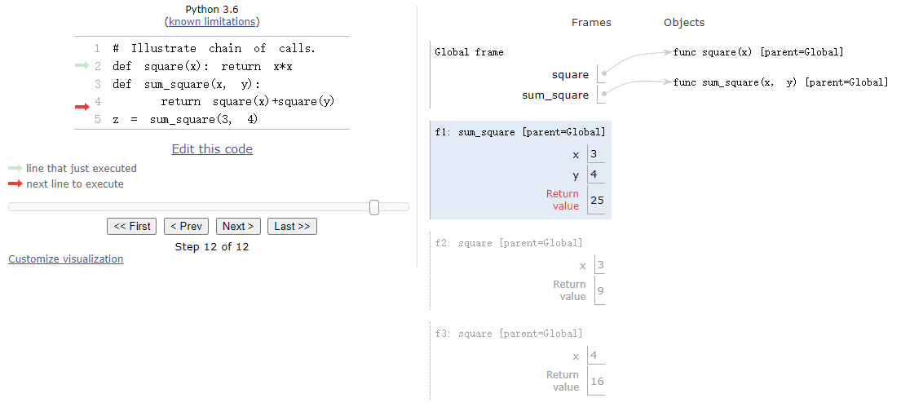

## Week2

`CS 61A 2021 Fall`官网：[CS 61A: Structure and Interpretation of Computer Programs](https://inst.eecs.berkeley.edu/~cs61a/sp21/)

`翻译视频`：[【计算机程序的构造和解释】精译【UC Berkeley 公开课-CS61A (Spring 2021)】-中英双语字幕](https://www.bilibili.com/video/BV1v64y1Q78o/?spm_id_from=444.41.top_right_bar_window_default_collection.content.click&vd_source=249a8ad55bb26717dd55ec3dd295f644)

`github`:[Maxwell2020152049/CS61A](https://github.com/Maxwell2020152049/CS61A)

### Lecture #3: Recap of Function Evaluation; Control

`Lab`：[Lab 1: Variables & Functions, Control](https://inst.eecs.berkeley.edu/~cs61a/sp21/lab/lab01/)

`Slide`：[03-Control_full.pdf](https://inst.eecs.berkeley.edu/~cs61a/sp21/assets/slides/03-Control_full.pdf)

​	一个名字(`name`)总是被绑定(`bound`)到一个值(`value`)上。

​	表达式和子表达式都会在同一个环境中求值，现在本地环境帧(`local environment frame`)中寻找，若找不到，再递归地在父环境

(`parent environment frame`)中寻找。

`eg1.`：

```python
# Create nested environment
x = 1
y = 12
def g1(x):
    def g2(x):
        # Stop here
        print(x)
    g2(x + 1)
g1(2)
```

输出：

```shell
3
```

在[pythontutor](https://pythontutor.com/cp/composingprograms.html#code=%23%20Create%20nested%20environment%0Ax%20%3D%201%0Ay%20%3D%2012%0Adef%20g1%28x%29%3A%0A%20%20%20%20def%20g2%28x%29%3A%0A%20%20%20%20%20%20%20%20%23%20Stop%20here%0A%20%20%20%20%20%20%20%20print%28x%29%0A%20%20%20%20g2%28x%20%2B%201%29%0Ag1%282%29&cumulative=true&curInstr=0&mode=display&origin=composingprograms.js&py=3&rawInputLstJSON=%5B%5D)中运行结果如下：

<div align="center">
    
</div>
`eg2.`：

```python
# Illustrate chain of calls.
def square(x): return x*x 
def sum_square(x, y):
    return square(x)+square(y) 
z = sum_square(3, 4)
```

在[pythontutor](https://pythontutor.com/cp/composingprograms.html#code=%23%20Illustrate%20chain%20of%20calls.%0Adef%20square%28x%29%3A%20return%20x*x%20%0Adef%20sum_square%28x,%20y%29%3A%0A%20%20%20%20return%20square%28x%29%2Bsquare%28y%29%20%0Az%20%3D%20sum_square%283,%204%29&cumulative=true&curInstr=0&mode=display&origin=composingprograms.js&py=3&rawInputLstJSON=%5B%5D)中运行结果如下：

<div align="center">
    
</div>
`eg3.`：

```python
# Functions taking and returning functions
def id(x):
    return x
print(id(id)(id(13)))
```

输出：

```shell
13
```

在[pythontutor](https://pythontutor.com/cp/composingprograms.html#code=%23%20Create%20nested%20environment%0Ax%20%3D%201%0Ay%20%3D%2012%0Adef%20g1%28x%29%3A%0A%20%20%20%20def%20g2%28x%29%3A%0A%20%20%20%20%20%20%20%20%23%20Stop%20here%0A%20%20%20%20%20%20%20%20print%28x%29%0A%20%20%20%20g2%28x%20%2B%201%29%0Ag1%282%29&cumulative=true&curInstr=0&mode=display&origin=composingprograms.js&py=3&rawInputLstJSON=%5B%5D)中运行结果如下：

<div align="center">
    
</div>
`eg4.`：

```python
# Illustration of returing a nested function.
def incr(n):
    def f(x):
        return n + x
    return f

incr(5)(6)
```

在[pythontutor](https://pythontutor.com/cp/composingprograms.html#code=%23%20Create%20nested%20environment%0Ax%20%3D%201%0Ay%20%3D%2012%0Adef%20g1%28x%29%3A%0A%20%20%20%20def%20g2%28x%29%3A%0A%20%20%20%20%20%20%20%20%23%20Stop%20here%0A%20%20%20%20%20%20%20%20print%28x%29%0A%20%20%20%20g2%28x%20%2B%201%29%0Ag1%282%29&cumulative=true&curInstr=0&mode=display&origin=composingprograms.js&py=3&rawInputLstJSON=%5B%5D)中运行结果如下：

<div align="center">
    
</div>

#### 条件表达式（`conditional expressions`）

`True Part` if `Condition` else `False Part`

对于上面的python语句，先计算 `Condition` ，若结果为`True value`，就执行`True Part` ，否则，执行`False Part` 。

`Example`：

```python
x = 2
y = 1 / x if x != 0 else 1
print(y)
```

`输出`：

```shell
0.5
```

`Example`：

```python
x = 0
y = 1 / x if x != 0 else 1
print(y)
```

`输出`：

```shell
1
```

`Example`：

```python
y = 13 if 0 else 5 == 13 if [] else 5 == 5
print(y)
```

`输出`：

```shell
True
```

如果有多个`if-else`语句在同一行中，从左到右计算。

在`python`中，以下值都是`False value`：

- False
- None
- 0
- Empty strings, sets, lists, tuples, and directories

其他的值都是`True value`。

#### 短路求值（`short circuit evaluation`）

`Left` and `Right`

如果`Left`是`True value`，返回`Right`的结果，如果`Left`是`False value`，返回`Left`的结果。

`Left` or `Right`

如果`Left`是`True value`，返回`Left`的结果，如果`Left`是`False value`，返回`Right`的结果。

#### 条件语句（`conditional statements`）

```python
if Condition1:
	Statements1
elif Condition2:
	Statements2
...
else:
	Statementsn
```

如果`Condition1`为`真`，就执行`Statement1`；

如果`Condition2`为`真`，就执行`Statement2`；

······

如果所有条件都为`假`，就执行`Statementn`；

在`python`中，使用`缩进`来控制语句块。

#### 循环语句（`loop statements`）

```python
while Condition:
	Statements
```

如果`Condition`为`真`，就执行`Statement`，如果`Condition`为`假`，结束循环；


### Lecture #4: Higher-Order Functions

`Disc`：[Discussion 1: Environment Diagrams, Control](https://inst.eecs.berkeley.edu/~cs61a/sp21/disc/disc01/)

`Project`： [Project 1: The Game of Hog](https://inst.eecs.berkeley.edu/~cs61a/sp21/proj/hog/)

`Slide`： [04-Higher-Order_Functions_full.pdf](https://inst.eecs.berkeley.edu/~cs61a/sp21/assets/slides/04-Higher-Order_Functions_full.pdf)

#### 课堂练习

上节课没讲完的程序，使用`python3 -m doctest {filename}`可以运行程序注释中的测试样例，以检测程序的正确性：

```python
#  Prime numbers

def is_prime(n):
    """Return True iff N is prime.
    >>> is_prime(1)
    False
    >>> is_prime(2)
    True
    >>> is_prime(8)
    False
    >>> is_prime(21)
    False
    >>> is_prime(23)
    True
    """
    

def smallest_factor(n):
    """Returns the smallest value k>1 that evenly divides N."""
    # The following can be speeded up a great deal!
    

def print_factors(n):
    """Print the prime factors of N.
    >>> print_factors(180)
    2
    2
    3
    3
    5
    """
    
    
```

我的实现：

```python
#  Prime numbers

def is_prime(n):
    """Return True iff N is prime.
    >>> is_prime(1)
    False
    >>> is_prime(2)
    True
    >>> is_prime(8)
    False
    >>> is_prime(21)
    False
    >>> is_prime(23)
    True
    """
    if (n == 1):    return False

    i = 2
    while i < n:
        if n % i == 0:
            return False
        i += 1
    
    return True

def smallest_factor(n):
    """Returns the smallest value k>1 that evenly divides N."""
    i = 2
    while i <= n:
        if n % i == 0:
            return i
        i += 1


def print_factors(n):
    """Print the prime factors of N.
    >>> print_factors(180)
    2
    2
    3
    3
    5
    """
    while n != 1:
        i = 2
        while i <= n:
            if n % i == 0:
                print(i)
                n //= i
                break
            i += 1
```

本课程给出的参考答案很巧妙，`is_prime`和`print_factors`的实现都使用了`smallest_factor`：

```python
#  Prime numbers

def is_prime(n):
    """Return True iff N is prime.
    >>> is_prime(1)
    False
    >>> is_prime(2)
    True
    >>> is_prime(8)
    False
    >>> is_prime(21)
    False
    >>> is_prime(23)
    True
    """
    return n > 1 and smallest_factor(n) == n

def smallest_factor(n):
    """Returns the smallest value k>1 that evenly divides N."""
    # The following can be speeded up a great deal!
    k = 2
    while k <= n:
        if n % k == 0:
            return k
        k += 1

def print_factors(n):
    """Print the prime factors of N.
    >>> print_factors(180)
    2
    2
    3
    3
    5
    """
    k = 2
    while n > 1:
        d = smallest_factor(n)
        print(d)
        n = n // d     # or n //= d
```

#### 重构函数引发的思考

实现一个函数，判断参数`a`和`b`是否有相同位数：

```python
# Designing Functions

def same_length(a, b):
    """Return true iff positive integers A and B have the same
    number of digits when written in decimal.

    >>> same_length(50, 70)
    True
    >>> same_length(50, 100)
    False
    >>> same_length(1000, 100000)
    False
    """
    a_count = 1
    while a >= 10:
        a_count += 1
        a //= 10

    # The next section looks the same as the first. Yuch!
    b_count = 1
    while b >= 10:
        b_count += 1
        b //= 10
    
    return a_count == b_count
```

将重复的代码段用函数实现：

```python
# So, we refactor into two functions
def same_length2(a, b):
    """Return true iff positive integers A and B have the same
    number of digits when written in decimal.

    >>> same_length2(50, 70)
    True
    >>> same_length2(50, 100)
    False
    >>> same_length2(1000, 100000)
    False
    """
    return digits2(a) == digits2(b)

def digits2(x):
    """Return the number of decimal digits in the positive integer X."""
    x_count = 1
    while x >= 10:
        x_count += 1
        x //= 10
    return x_count

# Now let's generalize even further!
```

进一步重构函数，使其适用性更强：

```python
# Now let's generalize even further!

def same_length3(a, b, base=10):
    """Return true iff positive integers A and B have the same
    number of digits when written in radix BASE.

    >>> same_length3(50, 70)
    True
    >>> same_length3(20, 100)
    False
    >>> same_length3(50, 100)
    False
    >>> same_length3(1000, 100000)
    False
    >>> same_length3(50, 100, 16)
    True
    """
    return digits3(a, base) == digits3(b, base)

def digits3(x, base=10):
    """Return the number of radix BASE digits in the positive integer X."""
    x_count = 1
    while x >= base:
        x_count += 1
        x //= base
    return x_count
```

#### 函数注释（`comments on functions in general terminology` ）

`domain`：定义域，函数合法的参数的集合

`range`：值域，函数合法的返回值的集合

`codomain`：上域，函数合法的返回值的超集

在`python`中，可以使用`""" """`在函数开头编写注释文档，作用如下：

- 文档注释可以提供足够的信息给程序员，使其不需要阅读函数体，就能明白如何使用该函数；
- 文档注释明确什么输入是合法的，以及什么情况下程序员可以使用该函数，这叫做`前置条件`；
- 文档注释明确函数接收合法输入时的输出和副作用，这叫做`后置条件`；
- 总之，这就是函数的`行为`和`语义`。

原文在本课的`ppt`的第4页：

> - Ideally, a `documentation comment` for a function provides enough information so that a programmer can use the function properly and understand what it does `without` having to read its body. 
> - It should make clear what inputs are valid or under what conditions the function may be called. This is the `precondition`. 
> - Likewise, it should make clear what the resulting output or effect of the function will be for correct inputs. This is the `postcondition`. 
> - Together, these are the `behavior` or `semantics` (meaning) of the function.

#### 设计函数的两条原则（`Two Design Principles`）

设计函数应当遵循以下原则：

- 函数是良定义（`well-defined`）的，即函数应该简洁清晰；
- 不要重复，但程序出现很多重复的语句块时，就要进行重构（`refactor`）；
- 编写可用性更强的函数。

原文在本课的`ppt`的第5页：

> - Functions should do one well-defined thing (a complicated documentation comment might suggest your function does too much).
> - `DRY` (Don’t Repeat Yourself). 
>   - Multiple segments of code that look really similar to each other cry out for `refactoring`. . . 
>   - That is, for replacing the segments with simple calls to a single general function that states their shared structure just once, with parameters used to specialize to the various cases.

### Lecture #5: Exercising Environments

`Exam Prep`：[Exam Prep 1: Control, Higher-Order Functions](https://inst.eecs.berkeley.edu/~cs61a/sp21/examprep/examprep01/)

`Lost`：[Lost 01: Control, Environment Diagrams](https://inst.eecs.berkeley.edu/~cs61a/sp21/lost/lost01.pdf)

`Homework`： [Homework 2: Higher Order Functions](https://inst.eecs.berkeley.edu/~cs61a/sp21/hw/hw02/)

`Slide`： [05-Environments_full.pdf](https://inst.eecs.berkeley.edu/~cs61a/sp21/assets/slides/05-Environments_full.pdf)

这节课主要讲了很多关于环境(`environment`)的习题，具体请看本节课的`slide`。