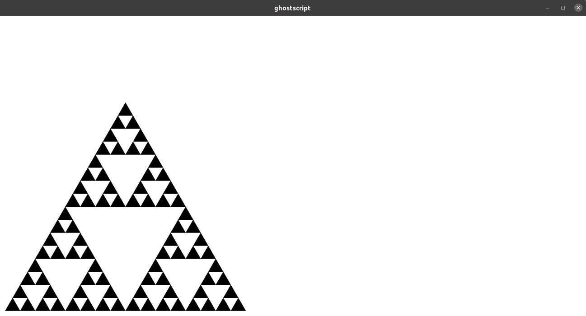

## Week3

`CS 61A 2021 Fall`官网：[CS 61A: Structure and Interpretation of Computer Programs](https://inst.eecs.berkeley.edu/~cs61a/sp21/)

`翻译视频`：[【计算机程序的构造和解释】精译【UC Berkeley 公开课-CS61A (Spring 2021)】-中英双语字幕](https://www.bilibili.com/video/BV1v64y1Q78o/?spm_id_from=444.41.top_right_bar_window_default_collection.content.click&vd_source=249a8ad55bb26717dd55ec3dd295f644)

`github`:[Maxwell2020152049/CS61A](https://github.com/Maxwell2020152049/CS61A)

### Lecture #6: Recursion

`Lab`：[Lab 2: Higher-Order Functions, Lambda Expressions](https://inst.eecs.berkeley.edu/~cs61a/sp21/lab/lab02/)

`Slide`：[06-Recursion_full.pdf](https://inst.eecs.berkeley.edu/~cs61a/sp21/assets/slides/06-Recursion_full.pdf)

#### 一个有意思的高阶函数：

```python
def print_sums(n):
    print(n)
    def next_sum(k):
        return print_sums(n+k)
    return next_sum

print_sums(1)(3)(5)
```

输出：

```shell
1
4
9
```

#### Currying

一种将多参数函数转化为一系列单参数函数的方法，也称部分实例化（`partial instantiation`）。

`eg.`：

```python
from operator import add
def curry2(f):
    return lambda x: \
    lambda y: \
    f(x, y)

print(curry2(add)(30)(12))
print(curry2(add)(30))
```

输出：

```shell
42
<function curry2.<locals>.<lambda>.<locals>.<lambda> at 0x7fa093dc1620>
```

#### 函数哲学（`Philosophy of Functions`）

- 语法规范说明了函数调用的语法（函数参数）
- 语义规范说明了如果工作：
  - 前置条件说明了对调用者的要求
  - 后置条件说明了来自函数实现者的承诺

> - Specifies a `contract` between caller and function implementer. 
> - `Syntactic specification` gives syntax for calling (number of arguments). 
> - `Semantic specification` tells what it does: 
>   - Preconditions are requirements on the caller. 
>   - Postconditions are promises from the function's implementer.

#### 函数抽象

`用户`和`函数实现者`之间有不同的关注点：

- 用户只提供函数参数并使用函数的返回值作为结果，不关心计算过程
- 函数实现者只考虑如果计算，不关心函数参数的来源和返回值如何被使用
- 对于用户来说，`sqrt`函数（平方根函数）就是一种抽象
- 综上，我们称其为`函数抽象`

> - Ideally, the specification (syntactic and semantic) should suffice to use the function (i.e., without seeing its body). 
> - There is a `separation of concerns` here: 
>   - The caller (client) is concerned with providing values of x and using the results, but `not` how the result is computed. 
>   - The implementer is concerned with how the result is computed, but `not` where x comes from or how the value is used. 
>   - From the client’s point of view, sqrt is an `abstraction` from the set of possible ways to compute this result. 
>   - Therefore, we call this `functional abstraction`. 
> - Programming is largely about choosing abstractions that lead to clear, fast, and maintainable programs.

#### 简单线性递归（`Simple Linear Recursions`）

用`递归`实现一个求`1`到`N`的平方和的函数`sum_squares`：

```python
# Simple linear recursions.
def sum_squares1(N):
    """Return The sum of K**2 for K from 1 to N (inclusive).
    >>> sum_squares1(-1)
    0
    >>> sum_squares1(0)
    0
    >>> sum_squares1(1)
    1
    >>> sum_squares1(4)
    30
    """

    if N < 1:
        return 0
    else:
        return sum_squares1(N - 1) + N**2
```

#### 尾递归（`Tail Recursion`）

`尾递归`：递归函数的调用是该递归函数最后计算的部分，或者是返回值。

> The right version is a `tail-recursive` function, meaning that the recursive call is either the returned value or the very last action performed.

上述函数可以用`尾递归`的方式实现：

```python
# Tail-recursive sum_squares
def sum_squares2(N):
    """Return the sum of K**2 for 1 <= K <= N.
    >>> sum_squares2(-1)
    0
    >>> sum_squares2(0)
    0
    >>> sum_squares2(1)
    1
    >>> sum_squares2(4)
    30
    """

    def part_sum(accum, k):
        """Return the sum of ACCUM + K**2 + (K+1)**2 + ... + N**2."""
        if k > N:
            return accum
        else:
            return part_sum(accum + k**2, k + 1)
    return part_sum(0, 1)
```

也可以用`迭代`方式实现：

```python
# Iterattive version
def sum_squares3(N):
    """Return the sum of K**2 for 1 <= K <= N.
    >>> sum_squares3(-1)
    0
    >>> sum_squares3(0)
    0
    >>> sum_squares3(1)
    1
    >>> sum_squares3(4)
    30
    """

    accum = 0
    k = 1
    while k <= N:
        accum = accum + k**2
        k = k + 1
    return accum
```

#### 递归的思想（`Recursive Thinking`）

简单来说，递归的正确性的数学证明很像`数学归纳法`，详见本节课的`Slide`的`P11~P14`，写的很详细：

概括如下：

- 起始步骤
- 递推步骤

- 递归要使得问题越变越小，有一个能够终止的终点

#### 基于树递归的`Sierpinski's Triangle`

`Sierpinski's Triangle`是一种典型的基于递归实现的图形结构。

修改了课程给的示例代码，在`Linux`上可以跑起来了（`Windows`上跑不起来，可能是缺少对应的库），把`make_displayer`函数中的`-g1300x1000`修改为`-g1300x8000`：

```python
import sys
from math import sqrt
from subprocess import Popen, DEVNULL, PIPE

sin60 = sqrt(3) / 2

# To use interactively:  Download 06.py from the cs61a.org website.
# Install gs (ghostscript) and put it in your path.  Then, run the command
#     python3 -i 06.py
# (or equivalent) on your local machine, at which point you can run
# >>> d = make_displayer()
# >>> draw_gasket(3, d.stdin)
# >>> draw_gasket(6, d.stdin)
# ...
# >>> stop_displayer(d)   # To clean up.

def make_gasket(n, x, y, s, output):
    """Write Postscript commands to OUTPUT that draw an Nth-order
    Sierpinski's gasket, with lower-left corner at (X,Y), and
    size S X S (units of points: 1/72 in)."""
    if n == 0:
        draw_solid_triangle(x, y, s, output)
    else:
        make_gasket(n - 1, x, y, s/2, output)
        make_gasket(n - 1, x + s/2, y, s/2, output)
        make_gasket(n - 1, x + s/4, y + sin60*s/2, s/2, output)

def draw_solid_triangle(x, y, s, output):
    """Draw a solid triangle lower-left corner at (X, Y)
    and side S on OUTPUT."""
    print(f"{x:.2f} {y:.2f} moveto "
          f"{s:.2f} 0 rlineto "
          f"-{s/2:.2f} {s*sin60:.2f} rlineto "
          "closepath fill", file=output)

def draw_gasket(n, output=sys.stdout, x=10, y=10, s=400):
    """Create a complete Postscript file for the gasket created by
    make_gasket(N, X, Y, S, OUTPUT)."""
    print("%!", file=output)
    make_gasket(n, x, y, s, output=output)
    print("showpage", file=output)
    output.flush()
    
def make_displayer():
    """Create a Ghostscript process that displays its input (sent in through
    .stdin)."""
    # Adjust the -gWIDTHxHEIGHT option to change drawing area.  Units are
    # pixels.
    return Popen(["gs", "-g1300x8000"],
                  universal_newlines=True, stdin=PIPE, stdout=DEVNULL)

def stop_displayer(d):
    """Terminate execution of displayer D (created by make_displayer)."""
    d.stdin.close()
    d.wait()

```

在终端中输入以下命令：

```shell
$ python3 -i 06.py 
>>> d = make_displayer()
>>> draw_gasket(4, d.stdin)
```

效果如下：



### Lecture #7: Tree Recursion

`Slide`：[07-Tree_Recursion_full.pdf](https://inst.eecs.berkeley.edu/~cs61a/sp21/assets/slides/07-Tree_Recursion_full.pdf)

#### 树递归（`Tree Recursion`）

上节课用到的`make_gasket`函数就是用树递归实现的。

> - The `make gasket` function is an example of a tree recursion, where each call makes multiple recursive calls on itself. 
> - A `linear recursion` makes at most one recursive call per call. 
> - A `tail recursion` has at most one recursive call per call, and it is the last thing evaluated.

一个`尾递归`的例子，`find_zero(lowest, highest, func)`函数返回`func`函数的`[lowest, highest]`区间上的零点的横坐标：

```python
def find zero(lowest, highest, func):
"""Return a value v such that LOWEST <= v <= HIGHEST and
FUNC(v) == 0, or None if there is no such value.
Assumes that FUNC is a non-decreasing function from integers
to integers (that is, if a < b, then FUNC(a) <= FUNC(b)."""
    if lowest > highest: 		# Base Case
        return None
    elif func(lowest) == 0: 	# Base Case
        return lowest
    else: 								# Inductive (Recursive) Case
    	return find zero(lowest + 1, highest, func)
```

等价的迭代版本：

```python
# Equivalent iterative solution
while lowest <= highest:
	if func(lowest) == 0:
		return lowest
	lowest += 1
# If we get here, returns None
```

使用`二分`思想查找零点：

```python
def find_zero(lowest, highest, func):
    """Return a value v such that LOWEST <= v <= HIGHEST and 
    FUNC(v) == 0, or None if there is no such value.
    Assumes that FUNC is a non-descending function from integers
    to integers (that is, if a < b, then FUNC(a) <= FUNC(b).
    >>> find_zero(0, 10, lambda x: x - 4)
    4
    >>> find_zero(0, 100, lambda x: x**2 - 36)
    6
    >>> find_zero(0, 100, lambda x: x**2 - 37)
    """

    if lowest > highest:
         return None
    middle = (lowest + highest) // 2
    if func(middle) == 0:
        return middle
    elif func(middle) < 0:
        return find_zero(middle + 1, highest, func)
    else: 
        return find_zero(lowest, middle -1, func)
```

等价的迭代版本：

```python
# Equivalent iterative solution
while lowest <= highest:
	middle = (lowest + highest) // 2
    if func(middle) == 0:
   		return middle
    elif func(middle) < 0:
    	lowest = middle + 1
    else:
    	highest = middle - 1
```

不使用`if`语句，只是用`and/or`逻辑运算符也能够实现一样的功能，详见本节课的`Slide`的`P16~P23`

#### 寻路问题（`Finding a Path`）

树递归的另一个例子，在迷宫中自上向下寻路，搜索是否存在路径或者存在多少条路径：

```python
# Maze configuration from lecture
# 第一个迷宫，用于测试 is_path 函数
BLOCKS1 = { (0, 0), (0, 3), (0, 4), (0, 5), (0, 6), (1, 0), (1, 2), (1, 3),
            (1, 4), (1, 5), (2, 0), (2, 1), (2, 3), (2, 4), (2, 6), (3, 0),
            (3, 1), (3, 3), (3, 5), (3, 6), (4, 0), (4, 1), (4, 2), (4, 3),
            (4, 4), (4, 6), (5, 0), (5, 2), (5, 3), (5, 4), (5, 5), (6, 1),
            (6, 3), (6, 6), (7, 1), (7, 2), (7, 4), (7, 5), (8, 0), (8, 1),
            (8, 3), (8, 4), (8, 6), (9, 0), (9, 3), (9, 6) }

# 第一个 blocked 函数
def maze1(x, y):
    return not 0 <= x < 10 or (x, y) in BLOCKS1

# Missing block at (7, 1)
# 第二个迷宫，用于测试 num_paths 函数
BLOCKS2 = { (0, 0), (0, 3), (0, 4), (0, 5), (0, 6), (1, 0), (1, 2), (1, 3),
            (1, 4), (1, 5), (2, 0), (2, 1), (2, 3), (2, 4), (2, 6), (3, 0),
            (3, 1), (3, 3), (3, 5), (3, 6), (4, 0), (4, 1), (4, 2), (4, 3),
            (4, 4), (4, 6), (5, 0), (5, 2), (5, 3), (5, 4), (5, 5), (6, 1),
            (6, 3), (6, 6), (7, 2), (7, 4), (7, 5), (8, 0), (8, 1),
            (8, 3), (8, 4), (8, 6), (9, 0), (9, 3), (9, 6) }

# 第二个 blocked 函数
def maze2(x, y):
    return not 0 <= x < 10 or (x, y) in BLOCKS2


# 搜索是否存在路径
def is_path(blocked, x0, y0):
   """True iff there is a path of squares from (X0, Y0) to some 
   square (x1, 0) such that all squares on the path (including first and
   last) are unoccupied.  BLOCKED is a predicate such that BLOCKED(x, y) 
   is true iff the grid square at (x, y) is occupied or off the edge.
   Each step of a path goes down one row and 1 or 0 columns left or right."""

   if blocked(x0, y0):
       return False
   elif y0 == 0:
       return True
   else:
       return (is_path(blocked, x0-1, y0-1) 
              or is_path(blocked, x0, y0-1) 
              or is_path(blocked, x0+1, y0-1))

# 返回存在多少条路径
def num_paths(blocked, x0, y0):
   """Return the number of unoccupied paths that run from (X0, Y0)
   to some square (x1, 0). BLOCKED is a predicate such that BLOCKED(x, y) 
   is true iff the grid square at (x, y) is occupied or off the edge. """

   if blocked(x0, y0):
       return 0
   elif y0 == 0:
       return 1
   else:
       return num_paths(blocked, x0, y0-1) \
            + num_paths(blocked, x0-1, y0-1) \
            + num_paths(blocked, x0+1, y0-1)
# OR (looking ahead a bit)
#      return sum( (num_paths(blocked, x0+k, y0-1)
#                   for k in range(-1, 2))
#                )
```

#### 分区计数（`Counting Partitions`）

又一个使用`树递归`的例子：

```python
def num_partitions(n, k):
    """Return number of distinct ways to express N as a sum of 
    positive integers each of which is <= K, where K > 0."""
    if n < 0:
        return 0
    elif k == 1:
        return 1
    else:
        return num_partitions(n-k, k) + num_partitions(n, k-1)
```


### Lecture #8: More on Functions

`Homework`：[Homework 3: Recursion](https://inst.eecs.berkeley.edu/~cs61a/sp21/hw/hw03/)

`Slide`：[08-Design_+_Exceptions_full.pdf](https://inst.eecs.berkeley.edu/~cs61a/sp21/assets/slides/08-Design_+_Exceptions_full.pdf)

#### 汉诺塔（`The Towers of Hanoi`）

经典递归问题，课程给出了其解决策略和一个可视化的程序：

```python
# Towers of Hanoi

def move_tower(n, start_peg, end_peg):
    """Perform moves that transfer an ordered tower of N>0 disks in the
    Towers of Hanoi puzzle from peg START_PEG to peg END_PEG, where 
    1 <= START_PEG, END_PEG <= 3, and START_PEG != END_PEG. Assumes
    the disks to be moved are all smaller than those on the other pegs."""

    if n == 1:
        move_disk(start_peg, end_peg)
    else:
        spare_peg = 6 - start_peg - end_peg
        move_tower(n - 1, start_peg, spare_peg)
        move_disk(start_peg, end_peg)
        move_tower(n - 1, spare_peg, end_peg)


## Extra fancy stuff for showing the moves, setting up, and solving the puzzle.

import time

PAUSE = 1.0

pegs = [0, [], [], []]

def solve_puzzle(n):
    """Show the moves to solve a Towers of Hanoi problem for a tower
    of N>0 disks."""
    set_up_puzzle(n)
    print_puzzle()
    time.sleep(PAUSE)
    move_tower(n, 1, 3)

def set_up_puzzle(n):
    """Set up Towers of Hanoi puzzle with N disks on peg 1, and
    other pegs empty."""
    pegs[:] = [n, [ k for k in range(n, 0, -1) ], [], []]

def move_disk(peg0, peg1):
    """Move disk from PEG0 and PEG1, printing the result."""
    pegs[peg1].append(pegs[peg0].pop())
    print_puzzle()
    time.sleep(PAUSE)
    
def print_puzzle():
    """Print current configuration of puzzle (stored in pegs)."""
    n = pegs[0]
    for k in range(n, 0, -1):
        for j in range(1, 4):
            print(" ", end="")
            if len(pegs[j]) >= k:
                c = pegs[j][k-1]
                print(" " + " " * (n - c) + "##" * c + " " * (n - c) + " ", end="")
            else:
                print(" " * (2 * n + 2), end="")
        print()
    print("=" * (6*n + 9))
    print(" " * (n+2) + "1" + " " * (2 * n + 2) + "2" + " " * (2 * n + 2) + "3")
    print()
```

在终端输入以下命令：

```shell
$ python3 -i 08.py 
>>> solve_puzzle(3)
```

可以打印三层汉诺塔的解决过程。

#### 异常（`Exceptions`）

`python`处理异常有两种方法：

- `Raise`：丢出一个错误，结束程序的运行：	

	- ```python
  	if N <= 0:
  	raise ValueError("Number of disks must be positive")
  
- `Try`：接收错误，打印错误信息，但不终止程序的运行

  - ```python
    try:
    	input = open(myfile).read()
    except FileNotFoundError: # Another standard exception
    	print("Warning: could not open", myfile)
    	input = ""
    ```


#### 编程练习

编写一个函数`remove_digits(n, digit)`，移除`n`中所有等于`digit`的位。

实现如下：

```python
# Deleting digits (spoiler alert!)

def remove_digit(n, digit):
    """Assuming N>=0, 0 <= DIGIT <= 9, return a number whose
    base-10 representation is the same as N, but with all instances of
    DIGIT removed.  If all digits removed, return 0.
    >>> remove_digit(123, 3)
    12
    >>> remove_digit(1234, 5)
    1234
    >>> remove_digit(1234, 1)
    234
    >>> remove_digit(111111, 1)
    0
    """
    if n == 0:
        return 0
    if n % 10 == digit:
        return remove_digit(n // 10, digit)
    return n % 10 + remove_digit(n // 10, digit) * 10
```

