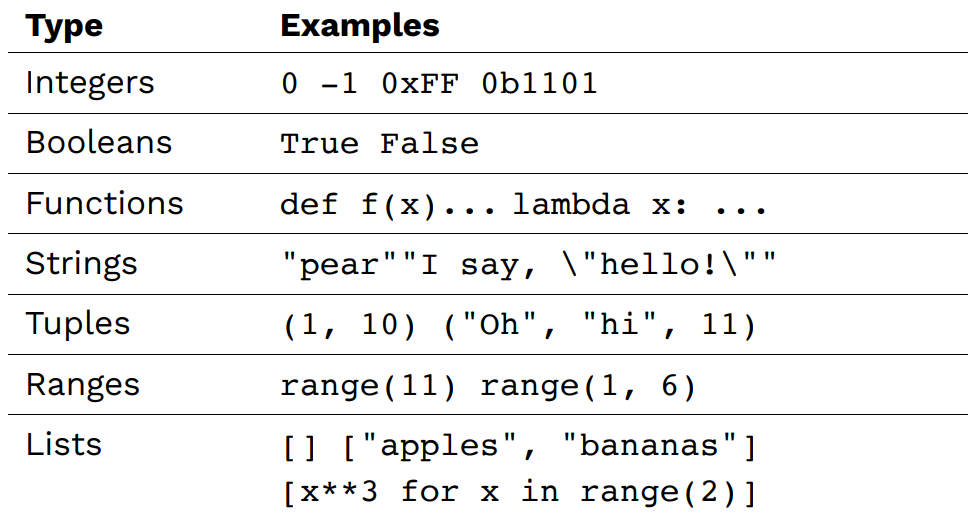

## Week5

`CS 61A 2021 Fall`官网：[CS 61A: Structure and Interpretation of Computer Programs](https://inst.eecs.berkeley.edu/~cs61a/sp21/)

`翻译视频`：[【计算机程序的构造和解释】精译【UC Berkeley 公开课-CS61A (Spring 2021)】-中英双语字幕](https://www.bilibili.com/video/BV1v64y1Q78o/?spm_id_from=444.41.top_right_bar_window_default_collection.content.click&vd_source=249a8ad55bb26717dd55ec3dd295f644)

`github`:[Maxwell2020152049/CS61A](https://github.com/Maxwell2020152049/CS61A)

### Lecture #12: Dictionaries, Matrices, and Trees：

`Project`：[Project 2: CS 61A Autocorrected Typing Software](https://inst.eecs.berkeley.edu/~cs61a/sp21/proj/cats/)

`Slide`：[12-Trees_full.pdf](https://inst.eecs.berkeley.edu/~cs61a/sp21/assets/slides/12-Trees_full.pdf) or [12-Trees.html](https://inst.eecs.berkeley.edu/~cs61a/sp21/assets/slides/12-Trees.html)

#### 抽象层次的复习（`Review: Layers of abstraction`）


#### `Python`类型的复习（`Review: Python types`）



#### 字典（`Dictionary`）

`字典`是一种可修改的`键-值对`映射（`key-value pair`）。

可以使用`Key in Dict`检查某个`Key`是否是字典的键，若是，返回`True`；若不是，返回`False`。

`eg`：

```python
# Dictionaries

states = {
	"CA": "California",
	"DE": "Delaware",
	"NY": "New York",
	"TX": "Texas",
	"WY": "Wyoming"
}

print(len(states))
print("CA" in states)
print("ZZ" in states)
```

输出：

```shell
5
True
False
```

#### 选择字典元素（`Dictionary selection`）

字典的`Key`是不可修改的类型，如`字符串`、`元组`，`列表`、`字典`不可以作为`Key`。

使用`Dict[Key]`可以得到字典的值，若`Key`不存在，会返回`KeyError`。

字典内置的`get(key, str)`，会使用`key`作为键在字典中查找，若存在，返回对应的值；若不存在，返回`str`，这样不会检索字典中不存在的键不会引发错误。

`eg`：

```python
# Dictionary selection

words = {
	"más": "more",
	"otro": "other",
	"agua": "water"
}

print(words["otro"])
first_word = "agua"
print(words[first_word])
# words["pavo"] - error!
print(words.get("pavo", "🤔"))
```

输出：

```shell
other
water
🤔
```

#### 修改字典（`Dictionary mutation`）

字典的值可以通过赋值语句修改：

```python
# Dictionary - mutating
users = {}
users["profpamela"] = "b3stp@ssEvErDontHackMe"
users["profpamela"] += "itsLongerSoItsMoreSecure!!"
print(users["profpamela"])
```

输出：

```shell
b3stp@ssEvErDontHackMeitsLongerSoItsMoreSecure!!
```

字典可以作为另一字典的值：

```python
# Dict of dicts
spiders = {
  "smeringopus": {
	  "name": "Pale Daddy Long-leg",
	  "length": 7
  },
  "holocnemus pluchei": {
	  "name": "Marbled cellar spider",
	  "length": (5, 7)
  }
}
```

#### 字典的迭代器

字典的迭代器是字典的键，迭代顺序是插入顺序：

```python
# Dictionary iteration
insects = {"spiders": 8, "centipedes": 100, "bees": 6}
for name in insects:
    print(insects[name])
```

输出：

```shell
8
100
6
```

#### 矩阵（`Matrices`）

矩阵是一张二维的表，有行和列：

数据抽象如下：


本课程介绍了多种实现方法，外部调用都是一样的：

```python
# Matrix- Implementation A
def matrix(rows, cols):
    return [ [0 for col in range(cols)] for row in range(rows) ]

def value(matrix, row, col):
    return matrix[row][col]

def set_value(matrix, row, col, val):
    matrix[row][col] = val

# Matrix- Implementation B
def matrix(rows, cols):
    return [ [0 for row in range(rows)] for col in range(cols) ]

def value(matrix, row, col):
    return matrix[col][row]

def set_value(matrix, row, col, val):
    matrix[col][row] = val

# Matrix- Implementation C
def matrix(rows, cols):
    return tuple( [0 for col in range(cols)] for row in range(rows) )

def value(matrix, row, col):
    return matrix[row][col]

def set_value(matrix, row, col, val):
    matrix[row][col] = val

# Matrix- Implementation D2
def matrix(rows, cols):
    return [ tuple(0 for col in range(cols))
        for row in range(rows) ]

def value(matrix, row, col):
    return matrix[row][col]

def set_value(matrix, row, col, val):
    matrix[row] = matrix[row][:col] + (val,) + matrix[row][col+1:]

m = matrix(3, 4)
set_value(m, 0, 0, 1)
set_value(m, 0, 1, 2)
set_value(m, 0, 3, 4)
```

PS：在课堂投票中，大部分人都选择用列表包含列表，并以行优先的方式实现：


#### 树（`Tree`）

数据抽象如下：


本课程介绍了多种实现方法，外部调用都是一样的：

```python
# Tree - Implementation A
def tree(label, children=[]):
    return [label] + children

def label(tree):
    return tree[0]

def children(tree):
    return tree[1:]

def is_leaf(tree):
    return len(children(tree)) == 0

# Tree- Implementation B
def tree(label, children=[]):
    return (label, children)

def label(tree):
    return tree[0]

def children(tree):
    return tree[1]

# Tree - Implementation C
def tree(label, children=[]):
    return {"l": label, "c": children}

def label(tree):
    return tree["l"]

def children(tree):
    return tree["c"]

t = tree(20, [tree(12,
               [tree(9,
                  [tree(7), tree(2)]),
                tree(3)]),
              tree(8,
                [tree(4), tree(4)])])
```

在课堂投票中，大部分人选择用列表包含列表实现（其实不是很好的方法，不够直观）：


#### 树的过程（`Tree processing`）

实现一个`count_leaves(t)`函数，统计树`t`的叶子的数量：

```python
# Tree processing

def count_leaves(t):
    """Returns the number of leaf nodes in T."""
    if is_leaf(t):
        return 1
    else:
        children_leaves = 0
        for c in children(t):
            children_leaves += count_leaves(c)
        return children_leaves

def count_leaves(t):
    """Returns the number of leaf nodes in T."""
    if is_leaf(t):
        return 1
    else:
        return sum([count_leaves(c) for c in children(t)])
```

