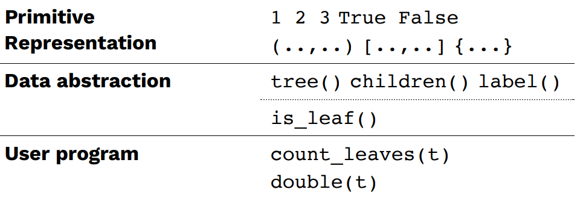
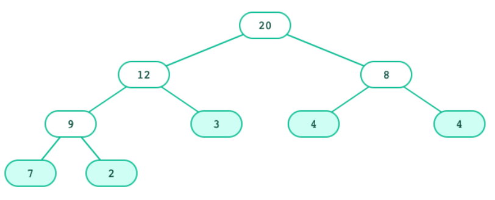
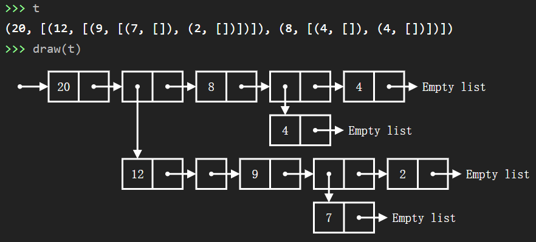
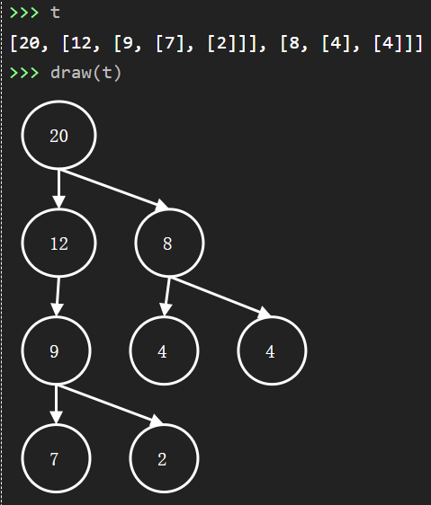
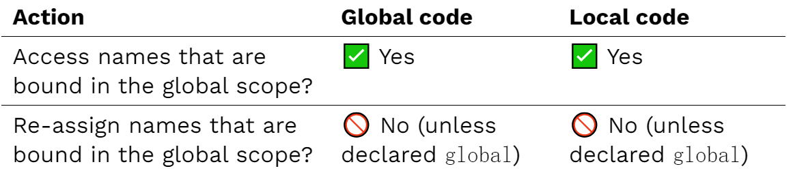
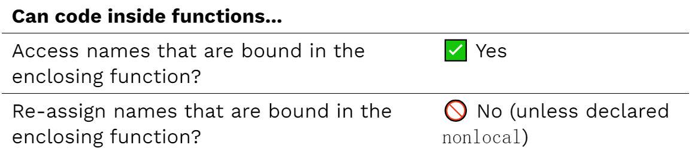
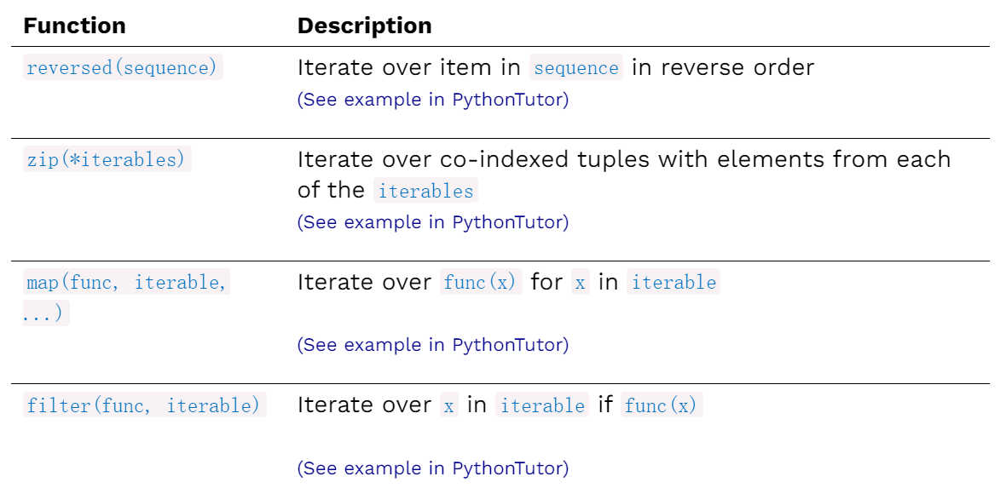
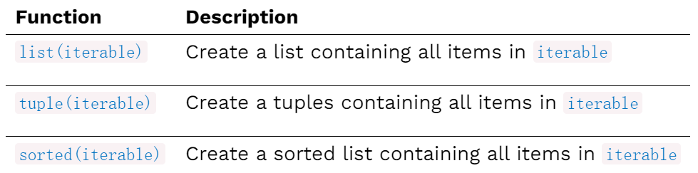

# Week6

`CS 61A 2021 Fall`官网：[CS 61A: Structure and Interpretation of Computer Programs](https://inst.eecs.berkeley.edu/~cs61a/sp21/)

`翻译视频`：[【计算机程序的构造和解释】精译【UC Berkeley 公开课-CS61A (Spring 2021)】-中英双语字幕](https://www.bilibili.com/video/BV1v64y1Q78o/?spm_id_from=444.41.top_right_bar_window_default_collection.content.click&vd_source=249a8ad55bb26717dd55ec3dd295f644)

`github`:[Maxwell2020152049/CS61A](https://github.com/Maxwell2020152049/CS61A)

## Lecture #13: Mutable Values

`Slide`：[13-Mutable_Values_full.pdf](https://inst.eecs.berkeley.edu/~cs61a/sp21/assets/slides/13-Mutable_Values_full.pdf)

`Lab`：[Lab 5: Python Lists, Data Abstraction, Trees](https://inst.eecs.berkeley.edu/~cs61a/sp21/lab/lab05/)

### 树的抽象层次（`Tree: Layers of abstraction`）



每一个层次的抽象都由上一个层次的抽象实现。

> Each layer only uses the layer above it.

### 一种树的实现（`A tree() implementation`）

本节课使用以元组为树，以列表为子树的方法创建树。

创建如下的树，`draw`是[CS 61A Coder](https://code.cs61a.org/)中实现的函数，能够绘制不同类型的结构的图形：



```python
def tree(label, children=None):
    """ Creates a tree whose root node is labeled LABEL and
        optionally has CHILDREN, a list of trees."""
    return (label, list(children or []))

def label(tree):
    """ Returns the label of the root node of TREE. """
    return tree[0]

def children(tree):
    """ Returns a list of children of TREE. """
    return tree[1]

t = tree(20, [tree(12, [tree(9, [tree(7), tree(2)])]), tree(8, [tree(4), tree(4)])])
```

输出如下：



[CS 61A Coder](https://code.cs61a.org/)中也实现了`tree`函数，但具体方式与上述方法有区别，使用以列表为树，也以列表为子树的方法创建树。如果不自行定义树的相关抽象类型，直接使用内置的`tree`函数：

```python
t = tree(20, [tree(12, [tree(9, [tree(7), tree(2)])]), tree(8, [tree(4), tree(4)])])
```

输入如下：



### 树节点翻倍

实现`double(t)`函数，`t`是一棵树，返回一个新的树，树上的节点都是`t`的两倍：

```python
def double(t):
    """Returns a tree identical to T, but with all labels doubled."""
    child = children(t)
    if not child:
        return tree(label(t) * 2)
    else:
        return tree(label(t) * 2, 
                [double(t) for t in child])
```

输出如下：

```shell
>>> t
(20, [(12, [(9, [(7, []), (2, [])])]), (8, [(4, []), (4, [])])])
>>> double(t)
(40, [(24, [(18, [(14, []), (4, [])])]), (16, [(8, []), (8, [])])])
```

`double(t)`函数可以更加精简，子树为空就传空列表：

```python
def double(t):
    """Returns a tree identical to T, but with all labels doubled."""
    child = children(t)
    return tree(label(t) * 2, 
            [double(t) for t in child])
```

输出与之前相同。

### 非破坏性操作与破坏性操作（`Non-destructive and Destructive`）

非破坏性操作：

```python
>>> aThing
<output A>
>>> <operation on aThing (that obey abstraction boundaries)>
>>> aThing
<output A>
```

`A`并没有被修改。

破坏性操作：

```python
>>> aThing
<output A>
>>> <operation on aThing (that obey abstraction boundaries)>
>>> aThing
<output B>
```

`A`被修改了。

之前实现的`double(t)`是非破坏性的，因为没有修改`t`。

### 不可变性和可变性（`Immutability and Mutability`）

一个不可变值一但被创建就不可修改。

> An `immutable` value is unchanging once created. 
>
> Immutable types (that we've covered): int, float, string, tuple

`eg`：

```python
a_tuple = (1, 2)
a_tuple[0] = 3                  # 🚫 Error! Tuple items cannot be set.
a_string = "Hi y'all"
a_string[1] = "I"               # 🚫 Error! String elements cannot be set.
a_string += ", how you doing?"  # 🤔 How does this work?
an_int = 20
an_int += 2                     # 🤔 And this?
```

可变值在计算过程中可以被修改，所有绑定了同一对象的值都会收到修改的影响。

> A `mutable` value can change in value throughout the course of computation. All names that refer to the same object are afected by a mutation. 
>
> Mutable types (that we've covered): list, dict

`eg`：

```python
grades = [90, 70, 85]
grades_copy = grades
grades[1] = 100
words = {"agua": "water"}
words["pavo"] = "turkey"
```

`id()`函数返回一个对象的`id`值，如果两个对象是同一个，`id`值应当相同，反之不一定。

在函数调用中可以进行修改，也可以修改父环境框架中的值。

若不可变序列包含可变值，可变值可以被修改。

之前实现的`tree()`函数创建的树是不可变的。

### 可被修改的树（`A mutable tree()`）

可被修改的树可以使用以下方法实现：

```python
def tree(label, children=None):
    return [label] + list(children or [])

def label(tree):
    return tree[0]

def children(tree):
    return tree[1:]

def set_label(tree, label):
    tree[0] = label

def set_children(tree, children):
    tree[1] = children
```

破坏性的翻倍操作如下：

```python
def double(t):
    """Doubles every label in T, mutating T."""
    set_label(t, label(t) * 2)
    if not is_leaf(t):
        for c in children(t):
            double(c)
```

### 复制列表（`Copying lists`）

可以使用`切片`来创建新列表：

```python
listA = [2, 3]
listB = listA

listC = listA[:]
listA[0] = 4
listB[1] = 5
```

或者使用`list()`函数，`list()`函数能接受任意类型的可迭代对象（`list()`是非破坏性的，列表是可修改的）：

```python
listA = [2, 3]
listB = listA

listC = list(listA)
listA[0] = 4
listB[1] = 5
```

### 对象的同一性与内容的相等性

`is`可以验证对象的同一性，若是同一个对象，返回`True`，否则返回`False`。

`==`可以验证内容的相等性，若两个对象的内容相同，返回`True`，否则返回`False`。

`eg`：

```python
list1 = [1,2,3]
list2 = [1,2,3]
identical = list1 is list2
are_equal = list1 == list2
```

## Lecture #14: List Mutation, Identity, and Nonlocal 

`Slide`：[14-List_mutation_+_Identity_+_Nonlocal_full.pdf](https://inst.eecs.berkeley.edu/~cs61a/sp21/assets/slides/14-List_mutation_+_Identity_+_Nonlocal_full.pdf)

### 列表的创建（`List creation`）

使用方括号可以创建列表：

```python
# Creating a list from scratch:
a = []
b = [1, 2, 3, 4, 5]
```

从已经存在的列表可以创建列表：

```python
# Creating a list from existing lists:
c = b + [20, 30]
d = c[:]
e = list(c)
```

以上方法都是非破坏性的（`Non-destructive`）。

### 通过`切片`修改列表（`Mutating lists with slicing`）

通过`切片`可以修改列表：

```python
# List Mutation
L = [1, 2, 3, 4, 5]

L[2] = 6

L[1:3] = [9, 8]

L[2:4] = []            # Deleting elements

L[1:1] = [2, 3, 4, 5]  # Inserting elements

L[len(L):] = [10, 11]  # Appending

L = L + [20, 30]

L[0:0] = range(-3, 0)  # Prepending
```

注意列表的`+`和`+=`运算符，前者会为右值创建一个新的列表绑定到左值的名称上（非破坏性操作）；后者不会创建新的列表（破坏性操作）。

```python
# Test List's '+' and '+='
a = [1, 2, 3]
print(a, id(a))

b = a + [4, 5]
print(b, id(b))

a += [6, 7]
print(a, id(a))

a = a + [8, 9]
print(a, id(a))
```


### 使用列表的方法修改列表（`Mutating lists with methods`）

`append()`函数可以把一个元素添加到列表尾部：

```python
# append() adds a single element to a list:
s = [2, 3]
t = [5, 6]
s.append(4)
s.append(t)
t = 0
```

`extend()`函数可以把一个列表的所有元素添加到指定列表的尾部：

```python
# extend() adds all the elements in one list to a list:
s = [2, 3]
t = [5, 6]
s.extend(4) # 🚫 Error: 4 is not an iterable!
s.extend(t)
t = 0
```

`pop()`函数可以移除并返回列表的最后一个元素：

```python
# pop() removes and returns the last element:
s = [2, 3]
t = [5, 6]
t = s.pop()
```

`reomve(val)`会移除列表中第一个等于`val`的值：

```python
# remove() removes the first element equal to the argument:
s = [6, 2, 4, 8, 4]
s.remove(4)
s.remove(9)
```

以上方法都会修改列表，都是破坏性操作（`Destructive`）。

### 对象的同一性与内容的相等性

`is`可以验证对象的同一性，若是同一个对象，返回`True`，否则返回`False`。

`==`可以验证内容的相等性，若两个对象的内容相同，返回`True`，否则返回`False`。

`eg`：

```python
list1 = [1,2,3]
list2 = [1,2,3]
# evaluates to True if both exp0 and exp1 evaluate to objects containing equal values
are_equal = list1 == list2
# evaluates to True if both exp0 and exp1 evaluate to the same object
identical = list1 is list2
```

```python
# Try this in your local friendly Python interpreter:
a = "orange"
b = "orange"
c = "o" + "range"
print(a is b)
print(a is c)

a = 100
b = 100
print(a is b)
print(a is 10 * 10)
print(a == 10 * 10)

a = 100000000000000000
b = 100000000000000000
print(a is b)
print(100000000000000000 is 100000000000000000)
```

### 本地空间的命名（`Names inside local scopes`）

命名的规则如下：



`eg`：

```python
# access is allowed
attendees = []

def mark_attendance(name):
    attendees.append(name)
    print("In attendance:", attendees)

mark_attendance("Emily")
mark_attendance("Cristiano")
mark_attendance("Samantha")
```

``` python
# re-assign is not allowed
# UnboundLocalError: local variable 'current' referenced before assignment
current = 0

def count():
    current = current + 1     # 🚫  Error!
    print("Count:", current)

count()
count()
```

可以使用`global`描述符引入全局环境的变量（但应尽量避免使用`global`）：

```python
# Re-assigning globals
current = 0

def count():
    global current
    current = current + 1
    print("Count:", current)

count()
count()
```

### 嵌套空间内的名称（`Names inside nested scopes`）



不允许在嵌套函数中重命名变量，因为根据计算顺序，左值会先创建`current`，右值访问`current`时，又会发现`current`没有绑定任何对象，就直接访问。

```python
# UnboundLocalError: local variable 'current' referenced before assignment
def make_counter(start):
    current = start

    def count():
        current = current + 1
        print("Count:", current)

    return count

counter = make_counter(30)
counter()
counter()
counter()
```

可以使用`nonlocal`修饰符（`Python3`的新特性），在嵌套函数中引入父函数的变量（但应尽量避免使用`nonlocal`）：

```python
# The nonlocal declaration tells Python to look in the parent frame for the name lookup.
def make_counter(start):
    current = start

    def count():
        nonlocal current
        current = current + 1
        print("Count:", current)

    return count

counter = make_counter(30)
counter()
counter()
counter()
```

## Lecture #15: Iterators + Generators

`Slide`：[15-Iterators_+_Generators_full.pdf](https://inst.eecs.berkeley.edu/~cs61a/sp21/assets/slides/15-Iterators_+_Generators_full.pdf)

`Homework`：[Homework 4: Trees, Data Abstraction](https://inst.eecs.berkeley.edu/~cs61a/sp21/hw/hw04/)

### 可迭代对象（`Iterables`）

列表、元组、字典、字符串都是`可迭代对象`：

```python
# Lists, tuples, dictionaries, and strings are all iterable objects.
my_order = ["Yuca Shepherds Pie", "Pão de queijo", "Guaraná"]

ranked_chocolates = ("Dark", "Milk", "White")

prices = {"pineapple": 9.99, "pen": 2.99, "pineapple-pen": 19.99}

best_topping = "pineapple"
```

这些类型都支持循环迭代：

```python
# We can iterate over iterable objects:
my_order = ["Yuca Shepherds Pie", "Pão de queijo", "Guaraná"]
for item in my_order:
    print(item)
lowered = [item.lower() for item in my_order]

ranked_chocolates = ("Dark", "Milk", "White")
for chocolate in ranked_chocolates:
    print(chocolate)

prices = {"pineapple": 9.99, "pen": 2.99, "pineapple-pen": 19.99}
for product in prices:
    print(product, " costs ", prices[product])
discounted = { item: prices[item] * 0.75 for item in prices }

best_topping = "pineapple"
for letter in best_topping:
    print(letter)
```

### 迭代器（`Iterators`）

迭代器可以提供对可迭代序列的元素的访问，一次访问一个元素：

`iter(iterable)`函数返回可迭代对象`iterable`的迭代器。

`next(iterator)`函数返回迭代器`iterator`的下一个元素。

```python
# An iterator is an object that provides sequential access to values, one by one.
# iter(iterable) returns an iterator over the elements of an iterable.
# next(iterator) returns the next element in an iterator.
toppings = ["pineapple", "pepper", "mushroom", "roasted red pepper"]

topperator = iter(toppings)
next(topperator) # 'pineapple'
next(topperator) # 'pepper'
next(topperator) # 'mushroom'
next(topperator) # 'roasted red pepper'
next(topperator) # ❌ StopIteration exception
```

迭代器中不含元素时调用`next`，会返回一个`StopIteration: StopIteration`对象，停止迭代。

可以使用`try/except`捕获异常：

```python
# An unhandled exception will immediately stop a program.
# Use try/except to handle an exception:
ranked_chocolates = ("Dark", "Milk", "White")

chocolaterator = iter(ranked_chocolates)
print(next(chocolaterator))
print(next(chocolaterator))
print(next(chocolaterator))

try:
    print(next(chocolaterator))
except StopIteration:
    print("No more left!")
```

但这样我们就需要知道迭代器的元素个数，可以使用`while`循环：

```python
# We can use a while loop to process iterators of arbitrary length:
ranked_chocolates = ("Dark", "Milk", "White")
chocolaterator = iter(ranked_chocolates)

try:
    while True:
        choco = next(chocolaterator)
        print(choco)
except StopIteration:
    print("No more left!")
```

### 迭代器与`For`循环（`Iterators vs. For loops`）

上述使用`while`的迭代器可以用`for`循环替代：

```python
# use for loops
ranked_chocolates = ("Dark", "Milk", "White")
for chocolate in ranked_chocolates:
    print(chocolate)
```

`for`循环可以视为对迭代器的封装（语法糖）。

### `For`循环的执行（`For loop execution`）

```python
for <name> in <expression>:
    <suite>
```

上述语句执行过程如下：

> 1. Python evaluates `<expression>` to make sure it's an iterable.
>
> 2. Python gets an iterator for the iterable.
> 3. Python gets the next value from the iterator and assigns to `<name>`.
> 4. Python executes `<suite>`.
> 5. Python repeats until it sees a StopIteration error.

与以下代码等价：

```python
iterator = iter(<expression>)
try:
    while True:
        <name> = next(iterator)
        <suite>
except StopIteration:
    pass
```

`for`循环迭代是更好的选择，无论从语法的简洁性还是从程序的性能开销考虑。

### `__next__() and __iter__()`

调用`next()`函数时，会调用迭代器内置的`__next__()`函数：

```python
# When the iter() function is passed an iterable object, it calls the __iter__() method on it:
ranked_chocolates = ("Dark", "Milk", "White")
chocorator1 = iter(ranked_chocolates)
chocorator2 = ranked_chocolates.__iter__()
```

调用`iter()`函数时，会调用迭代器内置的`__iter__()`函数：

```python
# When the next() function is passed an iterator, it calls the __next__() method on it:
ranked_chocolates = ("Dark", "Milk", "White")
chocolate1 = next(chocorator1)
chocolate2 = chocorator2.__next__()
```

### 返回迭代器的函数（`Functions that return iterators`）



`reversed(sequence)`函数会返回`sequence`的逆序的迭代器：

```python
# Iterate over item in sequence in reverse order
chocolate_bars = ("90%", "70%", "55%")

worst_first = reversed(chocolate_bars)

for chocolate in worst_first:
    print(chocolate)
```

`zip(*iterables)`函数返回若干可迭代对象的合并，第`i`个元素是`(a1[i]， a2[i], ..., an[i])`：

```python
# Iterate over co-indexed tuples with elements from each of the iterables
eng_nums = ["one", "two", "three"]
esp_nums = ["uno", "dos", "tres"]

zip_iter = zip(eng_nums, esp_nums)
eng, esp = next(zip_iter)
print(eng, esp)

for eng, esp in zip(eng_nums, esp_nums):
    print(eng, esp)
```

`map(func, iterable, ...)`函数，返回一个迭代器，元素是`func(x)`，`x`是可迭代对象`iterable`的元素：

```python
# Iterate over func(x) for x in iterable
# Same as [func(x) for x in iterable]
nums = [1, 2, 3, 4, 5]

# Map returns an iterator
squares1 = map(lambda num: num ** 2, nums)

# Create a list of all the elements from the iterator
squares1 = list(squares1)

# Compare to...
squares2 = [num**2 for num in nums]
```

`filter(func, iterable)`函数，返回一个迭代器，元素是可迭代对象`iterable`中满足`func(x)`的元素：

```python
# Iterate over x in iterable if func(x)
# Same as [x for x in iterable if func(x)]
nums = [1, 2, 3, 4, 5]

# Filter returns an iterator
even1 = filter(lambda num: num % 2 == 0, nums)

# Create a list of all the elements from the iterator
even1 = list(even1)

# Compare to...
even2 = [num for num in nums if num % 2 == 0]
```

### 返回可迭代对象的函数（`Functions that return iterables`）



### 生成器（`Generators`）

`生成器`是一种特殊的迭代器，从一个生成器函数中产生值：

```python
# A generator is a type of iterator that yields results from a generator function.
# A generator function uses yield instead of return:
def evens():
    num = 0
    while num < 10:
        yield num
        num += 2
        
evengen = evens()

next(evengen)  # 0
next(evengen)  # 2
next(evengen)  # 4
next(evengen)  # 6
next(evengen)  # 8
next(evengen)  # ❌ StopIteration exception
```

### 生成器是如何工作的（`How generators work`）

生成器中运作原理如下：

> - When the function is called, Python immediately returns an iterator without entering the function.
> - When `next()`is called on the iterator, it executes the body of the generator from the last stopping point up to the next `yield` statement.
> - If it finds a `yield` statement, it pauses on the next statement and returns the value of the yielded expression.
> - If it doesn't reach a yield statement, it stops at the end of the function and raises a `StopIteration` exception.

### 基于生成器的循环（`Looping over generators`）

可以在`for`循环中使用生成器，因为生成器是特殊的迭代器：

```python
# We can use for loops on generators, since generators are just special types of iterators.
def evens(start, end):
    num = start + (start % 2)
    while num < end:
        yield num
        num += 2

for num in evens(12, 60):
   print(num)
```

与下面代码等价：

```python
# Looks a lot like...
evens = [num for num in range(12, 60) if num % 2 == 0]
# Or  = filter(lambda x: x % 2 == 0, range(12, 60))
for num in evens:
    print(num)
```

### 为什么使用生成器（`Why use generators?`）

生成器只有在需要下一个元素时才会调用生成器函数，如果迭代的对象很大，那么使用生成器是个比较好的选择。

下面的代码会计算整个序列：

```python
# Generators are lazy: they only generate the next item when needed.
# Why generate the whole sequence...
def find_matches(filename, match):
    matched = []
    for line in open(filename):
        if line.find(match) > -1:
            matched.append(line)
    return matched

matched_lines = find_matches('frankenstein.txt', "!")
matched_lines[0]
matched_lines[1]
```

使用生成器只生成部分元素：

```python
# ...if you only want some elements?
def find_matches(filename, match):
    for line in open(filename):
        if line.find(match) > -1:
            yield line

line_iter = find_matches('frankenstein.txt', "!")
next(line_iter)
next(line_iter)
```

### `yield from`：从迭代器生成元素（`Yielding from iterables`）

`yield from iterable`可以从一个迭代器生成元素，一次生成一个元素。

先从迭代器`a`中生成，再从迭代器`b`中生成：

```python
# A yield from statement yields the values from an iterator one at a time. 🍬
# Instead of...
def a_then_b(a, b):
    for item in a:
        yield item
    for item in b:
        yield item

list(a_then_b(["Apples", "Aardvarks"], ["Bananas", "BEARS"]))
```

使用`yield from`的等价版本：

```python
# We can write...
def a_then_b(a, b):
    yield from a
    yield from b

list(a_then_b(["Apples", "Aardvarks"], ["Bananas", "BEARS"]))
```

`yield from`也可以从生成器函数的结果中生成值：

```python
# A yield from can also yield the results of a generator function.
# Instead of...
def factorial(n, accum):
    if n == 0:
        yield accum
    else:
        for result in factorial(n - 1, n * accum):
            yield result

for num in factorial(3, 1):
    print(num)
```

```python
# We can write...
def factorial(n, accum):
    if n == 0:
        yield accum
    else:
        yield from factorial(n - 1, n * accum)

for num in factorial(3, 1):
    print(num)
```

### 树的递归生成器（`Recursive generators for trees`）

生成器支持递归，那么树也可以有生成器：

```python
# A pre-order traversal of the tree leaves:
def leaves(t):
    yield label(t)
    for c in branches(t):
        yield from leaves(c)

t = tree(20, [tree(12,
               [tree(9,
                  [tree(7), tree(2)]),
                tree(3)]),
              tree(8,
               [tree(4), tree(4)])])

leave_gen = leaves(t)
next(leave_gen)
```

