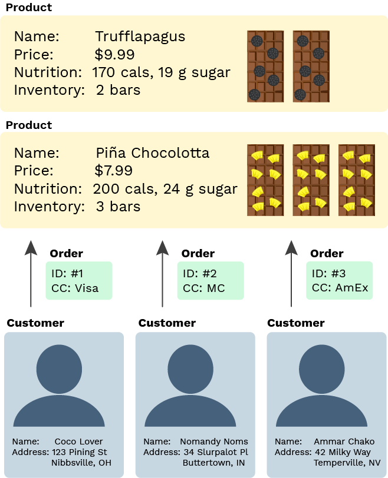
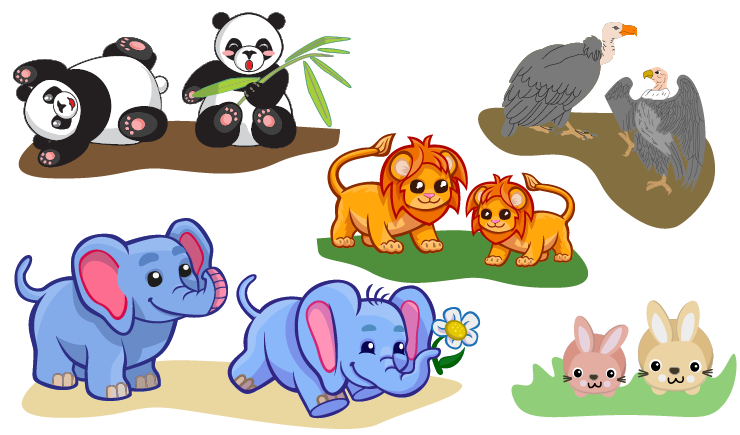
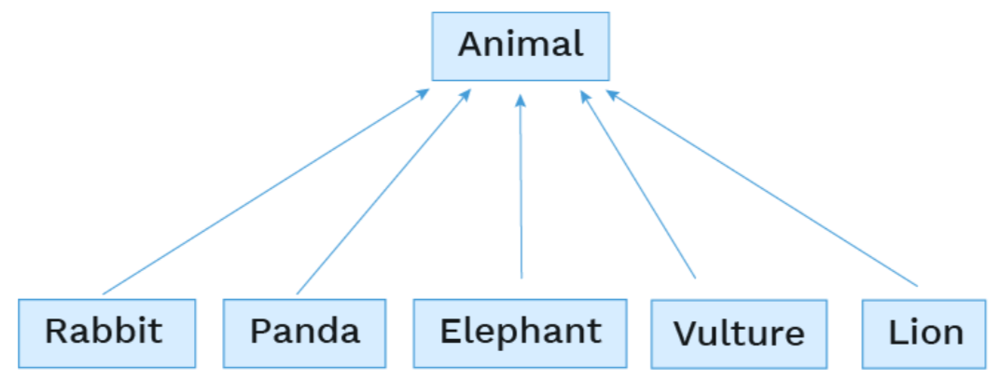
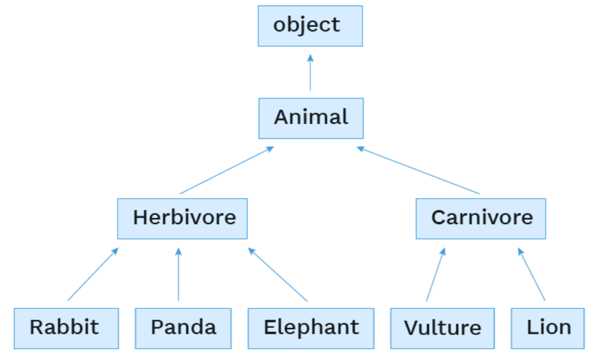
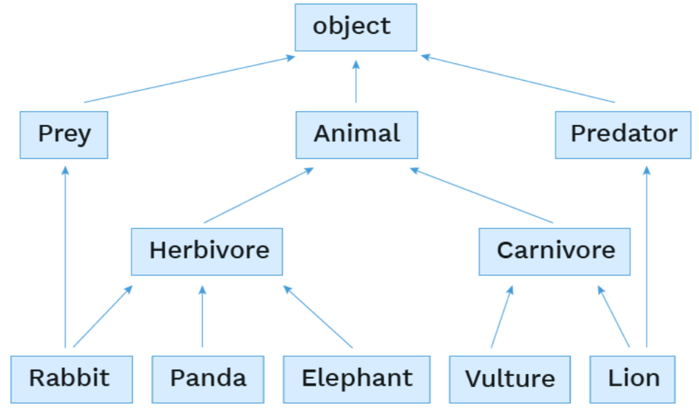
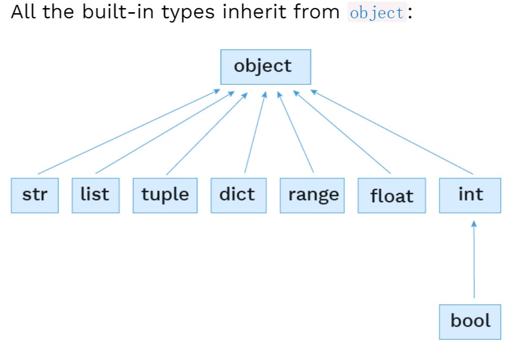
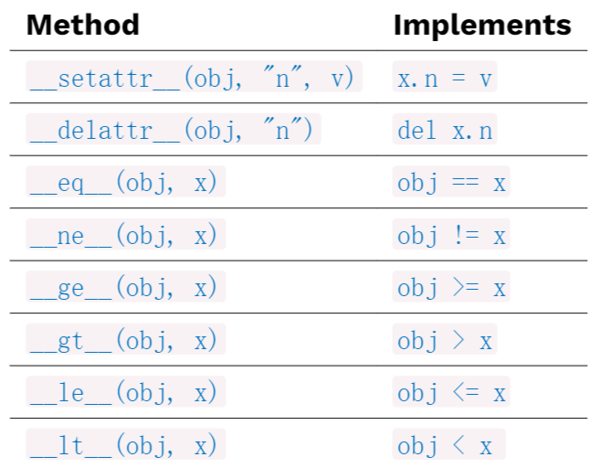

# Week7

`CS 61A 2021 Fall`官网：[CS 61A: Structure and Interpretation of Computer Programs](https://inst.eecs.berkeley.edu/~cs61a/sp21/)

`翻译视频`：[【计算机程序的构造和解释】精译【UC Berkeley 公开课-CS61A (Spring 2021)】-中英双语字幕](https://www.bilibili.com/video/BV1v64y1Q78o/?spm_id_from=444.41.top_right_bar_window_default_collection.content.click&vd_source=249a8ad55bb26717dd55ec3dd295f644)

`github`:[Maxwell2020152049/CS61A](https://github.com/Maxwell2020152049/CS61A)

## Lecture #16: Objects + Classes

`Slide`：[16-Objects_+_Classes_full.pdf](https://inst.eecs.berkeley.edu/~cs61a/sp21/assets/slides/16-Objects_+_Classes_full.pdf)

`Lab`：[Lab 6: Nonlocal, Mutability, Iterators and Generators](https://inst.eecs.berkeley.edu/~cs61a/sp21/lab/lab06/)

### 如何建造一间巧克力商店（`Building a chocolate shop`）



使用我们之前学习过的抽象数据类型（`Abstract Data Type`）的知识，用函数可以实现巧克力商店的所有行为，但这节课我们会引入类和对象（`Class and Objects`）。

```python
# Inventory tracking
add_product(name, price, nutrition)
get_label(product)
get_nutrition_info(product)
increase_inventory(product, amount)
reduce_inventory(product, amount)


# Customer tracking
signup_customer(name, address)
get_greeting(customer)
get_formatted_address(customer)


# Purchase tracking
order(customer, product, quantity, cc_info)
track(order_number)
refund(order_number, reason)
```

### 从函数到对象（`From functions to objects`）

使用`对象`来组织数据结构：

```python
# Inventory tracking
Product(name, price, nutrition)
Product.get_label()
Product.get_nutrition_info()
Product.increase_inventory(amount)
Product.reduce_inventory(amount)
Product.get_inventory_report()

# Customer tracking
Customer(name, address)
Customer.get_greeting()
Customer.get_formatted_address()
Customer.buy(product, quantity, cc_info)

# Purchase tracking
Order(customer, product, quantity, cc_info)
Order.ship()
Order.refund(reason)
```

一些关于`类和对象`的概念：

> - A **class** is a template for defining new data types.
>
> - An instance of a class is called an **object**.
>
> - Each object has data attributes called **instance variables** that describe its state.
>
> - Each object also has function attributes called **methods**.

### 类（`Classes`）

类能够实现：

- 初始化实例对象
- 定义方法，这些方法能够修改或者报告实例对象的值

> - Set the **initial values** for instance variables.
>
> - Define **methods** specific to the object, often used to change or report the values of instance variables.

本课程给出了一种`产品`类的实现：

```python
# Define a new type of data
class Product:

    # Set the initial values
    def __init__(self, name, price, nutrition_info):
        self._name = name
        self._price = price
        self._nutrition_info = nutrition_info
        self._inventory = 0

    # Define methods
    def increase_inventory(self, amount):
        self._inventory += amount

    def reduce_inventory(self, amount):
        self._inventory -= amount

    def get_label(self):
        return "Foxolate Shop: " + self._name

    def get_inventory_report(self):
        if self._inventory == 0:
            return "There are no bars!"
        return f"There are {self._inventory} bars."
```

使用方法如下：

```python
pina_bar = Product("Piña Chocolotta", 7.99,
    ["200 calories", "24 g sugar"])

pina_bar.increase_inventory(2)
```

### 类定义（`Class definition`）

```python
class Product:

    def __init__(self, name, price, nutrition_info):
    def increase_inventory(self, amount):
    def reduce_inventory(self, amount):
    def get_label(self):
    def get_inventory_report(self):
```

一个类语句可以创建一个新的类，并再当前环境的第一个帧中，把该类绑定到类名上。

> - A class statement creates a new class and binds that class to the class name in the first frame of the current environment.
>
> - Inner `def` statements create attributes of the class (*not* names in frames).

### 类的实例化（对象的构造）（`Class instantiation (Object construction)`）

```python
pina_bar = Product("Piña Chocolotta", 7.99,
    ["200 calories", "24 g sugar"])
```

`Product(args)`一般被称为`构造器`。

当`构造器`被调用时：

- 该类的一个实例被创建
- 该类的`__init__`函数被调用，新的对象作为`__init__`的第一个参数`self`。

> `Product(args)` is often called the **constructor**.
>
> When the constructor is called:
>
> - A new instance of that class is created
> - The `__init__` method of the class is called with the new object as its first argument (named `self`), along with any additional arguments provided in the call expression

```python
class Product:

    def __init__(self, name, price, nutrition_info):
        self._name = name
        self._price = price
        self._nutrition_info = nutrition_info
        self._inventory = 0
```

### 点运算符`.`（`Dot notation`）

一个对象的所有属性都可以被`.`运算符访问:

> All object attributes (which includes variables *and* methods) can be accessed with **dot notation**:

```python
pina_bar.increase_inventory(2)
```

上述表达式会在`pina_bar`类中查找名为`increase_inventory`的方法。

> That evaluates to the value of the attribute looked up by `increase_inventory` in the object referenced by `pina_bar`.

`.`运算符的左边也可以是任意的表达式：

> The left-hand side of the dot notation can also be any expression that evaluates to an object reference:

```python
bars = [pina_bar, truffle_bar]
bars[0].increase_inventory(2)
```

### 实例的变量（`Instance variables`）

> **Instance variables** are data attributes that describe the state of an object.
>
> This `__init__` initializes 4 instance variables:

```python
class Product:

    def __init__(self, name, price, nutrition_info):
        self._name = name
        self._price = price
        self._nutrition_info = nutrition_info
        self._inventory = 0
```

> The object's methods can then change the values of those variables or assign new variables.

### 方法的调用（`Method invocation`）

```python
pina_bar.increase_inventory(2)
```

```python
class Product:
    def increase_inventory(self, amount):
        self._inventory += amount
```

> `pina_bar.increase_inventory` is a **bound method**: a function which has its first parameter pre-bound to a particular value.
>
> In this case, `self` is pre-bound to `pina_bar` and `amount` is set to 2.

> It's equivalent to:

```python
Product.increase_inventory(pina_bar, 2)
```

### 动态实例变量（`Dynamic instance variables`）

> An object can create a new instance variable whenever it'd like.

```python
class Product:

    def reduce_inventory(self, amount):
        if (self._inventory - amount) <= 0:
            self._needs_restocking = True
        self._inventory -= amount

pina_bar = Product("Piña Chocolotta", 7.99,
    ["200 calories", "24 g sugar"])
pina_bar.reduce_inventory(1)
```

> Now `pina_bar` has an updated binding for `_inventory` and a new binding for `_needs_restocking` (which was not in `__init__`).

### 类变量（`Class variables`）

> A **class variable** is an assignment inside the class that isn't inside a method body.

```python
class Product:
    sales_tax = 0.07
```

> Class variables are "shared" across all instances of a class because they are attributes of the class, not the instance.

```python
class Product:
    _sales_tax = 0.07

    def get_total_price(self, quantity):
        return (self._price * (1 + self._sales_tax)) * quantity

pina_bar = Product("Piña Chocolotta", 7.99,
    ["200 calories", "24 g sugar"])
truffle_bar = Product("Truffalapagus", 9.99,
    ["170 calories", "19 g sugar"])

pina_bar._sales_tax
truffle_bar._sales_tax
pina_bar.get_total_price(4)
truffle_bar.get_total_price(4)
```

### 属性都是公共的（`Attributes are all public`）

> As long as you have a reference to an object, you can set or mutate any attributes.

```python
pina_bar = Product("Piña Chocolotta", 7.99,
    ["200 calories", "24 g sugar"])

pina_bar._inventory
pina_bar._inventory = 5000000
pina_bar._inventory = -5000
```

> You can even assign new instance variables:

```python
pina_bar.brand_new_attribute_haha = "instanception"
```

### “私有”属性（`"Private" attributes`）

> To communicate the desired access level of attributes, Python programmers generally use this convention:
>
> - `__` (double underscore) before very private attribute names
> - `_` (single underscore) before semi-private attribute names
> - no underscore before public attribute names
>
> 
>
> That allows classes to hide implementation details and add additional error checking.
>
> We will discuss `__` vs `_` next time.
>
> For now, if you see no underscore, HAVE FUN! 🎉 🎉

## Lecture #17: Inheritance + Composition

`Slide`：[17-Inheritance_+_Composition_full.pdf](https://inst.eecs.berkeley.edu/~cs61a/sp21/assets/slides/17-Inheritance_+_Composition_full.pdf)

`Project`：[Project 3: Ants Vs. SomeBees](https://inst.eecs.berkeley.edu/~cs61a/sp21/proj/ants/)

### 创建一个“动物园”（`Building "Animal Conserving"`）

要实现一个包含下图的动物的动物园，我们至少需要实现以下类：

```python
Panda()
Lion()
Rabbit()
Vulture()
Elephant()
Food()
```



### 食物类（`A Food class`）

一个简单的食物类的实现：

```python
# Let's start simple:
class Food:

    def __init__(self, name, type, calories):
        self.name = name
        self.type = type
        self.calories = calories
```

使用方式：

```python
# How would we use that class?
broccoli = Food("Broccoli Rabe", "veggies", 20)
bone_marrow = Food("Bone Marrow", "meat", 100)
```

### 大象类（`An Elephant class`）

一个简单的大象类的实现：

```python
class Elephant:
    species_name = "African Savanna Elephant"
    scientific_name = "Loxodonta africana"
    calories_needed = 8000

    def __init__(self, name, age=0):
        self.name = name
        self.age = age
        self.calories_eaten  = 0
        self.happiness = 0

    def play(self, num_hours):
        self.happiness += (num_hours * 4)
        print("WHEEE PLAY TIME!")

    def eat(self, food):
        self.calories_eaten += food.calories
        print(f"Om nom nom yummy {food.name}")
        if self.calories_eaten > self.calories_needed:
            self.happiness -= 1
            print("Ugh so full")

    def interact_with(self, animal2):
        self.happiness += 1
        print(f"Yay happy fun time with {animal2.name}")
```

使用方式：

```python
el1 = Elephant("Willaby", 5)
el2 = Elephant("Wallaby", 3)
el1.play(2)
el1.interact_with(el2)
```

### 兔子类（`An Rabbit class`）

一个简单的兔子类的实现：

```python
class Rabbit:
    species_name = "European rabbit"
    scientific_name = "Oryctolagus cuniculus"
    calories_needed = 200

    def __init__(self, name, age=0):
        self.name = name
        self.age = age
        self.calories_eaten = 0
        self.happiness = 0

    def play(self, num_hours):
        self.happiness += (num_hours * 10)
        print("WHEEE PLAY TIME!")

    def eat(self, food):
        self.calories_eaten += food.calories
        print(f"Om nom nom yummy {food.name}")
        if self.calories_eaten > self.calories_needed:
            self.happiness -= 1
            print("Ugh so full")

    def interact_with(self, animal2):
        self.happiness += 4
        print(f"Yay happy fun time with {animal2.name}")
```

使用方式：

```python
rabbit1 = Rabbit("Mister Wabbit", 3)
rabbit2 = Rabbit("Bugs Bunny", 2)
rabbit1.eat(broccoli)
rabbit2.interact_with(rabbit1)
```

### 继承——基类与子类（`Inheritance--Base classes and subclasses`）

如果多个类有相似的属性，可以实现一个基类（`Base class`），让这些类继承基类。

基类也被成为超类（`superclass`）。



### 基类（`The base class`）

```python
# The base class contains method headers common to the subclasses, and code that is used by multiple subclasses.
class Animal:
    species_name = "Animal"
    scientific_name = "Animalia"
    play_multiplier = 2
    interact_increment = 1

    def __init__(self, name, age=0):
        self.name = name
        self.age = age
        self.calories_eaten  = 0
        self.happiness = 0

    def play(self, num_hours):
        self.happiness += (num_hours * self.play_multiplier)
        print("WHEEE PLAY TIME!")

    def eat(self, food):
        self.calories_eaten += food.calories
        print(f"Om nom nom yummy {food.name}")
        if self.calories_eaten > self.calories_needed:
            self.happiness -= 1
            print("Ugh so full")

    def interact_with(self, animal2):
        self.happiness += self.interact_increment
        print(f"Yay happy fun time with {animal2.name}")
```

## 子类（`The subclasses`）

可用如下方式定义一个`Animal`类的子类`Panda`：

```python
# To declare a subclass, put parentheses after the class name and specify the base class in the parentheses:
class Panda(Animal):
```

子类只需要不同于基类的代码部分。子类可以重新定义基类的任何部分，如类变量，方法定义，构造器等。

重新定义（`redefinition`）也称重载（`overriding`）。

如果子类不需要重载任何代码，可以这样实现（`pass`语句是为了防止报错）：

```python
# The simplest subclass overrides nothing:
class AmorphousBlob(Animal):
    pass
```

### 重载类变量（`Overriding class variables`）

上述的兔子类和大象类可以重载动物类如下：

```python
# Subclasses can override existing class variables and assign new class variables:
class Rabbit(Animal):
    species_name = "European rabbit"
    scientific_name = "Oryctolagus cuniculus"
    calories_needed = 200
    play_multiplier = 8
    interact_increment = 4
    num_in_litter = 12

class Elephant(Animal):
    species_name = "African Savanna Elephant"
    scientific_name = "Loxodonta africana"
    calories_needed = 8000
    play_multiplier = 4
    interact_increment = 2
    num_tusks = 2
```

### 重载方法（`Overriding methods`）

子类可以重载基类的方法(调用基类时，使用的是重载的方法)：

```python
# If a subclass overrides a method, Python will use that definition instead of the superclass definition.
class Panda(Animal):
    species_name = "Giant Panda"
    scientific_name = "Ailuropoda melanoleuca"
    calories_needed = 6000

    def interact_with(self, other):
        print(f"I'm a Panda, I'm solitary, go away {other.name}!")
```

使用方式如下：

```python
# How would we call that method?
panda1 = Panda("Pandeybear", 6)
panda2 = Panda("Spot", 3)
panda1.interact_with(panda2)
```

### 使用基类的方法（`Using methods from the base class`）

可以使用`super()`表示当前类对象的基类，并调用基类方法：

```python
# To refer to a superclass method, we can use super():
class Lion(Animal):
    species_name = "Lion"
    scientific_name = "Panthera"
    calories_needed = 3000

    def eat(self, food):
        if food.type == "meat":
            super().eat(food)
```

使用方法如下：

```python
# How would we call that method?
bones = Food("Bones", "meat")
mufasa = Lion("Mufasa", 10)
mufasa.eat(bones)
```

以下两种调用是等价的：

```python
# super().attribute refers to the definition of attribute in the superclass of the first parameter to the method.
def eat(self, food):
    if food.type == "meat":
        super().eat(food)
```

```python
# ...is the same as:
# super() is better style than BaseClassName, though slightly slower.
def eat(self, food):
    if food.type == "meat":
        Animal.eat(self, food)
```

### 重载`__init__`（`Overriding __init__`）

使用`super().__init__()会实例化基类`：

```python
# Similarly, we need to explicitly call super().__init__() if we want to call the __init__ functionality of the base class.
class Elephant(Animal):
    species_name = "Elephant"
    scientific_name = "Loxodonta"
    calories_needed = 8000

    def __init__(self, name, age=0):
        super().__init__(name, age)
        if age < 1:
            self.calories_needed = 1000
        elif age < 5:
            self.calories_needed = 3000
```

使用方式如下：

```python
# What would this display?
elly = Elephant("Ellie", 3)
elly.calories_needed        # 3000
```

### 继承的层次（`Layers of inheritance`）

每一个`Python3`的类都隐式地继承了`object`类：



### 多继承（`Multiple inhteritance`）

`Python`也支持多继承，一个类可以继承多个基类：



### 组合（`Composition`）

一个对象可能包含其他类的对象的引用。

> An object can contain references to objects of other classes.

下面的`Animal`类的实例变量`mate`就指向了另一个`Animal`类的对象。

```python
class Animal:

    def mate_with(self, other):
        if other is not self and other.species_name == self.species_name:
            self.mate = other
            other.mate = self
```

使用方式如下：

```python
mr_wabbit = Rabbit("Mister Wabbit", 3)
jane_doe = Rabbit("Jane Doe", 2)
mr_wabbit.mate_with(jane_doe)
```

`eg`：

```python
class Rabbit(Animal):

    def reproduce_like_rabbits(self):
        if self.mate is None:
            print("oh no! better go on ZoOkCupid")
            return
        self.babies = []
        for _ in range(0, self.num_in_litter):
            self.babies.append(Rabbit("bunny", 0))
```

```python
mr_wabbit = Rabbit("Mister Wabbit", 3)
jane_doe = Rabbit("Jane Doe", 2)
mr_wabbit.mate_with(jane_doe)
jane_doe.reproduce_like_rabbits()
```

`eg.`：

```python
def partytime(animals):
    """Assuming ANIMALS is a list of Animals, cause each
    to interact with all the others exactly once."""
    for i in range(len(animals)):
        for j in range(i + 1, len(animals)):
            animals[i].interact_with(animals[j])
```

```python
jane_doe = Rabbit("Jane Doe", 2)
scar = Lion("Scar", 12)
elly = Elephant("Elly", 5)
pandy = Panda("PandeyBear", 4)
partytime([jane_doe, scar, elly, pandy])
```

## Lecture #18: Special Object Methods

`Slide`：[18-Special_Object_Methods_full.pdf](https://inst.eecs.berkeley.edu/~cs61a/sp21/assets/slides/18-Special_Object_Methods_full.pdf)

`Homework`：[Homework 5: Object-Oriented Programming, Linked Lists, Iterators and Generators](https://inst.eecs.berkeley.edu/~cs61a/sp21/hw/hw05/)

### 关于对象（`So many objects`）

在`Python`中，所有的类型和自定义类都隐式地直接或间接继承了`object`类，以下的变量名称都是对象的引用：

```python
class Lamb:
    species_name = "Lamb"
    scientific_name = "Ovis aries"

    def __init__(self, name):
        self.name = name

    def play(self):
        self.happy = True

lamb = Lamb("Lil")
owner = "Mary"
had_a_lamb = True
fleece = {"color": "white", "fluffiness": 100}
kids_at_school = ["Billy", "Tilly", "Jilly"]
day = 1
```

使用某个对象的`__class__`属性可以查看其类名，查看其类名的`__bases__`属性，可以得到基类（返回一个元组，基类可能不止一个）：

```shell
>>> lamb.__class__
<class '__main__.Lamb'>
>>> lamb.__class__.__bases__
(<class 'object'>,)
```

```shell
>>> owner.__class__
<class 'str'>
>>> owner.__class__.__bases__
(<class 'object'>,)
```

```shell
>>> had_a_lamb.__class__
<class 'bool'>
>>> had_a_lamb.__class__.__bases__
(<class 'int'>,)
```

```shell
>>> fleece.__class__
<class 'dict'>
>>> fleece.__class__.__bases__
(<class 'object'>,)
```

```shell
>>> kids_at_school.__class__
<class 'list'>
>>> kids_at_school.__class__.__bases__
(<class 'object'>,)
```

```shell
>>> day.__class__
<class 'int'>
>>> day.__class__.__bases__
(<class 'object'>,)
```



### 对象内置的属性（`Built-in object attributes`）

因为所有类都继承自`object`类，所以自然继承了该类的属性，用`dir()`函数可以查看一个类的属性：

```python
dir(object)
```

```shell
>>> dir(object)
['__bases__', '__class__', '__delattr__', '__dir__', '__eq__', '__format__', '__ge__', '__getattribute__', '__gt__', '__hash__', '__init__', '__init_subclass__', '__le__', '__lt__', '__module__', '__ne__', '__new__', '__reduce__', '__reduce_ex__', '__repr__', '__setattr__', '__str__', '__subclasshook__']
```

> - For string representation: `__repr__`, `__str__`, `__format__`
> - For comparisons: `__eq__`, `__ge__`, `__gt__`, `__le__`, `__lt__`, `__ne__`
> - Related to classes: `__bases__`, `__class__`, `__new__`, `__init__`, `__init_subclass__`, `__subclasshook__`, `__setattr__`, `__delattr__`, `__getattribute__`
> - Others: `__dir__`, `__hash__`, `__module__`, `__reduce__`, `__reduce_ex__`

### `__str__`方法（`__str__`）

`__str__`方法会返回一个可被人类阅读的字符串表示，在字符串构造，`print`函数，f-字符串（`f-string`）等地方都被调用了。

```python
from fractions import Fraction

one_third = 1/3
one_half = Fraction(1, 2)
```

```shell
>>> one_third
0.3333333333333333
>>> print(one_third)
0.3333333333333333
```

```shell
>>> one_half
Fraction(1, 2)
>>> print(one_half)
1/2
```

f-字符串可以把`{}`中的变量名进行替换，运算结果是一个字符串，`eval`函数可以接受一个字符串，对其进行计算，就和输入该字符串到终端一样。

```shell
>>> f"{one_half} > {one_third}"
'1/2 > 0.3333333333333333'
>>> eval(f"{one_half} > {one_third}")
True
```

### 自定义`__str__`方法（`Custom __str__ behavior`）

内置的`__str__`函数一般返回一个描述对象类名的字符串。

```shell
>>> lamb
<__main__.Lamb object>
```

```shell
>>> str(lamb)
'<__main__.Lamb object>'
```

```shell
>>> lamb.__str__()
'<__main__.Lamb object>'
```

```shell
>>> print(lamb)
<__main__.Lamb object>
```

重载`Lamb`类中的`__str__`函数：

```python
def __str__(self):
    return "🐑 : " + self.name
```

重载之后，注意到，输入`lamb`返回的是对象，并没有使用`__str__`：

```shell
>>> lamb
<__main__.Lamb object>
```

```shell
>>> lamb.__str__()
'🐑 : Lil'
```

```shell
>>> print(lamb)
🐑 : Lil
```

### `__repr__`方法（`__repr__`）

对象调用`__repr__`方法会返回一个字符串，该字符串可以被计算，得到该对象。

```shell
>>> one_half.__repr__()
'Fraction(1, 2)'
```

```shell
>>> eval(one_half.__repr__())
Fraction(1, 2)
```

`__repr__`主要用于展示如何得到某个对象：

```shell
>>> 
>>> one_third
0.3333333333333333
>>> repr(one_third)
'0.3333333333333333'
```

```shell
>>> one_half
Fraction(1, 2)
>>> repr(one_half)
'Fraction(1, 2)'
```

### 自定义`__repr__`方法（`Custom __repr__ behavior`）

```shell
>>> lamb
<__main__.Lamb object>
>>> repr(lamb)
'<__main__.Lamb object>'
```

重载`Lamb`类中的`__repr__`方法：

```python
def __repr__(self):
    return f"Lamb({repr(self.name)})"
```

```shell
>>> lamb
Lamb('Lil')
>>> repr(lamb)
"Lamb('Lil')"
```

### 使用`getattr`方法获取对象属性（`Get attribute with getattr()`）

使用`getattr(object, name[, default])`可以在`object`对象中查找`name`属性，若存在，返回该对象的类名的字符串，若不存在，返回`default`（若有该参数），否则返回`AttributeError`。

```shell
>>> getattr(lamb, "species_name")
'Lamb'
```

```shell
>>> getattr(lamb, "not_exist_name")
Traceback (most recent call last):
  File <string>, line 1, in <module>
AttributeError: not_exist_name
```

```shell
>>> getattr(lamb, "not_exist_name", 'not this attribute')
'not this attribute'
```

### 使用`hasattr`方法检测属性是否存在（`Check attribute exists with hasattr()`）

```shell
>>> hasattr(lamb, "scientific_name")
True
>>> hasattr(lamb, "not_exist_name")
False
```

### 特别的方法（`Special methods`）


