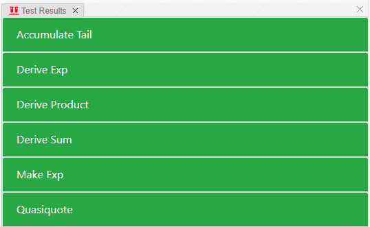

# Homework 8: More Scheme

作业链接：[Homework 8: More Scheme](https://inst.eecs.berkeley.edu/~cs61a/sp21/hw/hw08/)

使用以下命令可以下载作业：

```shell
wget https://inst.eecs.berkeley.edu/~cs61a/sp21/hw/hw08/hw08.zip
```

## Q1: WWSD: Quasiquote

使用如下命令进行解锁测试：

```shell
python3 ok -q wwsd-quasiquote -u --local
```

测试过程如下：

```shell
=====================================================================
Assignment: Homework 8
OK, version v1.18.1
=====================================================================

~~~~~~~~~~~~~~~~~~~~~~~~~~~~~~~~~~~~~~~~~~~~~~~~~~~~~~~~~~~~~~~~~~~~~
Unlocking tests

At each "? ", type what you would expect the output to be.
Type exit() to quit

---------------------------------------------------------------------
quasiquote > Suite 1 > Case 1
(cases remaining: 1)


scm> '(1 x 3)
? (1 x 3)
-- OK! --

scm> (define x 2)
? x
-- OK! --

scm> `(1 x 3)
? (1 x 3)
-- OK! --

scm> `(1 ,x 3)
? (1 ,x 3)
-- Not quite. Try again! --

? (1 (unquote x) 3)
-- Not quite. Try again! --

? (1 2 3)
-- OK! --

scm> '(1 ,x 3)
? (1 (unquote x) 3)
-- OK! --

scm> `(,1 x 3)
? (1 x 3)
-- OK! --

scm> `,(+ 1 x 3)
? 6
-- OK! --

scm> `(1 (,x) 3)
? (1 (2) 3)
-- OK! --

scm> `(1 ,(+ x 2) 3)
? (1 4 3)
-- OK! --

scm> (define y 3)
? y
-- OK! --

scm> `(x ,(* y x) y)
? (x 6 y)
-- OK! --

scm> `(1 ,(cons x (list y 4)) 5)
? (1 (2 (3 4) 5)
-- Not quite. Try again! --

? (1 (2 (3 4)) 5)
-- Not quite. Try again! --

? (1 (2 3 4) 5)
-- OK! --

---------------------------------------------------------------------
OK! All cases for quasiquote unlocked.

Cannot backup when running ok with --local.
```

> 在 Scheme 中，反引号符号 ` 通常用于表示代码中的引用，可以用于创建一个包含变量或表达式的代码片段。这种语法结构被称为“引用表达式”（quasiquote expression），也可以简写为“quasiquote”或“quasi”。
>
> 引用表达式的一般形式是 `(quasiquote expression)`，其中 expression 是一个 Scheme 表达式。在引用表达式中，我们可以使用逗号 `,` 和逗号后面跟着一个表达式 `,expression` 来表示将一个表达式插入到引用表达式中。
>
> 例如，假设我们有一个列表 `(1 2 3)` 和一个变量 `x`，我们可以使用引用表达式来创建一个新的列表，其中包含原列表中的元素和变量 `x` 的值：
>
> Plain TextCopy code
>
> ```Plain
> (define lst '(1 2 3))
> (define x 4)
> `(,@lst ,x) ; 输出：(1 2 3 4)
> ```
>
> 在这个例子中，引用表达式 `(,@lst ,x)` 表示将列表 `lst` 中的元素插入到新列表中，然后再插入变量 `x` 的值。
>
> 引用表达式是 Scheme 中非常有用的语法结构，它可以让我们方便地创建包含变量或表达式的代码片段，而不需要手动拼接字符串或者使用其他的语法结构。

## Tail Recursion

### Q2: Tail Recursive Accumulate

实现如下：

```scheme
(define (accumulate-tail combiner start n term)
  (cond 
    ((= n 0)
     start
    )
    (else
     (accumulate-tail combiner
                      (combiner (term n) start)
                      (- n 1)
                      term
     )
    )
  )
)
```

## Symbolic Differentiation

### Q3: Derive Sum

使用如下命令进行解锁测试：

```shell
python3 ok -q derive-sum -u --local
```

测试过程如下：

```shell
=====================================================================
Assignment: Homework 8
OK, version v1.18.1
=====================================================================

~~~~~~~~~~~~~~~~~~~~~~~~~~~~~~~~~~~~~~~~~~~~~~~~~~~~~~~~~~~~~~~~~~~~~
Unlocking tests

At each "? ", type what you would expect the output to be.
Type exit() to quit

---------------------------------------------------------------------
derive-sum > Suite 1 > Case 1
(cases remaining: 2)

scm> (load-all ".")
scm> (make-sum 1 3)
? 4
-- OK! --

scm> (make-sum 'x 0)
? x
-- OK! --

scm> (make-sum 0 'x)
? x
-- OK! --

scm> (make-sum 'a 'x)
? (+ a x)
-- OK! --

scm> (make-sum 'a (make-sum 'x 1))
? (+ a (+ x 1))
-- OK! --

---------------------------------------------------------------------
derive-sum > Suite 2 > Case 1
(cases remaining: 1)

scm> (load-all ".")
scm> (derive '(+ x 3) 'x)
? (+ x 3 x)
-- Not quite. Try again! --

? (+ (+ x 3) x)
-- Not quite. Try again! --

? (+ x 3)
-- Not quite. Try again! --

? 2
-- Not quite. Try again! --

? 1
-- OK! --

---------------------------------------------------------------------
OK! All cases for derive-sum unlocked.

Cannot backup when running ok with --local.
```

实现如下：

```scheme
(define (derive-sum expr var)
  (make-sum (derive (first-operand expr) var)
     (derive (second-operand expr) var)
  )
)
```

### Q4: Derive Product

使用如下命令进行解锁测试：

```shell
python3 ok -q derive-product -u --local
```

测试过程如下：

```shell
=====================================================================
Assignment: Homework 8
OK, version v1.18.1
=====================================================================

~~~~~~~~~~~~~~~~~~~~~~~~~~~~~~~~~~~~~~~~~~~~~~~~~~~~~~~~~~~~~~~~~~~~~
Unlocking tests

At each "? ", type what you would expect the output to be.
Type exit() to quit

---------------------------------------------------------------------
derive-product > Suite 1 > Case 1
(cases remaining: 2)

scm> (load-all ".")
scm> (make-product 2 3)
? 6
-- OK! --

scm> (make-product 'x 0)
? 0
-- OK! --

scm> (make-product 1 'x)
? x
-- OK! --

scm> (make-product 'a 'x)
? (* a x)
-- OK! --

---------------------------------------------------------------------
derive-product > Suite 2 > Case 1
(cases remaining: 1)

-- Already unlocked --

---------------------------------------------------------------------
OK! All cases for derive-product unlocked.

Cannot backup when running ok with --local.
```

实现如下：

```scheme
(define (derive-product expr var)
  (make-sum
   (make-product (derive (first-operand expr) var)
                 (second-operand expr)
   )
   (make-product (first-operand expr)
                 (derive (second-operand expr) var)
   )
  )
)
```

## Optional Questions

### Q5: Make Exp

使用如下命令进行解锁测试：

```shell
python3 ok -q make-exp -u --local
```

测试过程如下：

```shell
=====================================================================
Assignment: Homework 8
OK, version v1.18.1
=====================================================================

~~~~~~~~~~~~~~~~~~~~~~~~~~~~~~~~~~~~~~~~~~~~~~~~~~~~~~~~~~~~~~~~~~~~~
Unlocking tests

At each "? ", type what you would expect the output to be.
Type exit() to quit

---------------------------------------------------------------------
make-exp > Suite 1 > Case 1
(cases remaining: 1)

scm> (load-all ".")
scm> (define x^2 (make-exp 'x 2))
scm> (define x^3 (make-exp 'x 3))
scm> (make-exp 2 4)
? 16
-- OK! --

scm> (make-exp 'x 1)
? x
-- OK! --

scm> (make-exp 'x 0)
? 1
-- OK! --

scm> x^2
? (^ x 2)
-- OK! --

scm> (first-operand x^2)
? x
-- OK! --

scm> (second-operand x^2)
? 2
-- OK! --

scm> (exp? x^2) ; #t or #f
? #t
-- OK! --

scm> (exp? 1)
? #f
-- OK! --

scm> (exp? 'x)
? #f
-- OK! --

---------------------------------------------------------------------
OK! All cases for make-exp unlocked.

Cannot backup when running ok with --local.
```

实现如下：

```scheme
; Exponentiations are represented as lists that start with ^.
(define (make-exp base exponent)
  (cond 
    ((= exponent 0) 1)
    ((= exponent 1) base)
    ((number? base) (expt base exponent))
    (else           `(^ ,base ,exponent))
  )
)

(define (exp? exp)
  (and (list? exp) (eqv? (car exp) '^))
)
```

### Q6: Derive Exp

使用如下命令进行解锁测试：

```shell
python3 ok -q derive-exp -u --local
```

测试过程如下：

```shell
=====================================================================
Assignment: Homework 8
OK, version v1.18.1
=====================================================================

~~~~~~~~~~~~~~~~~~~~~~~~~~~~~~~~~~~~~~~~~~~~~~~~~~~~~~~~~~~~~~~~~~~~~
Unlocking tests

At each "? ", type what you would expect the output to be.
Type exit() to quit

---------------------------------------------------------------------
derive-exp > Suite 1 > Case 1
(cases remaining: 2)

scm> (load-all ".")
scm> (define x^2 (make-exp 'x 2))
scm> (define x^3 (make-exp 'x 3))
scm> (derive x^2 'x) ; Remember products have the form (* a b)
? (* x 2)
-- Not quite. Try again! --

? (* 2 x)
-- OK! --

scm> (derive x^3 'x)
? (* 3 (^ x 2))
-- OK! --

---------------------------------------------------------------------
derive-exp > Suite 1 > Case 2
(cases remaining: 1)

-- Already unlocked --

---------------------------------------------------------------------
OK! All cases for derive-exp unlocked.

Cannot backup when running ok with --local.
```

实现如下：

```scheme
(define (derive-exp exp var)
  (make-product (second-operand exp)
                (make-exp (first-operand exp)
                          (make-sum (second-operand exp) -1)
                )
  )
)
```

## 最终测试

测试结果如下：



