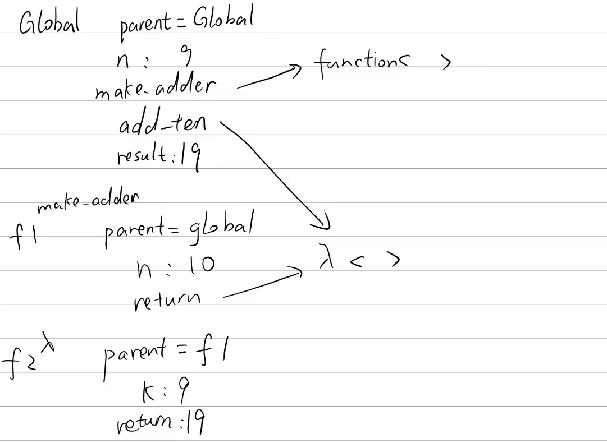
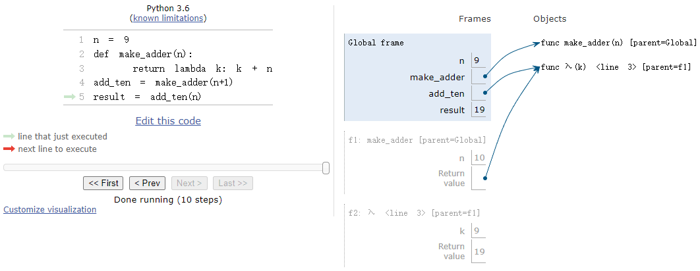
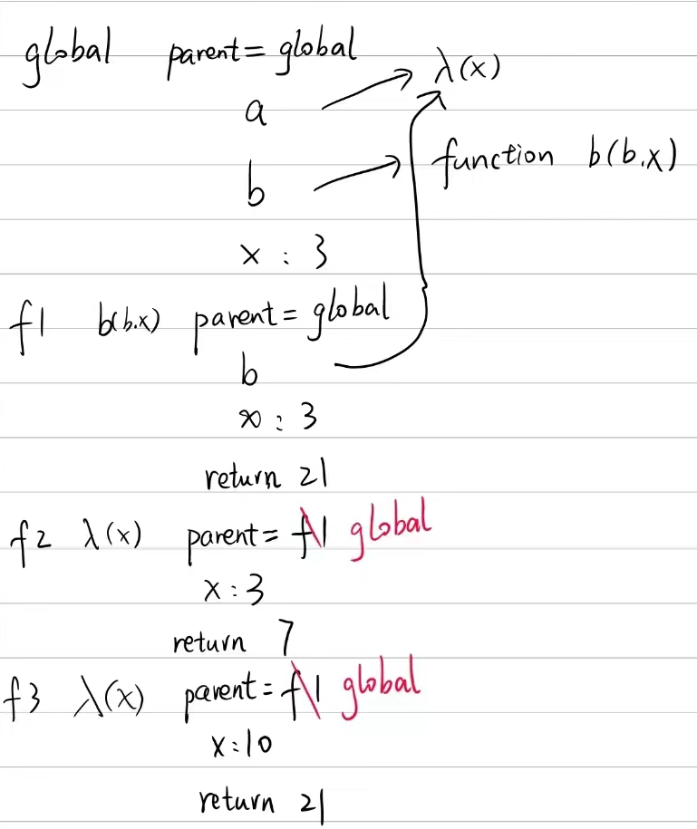
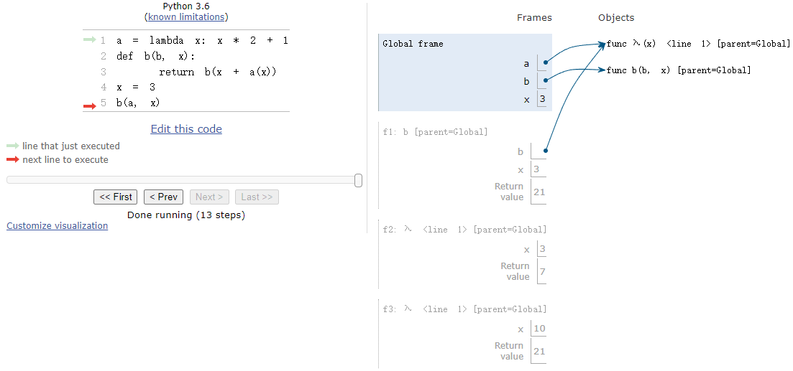

# Lab 2: Higher-Order Functions, Lambda Expressions

实验链接：[Lab 2: Higher-Order Functions, Lambda Expressions](https://inst.eecs.berkeley.edu/~cs61a/sp21/lab/lab02/)

如何下载实验压缩包：

```shell
wget https://inst.eecs.berkeley.edu/~cs61a/sp21/lab/lab02/lab02.zip
```

## What Would Python Display?

### Q1: WWPD: Lambda the Free

输入以下命令进行测试：

如果结果是函数，就输入`Function`，如果是错误就输入`Error`，如果没有输出就输入`Nothing`。

```shell
python3 ok -q lambda -u --local
```

过程如下：

```shell
=====================================================================
Assignment: Lab 2
OK, version v1.18.1
=====================================================================

~~~~~~~~~~~~~~~~~~~~~~~~~~~~~~~~~~~~~~~~~~~~~~~~~~~~~~~~~~~~~~~~~~~~~
Unlocking tests

At each "? ", type what you would expect the output to be.
Type exit() to quit

---------------------------------------------------------------------
Lambda the Free > Suite 1 > Case 1
(cases remaining: 7)

Q: Which of the following statements describes a difference between a def statement and a lambda expression?
Choose the number of the correct choice:
0) A def statement can only have one line in its body.
1) A lambda expression cannot have more than two parameters.
2) A lambda expression does not automatically bind the function object that it returns to any name.
3) A lambda expression cannot return another function.
? 2
-- OK! --

---------------------------------------------------------------------
Lambda the Free > Suite 1 > Case 2
(cases remaining: 6)

Q: How many parameters does the following lambda expression have?
lambda a, b: c + d
Choose the number of the correct choice:
0) Not enough information
1) two
2) three
3) one
? 1
-- OK! --

---------------------------------------------------------------------
Lambda the Free > Suite 1 > Case 3
(cases remaining: 5)

Q: When is the return expression of a lambda expression executed?
Choose the number of the correct choice:
0) When the lambda expression is evaluated.
1) When you pass the lambda expression into another function.
2) When the function returned by the lambda expression is called.
3) When you assign the lambda expression to a name.
? 0
-- Not quite. Try again! --

Choose the number of the correct choice:
0) When the lambda expression is evaluated.
1) When you pass the lambda expression into another function.
2) When the function returned by the lambda expression is called.
3) When you assign the lambda expression to a name.
? 2
-- OK! --

---------------------------------------------------------------------
Lambda the Free > Suite 2 > Case 1
(cases remaining: 4)

What would Python display? If you get stuck, try it out in the Python
interpreter!

>>> # If Python displays <function...>, type Function, if it errors type Error, if it displays nothing type Nothing
>>> lambda x: x  # A lambda expression with one parameter x
? Function
-- OK! --

>>> a = lambda x: x  # Assigning a lambda function to the name a
>>> a(5)
? 5
-- OK! --

>>> (lambda: 3)()  # Using a lambda expression as an operator in a call exp.
? 3
-- OK! --

>>> b = lambda x: lambda: x  # Lambdas can return other lambdas!
>>> c = b(88)
>>> c
? Function
-- OK! --

>>> c()
? 88
-- OK! --

>>> d = lambda f: f(4)  # They can have functions as arguments as well
>>> def square(x):
...     return x * x
>>> d(square)
? 16
-- OK! --

---------------------------------------------------------------------
Lambda the Free > Suite 2 > Case 2
(cases remaining: 3)

What would Python display? If you get stuck, try it out in the Python
interpreter!

>>> x = None # remember to review the rules of WWPD given above!
>>> x
>>> lambda x: x
? Function
-- OK! --

---------------------------------------------------------------------
Lambda the Free > Suite 2 > Case 3
(cases remaining: 2)

What would Python display? If you get stuck, try it out in the Python
interpreter!

>>> #
>>> # Pay attention to the scope of variables
>>> z = 3
>>> e = lambda x: lambda y: lambda: x + y + z
>>> e(0)(1)()
? 4
-- OK! --

>>> f = lambda z: x + z
>>> f(3)
? Error
-- OK! --

---------------------------------------------------------------------
Lambda the Free > Suite 2 > Case 4
(cases remaining: 1)

What would Python display? If you get stuck, try it out in the Python
interpreter!

>>> # Try drawing an environment diagram if you get stuck!
>>> higher_order_lambda = lambda f: lambda x: f(x)
>>> g = lambda x: x * x
>>> higher_order_lambda(2)(g) # Which argument belongs to which function call?
? Error
-- OK! --

>>> higher_order_lambda(g)(2)
? 4
-- OK! --

>>> call_thrice = lambda f: lambda x: f(f(f(x)))
>>> call_thrice(lambda y: y + 1)(0)
? 3
-- OK! --

>>> print_lambda = lambda z: print(z)
>>> print_lambda
? Function
-- OK! --

>>> one_thousand = print_lambda(1000)
? 1000
-- OK! --

>>> one_thousand
? None
-- Not quite. Try again! --

? Nothing
-- OK! --

---------------------------------------------------------------------
OK! All cases for Lambda the Free unlocked.

Cannot backup when running ok with --local.
```

### Q2: WWPD: Higher Order Functions

输入以下命令进行测试：

```shell
python3 ok -q hof-wwpd -u --local
```

如果结果是函数，就输入`Function`，如果是错误就输入`Error`，如果没有输出就输入`Nothing`。

过程如下：

```shell
=====================================================================
Assignment: Lab 2
OK, version v1.18.1
=====================================================================

~~~~~~~~~~~~~~~~~~~~~~~~~~~~~~~~~~~~~~~~~~~~~~~~~~~~~~~~~~~~~~~~~~~~~
Unlocking tests

At each "? ", type what you would expect the output to be.
Type exit() to quit

---------------------------------------------------------------------
Higher Order Functions > Suite 1 > Case 1
(cases remaining: 2)

What would Python display? If you get stuck, try it out in the Python
interpreter!

>>> def even(f):
...     def odd(x):
...         if x < 0:
...             return f(-x)
...         return f(x)
...     return odd
>>> steven = lambda x: x
>>> stewart = even(steven)
>>> stewart
? Function
-- OK! --

>>> stewart(61)
? 61
-- OK! --

>>> stewart(-4)
? 4
-- OK! --

---------------------------------------------------------------------
Higher Order Functions > Suite 1 > Case 2
(cases remaining: 1)

What would Python display? If you get stuck, try it out in the Python
interpreter!

>>> def cake():
...    print('beets')
...    def pie():
...        print('sweets')
...        return 'cake'
...    return pie
>>> chocolate = cake()
? beets
-- OK! --

>>> chocolate
? Function
-- OK! --

>>> chocolate()
(line 1)? sweets
(line 2)? 'cake'
-- OK! --

>>> more_chocolate, more_cake = chocolate(), cake
? sweets
-- OK! --

>>> more_chocolate
? 'cake'
-- OK! --

>>> def snake(x, y):
...    if cake == more_cake:
...        return chocolate
...    else:
...        return x + y
>>> snake(10, 20)
? 30
-- Not quite. Try again! --

? Function
-- OK! --

>>> snake(10, 20)()
(line 1)? sweets
(line 2)? 'cake'
-- OK! --

>>> cake = 'cake'
>>> snake(10, 20)
? 30
-- OK! --

---------------------------------------------------------------------
OK! All cases for Higher Order Functions unlocked.

Cannot backup when running ok with --local.
```

## Coding Practice

### Q3: Lambdas and Currying

实现`lambda_curry2(func)`函数，返回一个可以接收一个参数`x`的函数`f`，`f`也是一个可以接收一个参数`y`的函数`g`，最后返回`func(x, y)`。

实现代码如下：

```python
def lambda_curry2(func):
    """
    Returns a Curried version of a two-argument function FUNC.
    >>> from operator import add, mul, mod
    >>> curried_add = lambda_curry2(add)
    >>> add_three = curried_add(3)
    >>> add_three(5)
    8
    >>> curried_mul = lambda_curry2(mul)
    >>> mul_5 = curried_mul(5)
    >>> mul_5(42)
    210
    >>> lambda_curry2(mod)(123)(10)
    3
    """
    "*** YOUR CODE HERE ***"
    return lambda x: lambda y: func(x, y)
```

### Q4: Count van Count

阅读`count_factors(n)`和`count_primes(n)`函数，对其进行泛化，实现一个`count_cond(condition)`函数，返回一个可以接收参数`n`的函数，调用时，能够完成上述两个函数的功能。

```python
def count_factors(n):
    """Return the number of positive factors that n has.
    >>> count_factors(6)
    4   # 1, 2, 3, 6
    >>> count_factors(4)
    3   # 1, 2, 4
    """
    i = 1
    count = 0
    while i <= n:
        if n % i == 0:
            count += 1
        i += 1
    return count

def count_primes(n):
    """Return the number of prime numbers up to and including n.
    >>> count_primes(6)
    3   # 2, 3, 5
    >>> count_primes(13)
    6   # 2, 3, 5, 7, 11, 13
    """
    i = 1
    count = 0
    while i <= n:
        if is_prime(i):
            count += 1
        i += 1
    return count

def is_prime(n):
    return count_factors(n) == 2 # only factors are 1 and n
```

实现代码如下：

```python
def count_cond(condition):
    """Returns a function with one parameter N that counts all the numbers from
    1 to N that satisfy the two-argument predicate function Condition, where
    the first argument for Condition is N and the second argument is the
    number from 1 to N.

    >>> count_factors = count_cond(lambda n, i: n % i == 0)
    >>> count_factors(2)   # 1, 2
    2
    >>> count_factors(4)   # 1, 2, 4
    3
    >>> count_factors(12)  # 1, 2, 3, 4, 6, 12
    6

    >>> is_prime = lambda n, i: count_factors(i) == 2
    >>> count_primes = count_cond(is_prime)
    >>> count_primes(2)    # 2
    1
    >>> count_primes(3)    # 2, 3
    2
    >>> count_primes(4)    # 2, 3
    2
    >>> count_primes(5)    # 2, 3, 5
    3
    >>> count_primes(20)   # 2, 3, 5, 7, 11, 13, 17, 19
    8
    """
    "*** YOUR CODE HERE ***"
    def func(n):
        i = 1
        count = 0
        while i <= n:
            if condition(n ,i):
                count += 1
            i += 1
        return count
    return func
```

使用如下命令进行测试：

```shell
python3 ok --local
```

结果如下：

```shell
=====================================================================
Assignment: Lab 2
OK, version v1.18.1
=====================================================================

~~~~~~~~~~~~~~~~~~~~~~~~~~~~~~~~~~~~~~~~~~~~~~~~~~~~~~~~~~~~~~~~~~~~~
Running tests

---------------------------------------------------------------------
Test summary
    11 test cases passed! No cases failed.

Cannot backup when running ok with --local.
```

## Environment Diagram Practice

这部分就是看代码画环境图，在用`PythonTutor`检查结果。

### Q5: Make Adder

根据以下代码画出环境图：

```python
n = 9
def make_adder(n):
    return lambda k: k + n
add_ten = make_adder(n+1)
result = add_ten(n)
```

并回答问题：

> There are 3 frames total (including the Global frame). In addition, consider the following questions:
>
> 1. In the Global frame, the name `add_ten` points to a function object. What is the intrinsic name of that function object, and what frame is its parent?
> 2. What name is frame `f2` labeled with (`add_ten` or λ)? Which frame is the parent of `f2`?
> 3. What value is the variable `result` bound to in the Global frame?

答案：

> 1. The intrinsic name of the function object that `add_ten` points to is λ (specifically, the lambda whose parameter is `k`). The parent frame of this lambda is `f1`.
> 2. `f2` is labeled with the name λ. The parent frame of `f2` is `f1`, since that is where λ is defined.
> 3. The variable `result` is bound to 19.

我画的环境图：



在[Pythontutor](https://pythontutor.com/cp/composingprograms.html#code=n%20%3D%209%0Adef%20make_adder%28n%29%3A%0A%20%20%20%20return%20lambda%20k%3A%20k%20%2B%20n%0Aadd_ten%20%3D%20make_adder%28n%2B1%29%0Aresult%20%3D%20add_ten%28n%29&cumulative=true&curInstr=10&mode=display&origin=composingprograms.js&py=3&rawInputLstJSON=%5B%5D)中：



### Q6: Lambda the Environment Diagram

根据以下代码画出环境图：

```python
>>> a = lambda x: x * 2 + 1
>>> def b(b, x):
...     return b(x + a(x))
>>> x = 3
>>> b(a, x)
```

我画的环境图：



在[Python tutor](https://pythontutor.com/cp/composingprograms.html#code=a%20%3D%20lambda%20x%3A%20x%20*%202%20%2B%201%0Adef%20b%28b,%20x%29%3A%0A%20%20%20%20return%20b%28x%20%2B%20a%28x%29%29%0Ax%20%3D%203%0Ab%28a,%20x%29&cumulative=true&curInstr=13&mode=display&origin=composingprograms.js&py=3&rawInputLstJSON=%5B%5D)中：



## Optional Questions

### Q7: Composite Identity Function

实现一个`composite_identity(f, g)`函数，返回一个接收一个参数`x`的函数`func`。当`f(g(x) == g(f(x))`时，`func`返回`True`，否则返回`False`。

题目已经定义好了`compose1(f, g)`函数：

```python
def compose1(f, g):
    """Return the composition function which given x, computes f(g(x)).

    >>> add_one = lambda x: x + 1        # adds one to x
    >>> square = lambda x: x**2
    >>> a1 = compose1(square, add_one)   # (x + 1)^2
    >>> a1(4)
    25
    >>> mul_three = lambda x: x * 3      # multiplies 3 to x
    >>> a2 = compose1(mul_three, a1)    # ((x + 1)^2) * 3
    >>> a2(4)
    75
    >>> a2(5)
    108
    """
    return lambda x: f(g(x))
```

实现代码如下：

```python
def composite_identity(f, g):
    """
    Return a function with one parameter x that returns True if f(g(x)) is
    equal to g(f(x)). You can assume the result of g(x) is a valid input for f
    and vice versa.

    >>> add_one = lambda x: x + 1        # adds one to x
    >>> square = lambda x: x**2
    >>> b1 = composite_identity(square, add_one)
    >>> b1(0)                            # (0 + 1)^2 == 0^2 + 1
    True
    >>> b1(4)                            # (4 + 1)^2 != 4^2 + 1
    False
    """
    "*** YOUR CODE HERE ***"
    def func(x):
        return compose1(f, g)(x) == compose1(g, f)(x)
    return func
```

使用以下命令可以进行测试：

```shell
python3 ok -q composite_identity --local
```

结果如下：

```shell
=====================================================================
Assignment: Lab 2
OK, version v1.18.1
=====================================================================

~~~~~~~~~~~~~~~~~~~~~~~~~~~~~~~~~~~~~~~~~~~~~~~~~~~~~~~~~~~~~~~~~~~~~
Running tests

---------------------------------------------------------------------
Test summary
    1 test cases passed! No cases failed.

Cannot backup when running ok with --local.
```

### Q8: I Heard You Liked Functions...

实现一个函数`cycle(f1, f2, f3)`，返回一个接收参数`n`的函数`my_cycle`，`my_cycle(x)`函数接收一个参数`x`，循环调用`f1`、`f2`、`f3`作用于`x`上。

实现代码如下：

```python
def cycle(f1, f2, f3):
    """Returns a function that is itself a higher-order function.

    >>> def add1(x):
    ...     return x + 1
    >>> def times2(x):
    ...     return x * 2
    >>> def add3(x):
    ...     return x + 3
    >>> my_cycle = cycle(add1, times2, add3)
    >>> identity = my_cycle(0)
    >>> identity(5)
    5
    >>> add_one_then_double = my_cycle(2)
    >>> add_one_then_double(1)
    4
    >>> do_all_functions = my_cycle(3)
    >>> do_all_functions(2)
    9
    >>> do_more_than_a_cycle = my_cycle(4)
    >>> do_more_than_a_cycle(2)
    10
    >>> do_two_cycles = my_cycle(6)
    >>> do_two_cycles(1)
    19
    """
    "*** YOUR CODE HERE ***"
    def my_cycle(n):
        def func(x):
            if n == 0:
                return x
            elif n == 1:
                return f1(x)
            elif n == 2:
                return f2(f1(x))
            elif n == 3:
                return f3(f2(f1(x)))
            elif n % 3 == 1:
                return f1(my_cycle(n - 1)(x))
            elif n % 3 == 2:
                return f2(f1(my_cycle(n - 2)(x)))
            elif n % 3 == 0:
                return f3(f2(f1(my_cycle(n - 3)(x))))
        return func
    
    return my_cycle
```

使用以下命令可以进行测试：

```shell
python3 ok -q cycle --local
```

结果如下：

```shell
=====================================================================
Assignment: Lab 2
OK, version v1.18.1
=====================================================================

~~~~~~~~~~~~~~~~~~~~~~~~~~~~~~~~~~~~~~~~~~~~~~~~~~~~~~~~~~~~~~~~~~~~~
Running tests

---------------------------------------------------------------------
Test summary
    1 test cases passed! No cases failed.

Cannot backup when running ok with --local.
```

