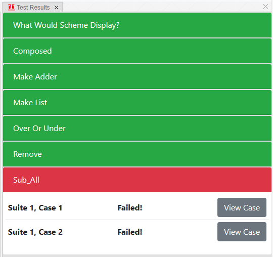

[TOC]

# Lab 10: Scheme

实验链接：[Lab 10: Scheme](https://inst.eecs.berkeley.edu/~cs61a/sp21/lab/lab10/)

一个有趣的四则漫画，介绍了`scheme`的特性(年龄久，括号特别多)：[Lisp Cycles](https://xkcd.com/297/)

`lisp`的列表的首元素是`car`(相当于`Python`的`first`)，次元素是`cdr`(相当于`Python`的`rest`)。

关于这两个"奇怪的"名字：[CAR and CDR](https://en.wikipedia.org/wiki/CAR_and_CDR)

如何下载实验压缩包：

```shell
wget https://inst.eecs.berkeley.edu/~cs61a/sp21/lab/lab10/lab10.zip
```

## 配置环境

在华为云上放行端口`31415`，服务器的防火墙也要放行。

```shell
sudo firewall-cmd --zone=public --add-port=31415/tcp --permanent
```

```shell
sudo firewall-cmd --query-port=31415/tcp
```

```shell
sudo firewall-cmd --reload
```

运行以下命令和`scheme`进行交互(和`python`一样)：

```shell
python3 scheme
```

运行以下命令打开`scheme`编辑器：

```shell
python3 editor/
```

## What Would Scheme Display?

### Q1: Combinations

使用如下命令进行测试：

```shell
python3 python3 ok -q combinations -u --local
```

测试过程如下：

```shell
=====================================================================
Assignment: Lab 10
OK, version v1.18.1
=====================================================================

~~~~~~~~~~~~~~~~~~~~~~~~~~~~~~~~~~~~~~~~~~~~~~~~~~~~~~~~~~~~~~~~~~~~~
Unlocking tests

At each "? ", type what you would expect the output to be.
Type exit() to quit

---------------------------------------------------------------------
What Would Scheme Display? > Suite 1 > Case 1
(cases remaining: 4)


scm> (- 10 4)
? 6
-- OK! --

scm> (* 7 6)
? 42
-- OK! --

scm> (+ 1 2 3 4)
? 10
-- OK! --

scm> (/ 8 2 2)
? 2
-- OK! --

scm> (quotient 29 5)
? 4
-- Not quite. Try again! --

? 5
-- OK! --

scm> (modulo 29 5)
? 4
-- OK! --

---------------------------------------------------------------------
What Would Scheme Display? > Suite 1 > Case 2
(cases remaining: 3)


scm> (= 1 3)                    ; Scheme uses '=' instead of '==' for comparison
? 4f
-- Not quite. Try again! --

? #f
-- OK! --

scm> (< 1 3)
? #t
-- OK! --

scm> (or #t #f)                 ; or special form short circuits
? #t
-- OK! --

scm> (and #t #f (/ 1 0))
? #f
-- OK! --

scm> (not #t)
? #f
-- OK! --

---------------------------------------------------------------------
What Would Scheme Display? > Suite 1 > Case 3
(cases remaining: 2)


scm> (define x 3)
? x
-- OK! --

scm> x
? 3
-- OK! --

scm> (define y (+ x 4))
? y
-- OK! --

scm> y
? 7
-- OK! --

scm> (define x (lambda (y) (* y 2)))
? x
-- OK! --

scm> (x y)
? 49
-- Not quite. Try again! --

? 14
-- OK! --

---------------------------------------------------------------------
What Would Scheme Display? > Suite 1 > Case 4
(cases remaining: 1)


scm> (if (print 1) (print 2) (print 3))
(line 1)? 1
(line 2)? 2
-- OK! --

scm> (* (if (> 3 2) 1 2) (+ 4 5))
? 9
-- OK! --

scm> (define foo (lambda (x y z) (if x y z)))
? foo
-- OK! --

scm> (foo 1 2 (print 'hi))
(line 1)? 2
-- Not quite. Try again! --

(line 1)? hi
(line 2)? 2
-- OK! --

scm> ((lambda (a) (print 'a)) 100)
? 100
-- Not quite. Try again! --

? a
-- OK! --

---------------------------------------------------------------------
OK! All cases for What Would Scheme Display? unlocked.

Cannot backup when running ok with --local.
```

## Coding Questions

### Q2: Over or Under

使用如下命令进行测试：

```shell
python3 python3 ok -q combinations -u --local
```

测试过程如下：

```shell
=====================================================================
Assignment: Lab 10
OK, version v1.18.1
=====================================================================

~~~~~~~~~~~~~~~~~~~~~~~~~~~~~~~~~~~~~~~~~~~~~~~~~~~~~~~~~~~~~~~~~~~~~
Unlocking tests

At each "? ", type what you would expect the output to be.
Type exit() to quit

---------------------------------------------------------------------
over-or-under > Suite 1 > Case 1
(cases remaining: 3)

scm> (load-all ".")
scm> (over-or-under 5 5)
? 0
-- OK! --

---------------------------------------------------------------------
over-or-under > Suite 1 > Case 2
(cases remaining: 2)

scm> (load-all ".")
scm> (over-or-under 5 4)
? 1
-- OK! --

---------------------------------------------------------------------
over-or-under > Suite 1 > Case 3
(cases remaining: 1)

scm> (load-all ".")
scm> (over-or-under 3 5)
? -1
-- OK! --

---------------------------------------------------------------------
OK! All cases for over-or-under unlocked.

Cannot backup when running ok with --local.
```

实现如下：

```scheme
(define (over-or-under num1 num2) 
    (cond
        ((< num1 num2) -1) 
        ((= num1 num2) 0) 
        (else 1)
    )
)


; ;; Tests
(over-or-under 1 2)

; expect -1
(over-or-under 2 1)

; expect 1
(over-or-under 1 1)

; expect 0
```

### Q3: Make Adder

使用如下命令进行测试：

```shell
python3 ok -q make_adder -u --local
```

测试过程如下：

```shell
=====================================================================
Assignment: Lab 10
OK, version v1.18.1
=====================================================================

~~~~~~~~~~~~~~~~~~~~~~~~~~~~~~~~~~~~~~~~~~~~~~~~~~~~~~~~~~~~~~~~~~~~~
Unlocking tests

At each "? ", type what you would expect the output to be.
Type exit() to quit

---------------------------------------------------------------------
make-adder > Suite 1 > Case 1
(cases remaining: 4)

scm> (load-all ".")
scm> (define add-two (make-adder 2))
scm> (define add-three (make-adder 3))
scm> (add-two 2)
? 4
-- OK! --

---------------------------------------------------------------------
make-adder > Suite 1 > Case 2
(cases remaining: 3)

scm> (load-all ".")
scm> (define add-two (make-adder 2))
scm> (define add-three (make-adder 3))
scm> (add-two 3)
? 5
-- OK! --

---------------------------------------------------------------------
make-adder > Suite 1 > Case 3
(cases remaining: 2)

scm> (load-all ".")
scm> (define add-two (make-adder 2))
scm> (define add-three (make-adder 3))
scm> (add-three 3)
? 6
-- OK! --

---------------------------------------------------------------------
make-adder > Suite 1 > Case 4
(cases remaining: 1)

scm> (load-all ".")
scm> (define add-two (make-adder 2))
scm> (define add-three (make-adder 3))
scm> (add-three 9)
? 12
-- OK! --

---------------------------------------------------------------------
OK! All cases for make-adder unlocked.

Cannot backup when running ok with --local.
```

实现如下(使用`lambda`)：

```scheme
(define (make-adder num) 
    (lambda (inc)
        (+ num inc)
    )
)

; ;; Tests
(define adder (make-adder 5))

(adder 8)

; expect 13
```

实现如下(使用`define`)：

```scheme
(define (make-adder num) 
    (define (foo inc) 
        (+ num inc)
    )
    foo
)

; ;; Tests
(define adder (make-adder 5))

(adder 8)

; expect 13
```

### Q4: Compose

使用如下命令进行测试：

```shell
python3 ok -q composed -u --local
```

测试过程如下：

```shell
=====================================================================
Assignment: Lab 10
OK, version v1.18.1
=====================================================================

~~~~~~~~~~~~~~~~~~~~~~~~~~~~~~~~~~~~~~~~~~~~~~~~~~~~~~~~~~~~~~~~~~~~~
Unlocking tests

At each "? ", type what you would expect the output to be.
Type exit() to quit

---------------------------------------------------------------------
composed > Suite 1 > Case 1
(cases remaining: 7)

scm> (load-all ".")
scm> (define (add-one a) (+ a 1))
scm> (define (multiply-by-two a) (* a 2))
scm> ((composed add-one add-one) 2)
? 4
-- OK! --

---------------------------------------------------------------------
composed > Suite 1 > Case 2
(cases remaining: 6)

scm> (load-all ".")
scm> (define (add-one a) (+ a 1))
scm> (define (multiply-by-two a) (* a 2))
scm> ((composed multiply-by-two multiply-by-two) 2)
? 8
-- OK! --

---------------------------------------------------------------------
composed > Suite 1 > Case 3
(cases remaining: 5)

scm> (load-all ".")
scm> (define (add-one a) (+ a 1))
scm> (define (multiply-by-two a) (* a 2))
scm> ((composed add-one multiply-by-two) 2)
? 5
-- OK! --

---------------------------------------------------------------------
composed > Suite 1 > Case 4
(cases remaining: 4)

scm> (load-all ".")
scm> (define (add-one a) (+ a 1))
scm> (define (multiply-by-two a) (* a 2))
scm> ((composed multiply-by-two add-one) 2)
? 6
-- OK! --

---------------------------------------------------------------------
composed > Suite 1 > Case 5
(cases remaining: 3)

scm> (load-all ".")
scm> (define (add-one a) (+ a 1))
scm> (define (multiply-by-two a) (* a 2))
scm> ((composed (composed add-one add-one) add-one) 2)
? 5
-- OK! --

---------------------------------------------------------------------
composed > Suite 1 > Case 6
(cases remaining: 2)

scm> (load-all ".")
scm> (define (add-one a) (+ a 1))
scm> (define (multiply-by-two a) (* a 2))
scm> ((composed (composed add-one add-one) multiply-by-two) 2)
? 6
-- OK! --

---------------------------------------------------------------------
composed > Suite 1 > Case 7
(cases remaining: 1)

scm> (load-all ".")
scm> (define (add-one a) (+ a 1))
scm> (define (multiply-by-two a) (* a 2))
scm> ((composed multiply-by-two (composed add-one add-one)) 2)
? 8
-- OK! --

---------------------------------------------------------------------
OK! All cases for composed unlocked.

Cannot backup when running ok with --local.
```

实现如下：

```scheme
(define (composed f g) 
    (lambda (x)
        (f (g x))
    )
)
```

## 必做题测试

使用如下代码对上述问题进行测试：

```shell
python3 ok --score --local
```

结果如下：

```shell
=====================================================================
Assignment: Lab 10
OK, version v1.18.1
=====================================================================

~~~~~~~~~~~~~~~~~~~~~~~~~~~~~~~~~~~~~~~~~~~~~~~~~~~~~~~~~~~~~~~~~~~~~
Scoring tests

---------------------------------------------------------------------
What Would Scheme Display?
    Passed: 1
    Failed: 0
[ooooooooook] 100.0% passed

---------------------------------------------------------------------
over-or-under
    Passed: 1
    Failed: 0
[ooooooooook] 100.0% passed

---------------------------------------------------------------------
make-adder
    Passed: 1
    Failed: 0
[ooooooooook] 100.0% passed

---------------------------------------------------------------------
composed
    Passed: 1
    Failed: 0
[ooooooooook] 100.0% passed

---------------------------------------------------------------------
Point breakdown
    What Would Scheme Display?: 1.0/1
    over-or-under: 1.0/1
    make-adder: 1.0/1
    composed: 1.0/1

Score:
    Total: 4.0

Cannot backup when running ok with --local.
```

## Optional Questions

### Q5: Make a List

使用如下命令进行测试：

```shell
python3 ok -q make_structure -u --local
```

测试过程如下：

```shell
=====================================================================
Assignment: Lab 10
OK, version v1.18.1
=====================================================================

~~~~~~~~~~~~~~~~~~~~~~~~~~~~~~~~~~~~~~~~~~~~~~~~~~~~~~~~~~~~~~~~~~~~~
Unlocking tests

At each "? ", type what you would expect the output to be.
Type exit() to quit

---------------------------------------------------------------------
make-list > Suite 1 > Case 1
(cases remaining: 2)

scm> (load-all ".")
scm> (define a '(1))
? a
-- OK! --

scm> a
? (1)
-- OK! --

scm> (define b (cons 2 a))
? b
-- OK! --

scm> b
? (2 1)
-- OK! --

scm> (define c (list 3 b))
? c
-- OK! --

scm> c
? (3 2 1)
-- Not quite. Try again! --

? (3 (2 1))
-- OK! --

scm> (car c)
? 3
-- OK! --

scm> (cdr c)
? (2 1)
-- Not quite. Try again! --

? ((2 1))
-- OK! --

scm> (car (car (cdr c)))
? 2
-- OK! --

scm> (cdr (car (cdr c)))
? (1)
-- OK! --

---------------------------------------------------------------------
make-list > Suite 1 > Case 2
(cases remaining: 1)

scm> (load-all ".")
scm> lst  ; type out exactly how Scheme would print the list
? ((1) 2 (3 4) 5)
-- OK! --

---------------------------------------------------------------------
OK! All cases for make-list unlocked.

Cannot backup when running ok with --local.
```

实现如下：

```scheme
(define lst 
    (cons 
        (cons 1 nil)
        (cons 2
            (cons
                (cons 3 
                    (cons 4 nil)
                )
                (cons 5 nil)
            )
        )
    )
)
```

### Q6: Remove

使用如下命令进行测试：

```shell
python3 ok -q remove -u --local
```

测试过程如下：

```shell
=====================================================================
Assignment: Lab 10
OK, version v1.18.1
=====================================================================

~~~~~~~~~~~~~~~~~~~~~~~~~~~~~~~~~~~~~~~~~~~~~~~~~~~~~~~~~~~~~~~~~~~~~
Unlocking tests

At each "? ", type what you would expect the output to be.
Type exit() to quit

---------------------------------------------------------------------
remove > Suite 1 > Case 1
(cases remaining: 5)

scm> (load-all ".")
scm> (remove 3 nil)
? ()
-- OK! --

---------------------------------------------------------------------
remove > Suite 1 > Case 2
(cases remaining: 4)

scm> (load-all ".")
scm> (remove 2 '(1 3 2))
? (1 3)
-- OK! --

---------------------------------------------------------------------
remove > Suite 1 > Case 3
(cases remaining: 3)

scm> (load-all ".")
scm> (remove 1 '(1 3 2))
? (3 2)
-- OK! --

---------------------------------------------------------------------
remove > Suite 1 > Case 4
(cases remaining: 2)

scm> (load-all ".")
scm> (remove 42 '(1 3 2))
? (1 3 2)
-- OK! --

---------------------------------------------------------------------
remove > Suite 1 > Case 5
(cases remaining: 1)

scm> (load-all ".")
scm> (remove 3 '(1 3 3 7))
? (1 7)
-- OK! --

---------------------------------------------------------------------
OK! All cases for remove unlocked.

Cannot backup when running ok with --local.
```

实现如下：

```scheme
(define (neq item)
    (lambda (x)
        (not (= item x))
    )
)

(define (remove item lst) 
    (filter (neq item) lst)
)
```

递归做法：

```scheme
(define (remove item list)
    (cond
        ((eq? list nil) nil)
        ((not (= (car list) item)) (cons (car list) (remove item (cdr list))))
        (else (remove item (cdr list)))
    )
)
```

## 最终测试



### 关于`Sub All`

原本是`20sp`中`Lab09`的题目，`20fa`的实验与`21sp`相同，该题测试文件疑似未被移除。

详见：[Lab 9: Scheme](https://inst.eecs.berkeley.edu/~cs61a/sp20/lab/lab09/#q10)

使用如下命令进行测试：

```shell
python3 ok -q sub_all -u --local
```

测试过程如下：

```shell
=====================================================================
Assignment: Lab 10
OK, version v1.18.1
=====================================================================

~~~~~~~~~~~~~~~~~~~~~~~~~~~~~~~~~~~~~~~~~~~~~~~~~~~~~~~~~~~~~~~~~~~~~
Unlocking tests

At each "? ", type what you would expect the output to be.
Type exit() to quit

---------------------------------------------------------------------
sub_all > Suite 1 > Case 1
(cases remaining: 2)

scm> (load-all ".")
scm> (sub-all '(go ((bears))) '(go bears) '(big game))
? (big ((game))
-- Not quite. Try again! --

? (big ((game)))
-- OK! --

---------------------------------------------------------------------
sub_all > Suite 1 > Case 2
(cases remaining: 1)

-- Already unlocked --

---------------------------------------------------------------------
OK! All cases for sub_all unlocked.

Cannot backup when running ok with --local.
```

