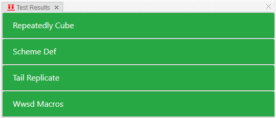

[TOC]

# Lab 12: Tail Recursion, Scheme

实验链接：[Lab 12: Tail Recursion, Scheme](https://inst.eecs.berkeley.edu/~cs61a/sp21/lab/lab12/)

如何下载实验压缩包：

```shell
wget https://inst.eecs.berkeley.edu/~cs61a/sp21/lab/lab12/lab12.zip
```

## Q1: WWSD: Macros

使用如下命令进行测试：

```shell
python3 ok -q wwsd-macros -u --local
```

测试过程如下：

```shell
=====================================================================
Assignment: Lab 12
OK, version v1.18.1
=====================================================================

~~~~~~~~~~~~~~~~~~~~~~~~~~~~~~~~~~~~~~~~~~~~~~~~~~~~~~~~~~~~~~~~~~~~~
Unlocking tests

At each "? ", type what you would expect the output to be.
Type exit() to quit

---------------------------------------------------------------------
wwsd-macros > Suite 1 > Case 1
(cases remaining: 3)


scm> +
? #[+]
-- OK! --

scm> list
? #[list]
-- OK! --

scm> (define-macro (f x) (car x))
? f
-- OK! --

scm> (f (2 3 4)) ; type SchemeError for error, or Nothing for nothing
? 2
-- OK! --

scm> (f (+ 2 3))
? +
-- Not quite. Try again! --

? #[+]
-- OK! --

scm> (define x 2000)
? x
-- OK! --

scm> (f (x y z))
? 2000
-- OK! --

scm> (f (list 2 3 4))
? #[list]
-- OK! --

scm> (f (quote (2 3 4)))
? #[quote]
-- Not quite. Try again! --

? SchemeError
-- OK! --

scm> (define quote 7000)
? quote
-- OK! --

scm> (f (quote (2 3 4)))
? 7000
-- OK! --

---------------------------------------------------------------------
wwsd-macros > Suite 1 > Case 2
(cases remaining: 2)


scm> (define-macro (g x) (+ x 2))
? g
-- OK! --

scm> (g 2)
? 4
-- OK! --

scm> (g (+ 2 3))
? 7
-- Not quite. Try again! --

? SchemeError
-- OK! --

scm> (define-macro (h x) (list '+ x 2))
? h
-- OK! --

scm> (h (+ 2 3))
? 7
-- OK! --

---------------------------------------------------------------------
wwsd-macros > Suite 1 > Case 3
(cases remaining: 1)


scm> (define-macro (if-else-5 condition consequent) `(if ,condition ,consequent 5))
? if-else-5
-- OK! --

scm> (if-else-5 #t 2)
? 2
-- OK! --

scm> (if-else-5 #f 3)
? 5
-- OK! --

scm> (if-else-5 #t (/ 1 0))
? SchemeError
-- OK! --

scm> (if-else-5 #f (/ 1 0))
? 5
-- OK! --

scm> (if-else-5 (= 1 0) 2)
? 5
-- OK! --

---------------------------------------------------------------------
OK! All cases for wwsd-macros unlocked.

Cannot backup when running ok with --local.
```

## Q2: Replicate

实现如下(线性深度的递归，递归深度过大`RecursionError: maximum recursion depth exceeded in comparison`)：

```scheme
(define (tail-replicate x n)
  (cond 
    ((= n 0) nil)
    (else    (cons x (tail-replicate x (- n 1))))
  )
)
```

实现如下(对数深度的递归)：

```scheme
(define (tail-replicate x n)
    (define (tail-replicate1 x lst n) 
        (cond ((= n 0) nil)
            ((= n 1) lst)
            ((= (modulo n 2) 1) (append lst (tail-replicate1 x (append lst lst) (quotient n 2))))
            (else (tail-replicate1 x (append lst lst) (quotient n 2)))
        )
    )
    (tail-replicate1 x (cons x nil) n)
)
```

## Q3: Scheme def

实现如下：

```scheme
(define-macro (def func args body)
  `(define (,func ,@args) ,body)
)
```

## Q4: Repeatedly Cube

实现如下：

```scheme
(define (repeatedly-cube n x)
  (if (zero? n)
      x
      (let ((y (repeatedly-cube (- n 1) x))
           )
        (* y y y)
      )
  )
)
```

## 最终测试



可以使用如下命令进行测试：

```shell
python3 ok --score --local
```

结果如下：

```shell
=====================================================================
Assignment: Lab 12
OK, version v1.18.1
=====================================================================

~~~~~~~~~~~~~~~~~~~~~~~~~~~~~~~~~~~~~~~~~~~~~~~~~~~~~~~~~~~~~~~~~~~~~
Scoring tests

---------------------------------------------------------------------
wwsd-macros
    Passed: 0
    Failed: 0
[k..........] 0.0% passed

---------------------------------------------------------------------
tail replicate
    Passed: 1
    Failed: 0
[ooooooooook] 100.0% passed

---------------------------------------------------------------------
scheme-def
    Passed: 1
    Failed: 0
[ooooooooook] 100.0% passed

---------------------------------------------------------------------
repeatedly-cube
    Passed: 1
    Failed: 0
[ooooooooook] 100.0% passed

---------------------------------------------------------------------
Point breakdown
    wwsd-macros: 0.0/0
    tail replicate: 1.0/1
    scheme-def: 1.0/1
    repeatedly-cube: 1.0/1

Score:
    Total: 3.0

Cannot backup when running ok with --local.
```
