# Project 3: Ants Vs. SomeBees

`Project`地址：[Project 3: Ants Vs. SomeBees](https://inst.eecs.berkeley.edu/~cs61a/sp21/proj/ants/)

使用如下命令可以下载项目：

```shell
wget https://inst.eecs.berkeley.edu/~cs61a/sp21/proj/ants/ants.zip
```

`Optional Probelms`的`Problem 2`和`Problem 3`未完成，之后再填坑。

## The Game

### Core concepts

`The colony`：蚂蚁的`领地`，领地由若干`隧道`组成，蚂蚁从领地上获取食物。

`Places`：`区块`，隧道由若干区块连接组成。一个区块上只能放置一只蚂蚁，但可能有多个蜜蜂。

`The Hive`：蜂巢，蜜蜂产生的地方。

`Ants`：蚂蚁，玩家可以放置蚂蚁在`隧道`的某一个`区块`上，由两种基本的蜜蜂类型：

- `HarvesterAnt`：收割蚂蚁，没有攻击能力，负责从领地上收获食物。
- `ThrowerAnt`：投掷蚂蚁，能力是扔出树叶，攻击蜜蜂。

`Bees`：蜜蜂，玩家必须抵御蜜蜂的攻击。每个回合，如果某个蜜蜂前方的区块没有蚂蚁，蜜蜂就会前进一格，如果由蚂蚁，就会攻击该蚂蚁。如果某个隧道上，蜜蜂到达了最左边，游戏失败。

> **The Colony**. This is where the game takes place. The colony consists of several *places* that are chained together to form a tunnel where bees can travel through. The colony also has some quantity of food which can be expended in order to place an ant in a tunnel.
>
> **Places**. A place links to another place to form a tunnel. The player can place a single ant into each place. However, there can be many bees in a single place.
>
> **The Hive**. This is the place where bees originate. Bees exit the beehive to enter the ant colony.
>
> **Ants**. Players place an ant into the colony by selecting from the available ant types at the top of the screen. Each type of ant takes a different action and requires a different amount of colony food to place. The two most basic ant types are the `HarvesterAnt`, which adds one food to the colony during each turn, and the `ThrowerAnt`, which throws a leaf at a bee each turn. You will be implementing many more!
>
> **Bees**. In this game, bees are the antagonistic forces that the player must defend the ant colony from. Each turn, a bee either advances to the next place in the tunnel if no ant is in its way, or it stings the ant in its way. Bees win when at least one bee reaches the end of a tunnel.

### Core classes

> The concepts described above each have a corresponding class that encapsulates the logic for that concept. Here is a summary of the main classes involved in this game:
>
> - **`GameState`**: Represents the colony and some state information about the game, including how much food is available, how much time has elapsed, where the `AntHomeBase` is, and all the `Place`s in the game.
> - **`Place`**: Represents a single place that holds insects. At most one `Ant` can be in a single place, but there can be many `Bee`s in a single place. `Place` objects have an `exit` to the left and an `entrance` to the right, which are also places. Bees travel through a tunnel by moving to a `Place`'s `exit`.
> - **`Hive`**: Represents the place where `Bee`s start out (on the right of the tunnel).
> - **`AntHomeBase`**: Represents the place `Ant`s are defending (on the left of the tunnel). If Bees get here, they win :(
> - **`Insect`**: A superclass for `Ant` and `Bee`. All insects have `health` attribute, representing their remaining health, and a `place` attribute, representing the `Place` where they are currently located. Each turn, every active `Insect` in the game performs its `action`.
> - **`Ant`**: Represents ants. Each `Ant` subclass has special attributes or a special `action` that distinguish it from other `Ant` types. For example, a `HarvesterAnt` gets food for the colony and a `ThrowerAnt` attacks `Bee`s. Each ant type also has a `food_cost` attribute that indicates how much it costs to deploy one unit of that type of ant.
> - **`Bee`**: Represents bees. Each turn, a bee either moves to the `exit` of its current `Place` if the `Place` is not `blocked` by an ant, or stings the ant occupying its same `Place`.

### Game Layout

Below is a visualization of a GameState. As you work through the unlocking tests and problems, we recommend drawing out similar diagrams to help your understanding.

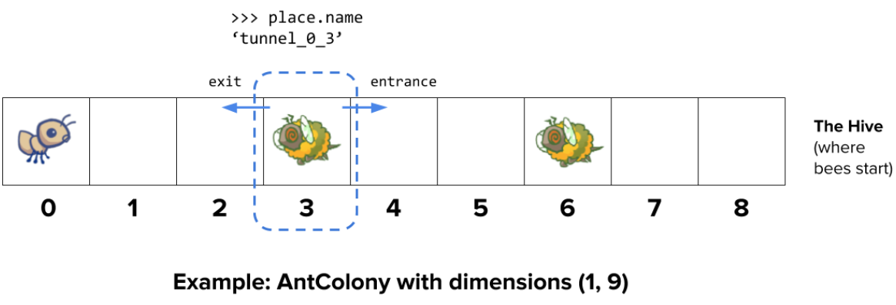

### Playing the game

游戏有两种运行模式：

- `text-based game`
- `using a graphical user interface (GUI)`

第一种主要用于`DEBUG`和开发，第二种提供图形界面，用于正常游玩。

分别运行以下两种命令：

```shell
python3 ants_text.py
```

```shell
python3 gui.py
```

最开始运行图形化界面时，`Python`报错，某个模块无法找到：

```python
Traceback (most recent call last):
  File "gui.py", line 6, in <module>
    import distutils.core
ModuleNotFoundError: No module named 'distutils.core'
```

**`解决方案`** ：

先确定`Python`版本：

```shell
python3 --version
```

获得版本号：

```shell
Python 3.8.10
```

安装对应版本的模块：

```python
sudo apt install python3.8-distutils
```

之后就成功运行了。

使用以下命令可以获取帮助：

```shell
python3 ants_text.py --help
```

输出如下：

```shell
usage: ants_text.py [-h] [-d DIFFICULTY] [-w] [--food FOOD]

Play Ants vs. SomeBees

optional arguments:
  -h, --help     show this help message and exit
  -d DIFFICULTY  sets difficulty of game (test/easy/normal/hard/extra-hard)
  -w, --water    loads a full layout with water
  --food FOOD    number of food to start with when testing
```

## Phase 1: Basic gameplay

本关主要是实现`HarvesterAnt`和`ThrowerAnt`类，以满足游戏的基本功能。

### Problem 0 (0 pt)

本题主要是帮助理解游戏规则，如果对有戏规则有疑问，可以先思考以下问题（在项目文档中都有答案）：

> 1. What is the significance of an Insect's `health` attribute? Does this value change? If so, how?
> 2. Which of the following is a class attribute of the `Insect` class?
> 3. Is the `health` attribute of the `Ant` class an instance attribute or class attribute? Why?
> 4. Is the `damage` attribute of an `Ant` subclass (such as `ThrowerAnt`) an instance attribute or class attribute? Why?
> 5. Which class do both `Ant` and `Bee` inherit from?
> 6. What do instances of `Ant` and instances of `Bee` have in common?
> 7. How many insects can be in a single `Place` at any given time (before Problem 8)?
> 8. What does a `Bee` do during one of its turns?
> 9. When is the game lost?

使用以下命令解锁本题：

```shell
python3 ok -q 00 -u --local
```

过程如下：

```shell
=====================================================================
Assignment: Project 3: Ants Vs. SomeBees
OK, version v1.18.1
=====================================================================

~~~~~~~~~~~~~~~~~~~~~~~~~~~~~~~~~~~~~~~~~~~~~~~~~~~~~~~~~~~~~~~~~~~~~
Unlocking tests

At each "? ", type what you would expect the output to be.
Type exit() to quit

---------------------------------------------------------------------
Problem 0 > Suite 1 > Case 1
(cases remaining: 9)

Q: What is the significance of an Insect's health attribute? Does this
value change? If so, how?
Choose the number of the correct choice:
0) It represents the strength of an insect against attacks, which
   doesn't change throughout the game
1) It represents the amount of health the insect has left, so the
   insect is eliminated when it reaches 0
2) It represents health protecting the insect, so the insect can only
   be damaged when its health reaches 0
? 1
-- OK! --

---------------------------------------------------------------------
Problem 0 > Suite 1 > Case 2
(cases remaining: 8)

Q: Which of the following is a class attribute of the Insect class?
Choose the number of the correct choice:
0) place
1) bees
2) health
3) damage
? 2
-- Not quite. Try again! --

Choose the number of the correct choice:
0) place
1) bees
2) health
3) damage
? 3
-- OK! --

---------------------------------------------------------------------
Problem 0 > Suite 1 > Case 3
(cases remaining: 7)

Q: Is the health attribute of the Ant class an instance attribute or class attribute? Why?
Choose the number of the correct choice:
0) class, Ants of the same subclass all have the same amount of starting health
1) instance, each Ant starts out with a different amount of health
2) class, when one Ant gets damaged, all ants receive the same amount of damage
3) instance, each Ant instance needs its own health value
? 3
-- OK! --

---------------------------------------------------------------------
Problem 0 > Suite 1 > Case 4
(cases remaining: 6)

Q: Is the damage attribute of an Ant subclass (such as ThrowerAnt) an
instance or class attribute? Why?
Choose the number of the correct choice:
0) instance, the damage an Ant depends on where the Ant is
1) class, all Ants deal the same damage
2) instance, each Ant does damage to bees at different rates
3) class, all Ants of the same subclass deal the same damage
? 3
-- OK! --

---------------------------------------------------------------------
Problem 0 > Suite 1 > Case 5
(cases remaining: 5)

Q: Which class do both Ant and Bee inherit from?
Choose the number of the correct choice:
0) Bee
1) Ant
2) Insect
3) Place
? 2
-- OK! --

---------------------------------------------------------------------
Problem 0 > Suite 1 > Case 6
(cases remaining: 4)

Q: What do instances of Ant and instances of Bee have in common? Please choose the most correct answer.
Choose the number of the correct choice:
0) Ants and Bees both have the attributes health, damage, and place
   and the methods reduce_health and action
1) Ants and Bees both take the same action each turn
2) Ants and Bees have nothing in common
3) Ants and Bees both have the attribute damage and the methods
   reduce_health and action
? 0
-- OK! --

---------------------------------------------------------------------
Problem 0 > Suite 1 > Case 7
(cases remaining: 3)

Q: How many insects can be in a single Place at any given time in the
game (before Problem 8)?
Choose the number of the correct choice:
0) Only one insect can be in a single Place at a time
1) There is no limit on the number of insects of any type in a single Place
2) There can be one Ant and many Bees in a single Place
3) There can be one Bee and many Ants in a single Place
? 2
-- OK! --

---------------------------------------------------------------------
Problem 0 > Suite 1 > Case 8
(cases remaining: 2)

Q: What does a Bee do during one of its turns?
Choose the number of the correct choice:
0) The bee stings the ant in its place and then moves to the next place
1) The bee flies to the nearest Ant and attacks it
2) The bee moves to the next place, then stings the ant in that place
3) The bee stings the ant in its place or moves to the next place if there is no ant in its place
? 3
-- OK! --

---------------------------------------------------------------------
Problem 0 > Suite 1 > Case 9
(cases remaining: 1)

Q: When is the game lost?
Choose the number of the correct choice:
0) When any bee reaches the end of the tunnel and the Queen Ant is killed
1) When any bee reaches the end of the tunnel or when the Queen Ant is killed
2) When the bees enter the colony
3) When no ants are left on the map
4) When the colony runs out of food
? 1
-- OK! --

---------------------------------------------------------------------
OK! All cases for Problem 0 unlocked.

Cannot backup when running ok with --local.
```

### Problem 1 (1 pt)

本题包含两部分：

- 原本放置蚂蚁是不需要花费食物的，根据下图，重载`HarvesterAnt`和`ThrowerAnt`类的`food_cost`。
- 添加获取食物的途径，实现`HarvesterAnt`类的`action`方法，调用一次该方法，使得`gamestate.food`加1。

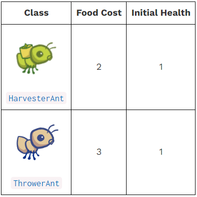

使用以下命令解锁本题：

```shell
python3 ok -q 01 -u --local
```

过程如下：

```shell
=====================================================================
Assignment: Project 3: Ants Vs. SomeBees
OK, version v1.18.1
=====================================================================

~~~~~~~~~~~~~~~~~~~~~~~~~~~~~~~~~~~~~~~~~~~~~~~~~~~~~~~~~~~~~~~~~~~~~
Unlocking tests

At each "? ", type what you would expect the output to be.
Type exit() to quit

---------------------------------------------------------------------
Problem 1 > Suite 1 > Case 1
(cases remaining: 5)

Q: What is the purpose of the food_cost attribute?
Choose the number of the correct choice:
0) Each turn, each Ant in the colony eats food_cost food from the
   colony's total available food
1) Each turn, each Ant in the colony adds food_cost food to the
   colony's total available food
2) Placing an ant into the colony will decrease the colony's total
   available food by that ant's food_cost
? 2
-- OK! --

---------------------------------------------------------------------
Problem 1 > Suite 1 > Case 2
(cases remaining: 4)

Q: What type of attribute is food_cost?
Choose the number of the correct choice:
0) instance, the food_cost of an Ant depends on the location it is placed
1) instance, the food_cost of an Ant is randomized upon initialization
2) class, all Ants cost the same to place no matter what type of Ant it is
3) class, all Ants of the same subclass cost the same to place
? 3
-- OK! --

---------------------------------------------------------------------
Problem 1 > Suite 2 > Case 1
(cases remaining: 3)

>>> from ants import *
>>> from ants_plans import *
>>> Ant.food_cost
? 0
-- OK! --

>>> HarvesterAnt.food_cost
? 2
-- OK! --

>>> ThrowerAnt.food_cost
? 3
-- OK! --

---------------------------------------------------------------------
Problem 1 > Suite 2 > Case 2
(cases remaining: 2)

>>> from ants import *
>>> from ants_plans import *
>>> # Testing HarvesterAnt action
>>> # Note that initializing an Ant here doesn't cost food, only
>>> # deploying an Ant in the game simulation does
>>> #
>>> # Create a test layout where the colony is a single row with 9 tiles
>>> beehive = Hive(make_test_assault_plan())
>>> gamestate = GameState(None, beehive, ant_types(), dry_layout, (1, 9))
>>> #
>>> gamestate.food = 4
>>> harvester = HarvesterAnt()
>>> harvester.action(gamestate)
>>> gamestate.food
? 2
-- Not quite. Try again! --

? 4
-- Not quite. Try again! --

? 3
-- Not quite. Try again! --

? 5
-- OK! --

>>> harvester.action(gamestate)
>>> gamestate.food
? 6
-- OK! --

---------------------------------------------------------------------
Problem 1 > Suite 2 > Case 3
(cases remaining: 1)

-- Already unlocked --

---------------------------------------------------------------------
OK! All cases for Problem 1 unlocked.

Cannot backup when running ok with --local.
```

实现代码如下：

```python
class ThrowerAnt(Ant):
    """ThrowerAnt throws a leaf each turn at the nearest Bee in its range."""

    name = 'Thrower'
    implemented = True
    damage = 1
    # ADD/OVERRIDE CLASS ATTRIBUTES HERE
    food_cost = 3 									# here!
```

```python
class HarvesterAnt(Ant):
    """HarvesterAnt produces 1 additional food per turn for the colony."""

    name = 'Harvester'
    implemented = True
    # OVERRIDE CLASS ATTRIBUTES HERE
    food_cost = 2 									# here!

    def action(self, gamestate):
        """Produce 1 additional food for the colony.

        gamestate -- The GameState, used to access game state information.
        """
        # BEGIN Problem 1
        "*** YOUR CODE HERE ***"
        gamestate.food += 1
        # END Problem 1
```

### Problem 2 (2 pt)

补全`Place`类的`__init__`函数，使其能够正确初始化入口`entrance`：

- 一个新创建的`Place`类的对象，`entrance`总是`None`
- 如果该对象的出口`exit`非空，`exit`这个`Place`的入口就是该对象


使用以下命令解锁本题：

```shell
python3 ok -q 02 -u --local
```

过程如下：

```shell
=====================================================================
Assignment: Project 3: Ants Vs. SomeBees
OK, version v1.18.1
=====================================================================

~~~~~~~~~~~~~~~~~~~~~~~~~~~~~~~~~~~~~~~~~~~~~~~~~~~~~~~~~~~~~~~~~~~~~
Unlocking tests

At each "? ", type what you would expect the output to be.
Type exit() to quit

---------------------------------------------------------------------
Problem 2 > Suite 1 > Case 1
(cases remaining: 5)

Q: What does a Place represent in the game?
Choose the number of the correct choice:
0) Where the bees start out in the game
1) The entire space where the game takes place
2) A single tile that an Ant can be placed on and that connects to
   other Places
3) The tunnel that bees travel through
? 2
-- OK! --

---------------------------------------------------------------------
Problem 2 > Suite 1 > Case 2
(cases remaining: 4)

Q: p is a Place whose entrance is q and exit is r (q and r are not None). When is p.entrance first set to a non-None value?
Choose the number of the correct choice:
0) Never, it is always set to None
1) When q is constructed
2) When p is constructed
? 1
-- OK! --

---------------------------------------------------------------------
Problem 2 > Suite 1 > Case 3
(cases remaining: 3)

Q: p is a Place whose entrance is q and exit is r (q and r are not None). When is p.exit first set to a non-None value?
Choose the number of the correct choice:
0) When q is constructed
1) Never, it is always set to None
2) When p is constructed
? 2
-- OK! --

---------------------------------------------------------------------
Problem 2 > Suite 2 > Case 1
(cases remaining: 2)

>>> from ants import *
>>> from ants_plans import *
>>> #
>>> # Create a test layout where the gamestate is a single row with 3 tiles
>>> beehive, layout = Hive(make_test_assault_plan()), dry_layout
>>> dimensions = (1, 3)
>>> gamestate = GameState(None, beehive, ant_types(), layout, dimensions)
>>> #
>>> # Simple test for Place
>>> place0 = Place('place_0')
>>> print(place0.exit)
? 'place_0'
-- Not quite. Try again! --

? None
-- OK! --

>>> print(place0.entrance)
? None
-- OK! --

>>> place1 = Place('place_1', place0)
>>> place1.exit is place0
? True
-- OK! --

>>> place0.entrance is place1
? True
-- OK! --

---------------------------------------------------------------------
OK! All cases for Problem 2 unlocked.

Cannot backup when running ok with --local.
```

实现代码如下：

```python
class Place:
    """A Place holds insects and has an exit to another Place."""

    def __init__(self, name, exit=None):
        """Create a Place with the given NAME and EXIT.

        name -- A string; the name of this Place.
        exit -- The Place reached by exiting this Place (may be None).
        """
        self.name = name
        self.exit = exit
        self.bees = []        # A list of Bees
        self.ant = None       # An Ant
        self.entrance = None  # A Place
        # Phase 1: Add an entrance to the exit
        # BEGIN Problem 2
        "*** YOUR CODE HERE ***"
        if self.exit:
            self.exit.entrance = self
        # END Problem 2
```

### Problem 3 (2 pt)

实现`ThrowerAnt`类的`nearest_bee`函数，返回距离平台最近的蜜蜂。

`nearnst_bee(self, beehive)`函数返回前方离`self`最近且的包含蜜蜂的区块的一只随机蜜蜂，`bee_selector(bees)`函数能够返回一个蜜蜂列表`bees`中的随机一个元素。

使用以下命令解锁本题：

```shell
python3 ok -q 03 -u --local
```

过程如下：

```shell
=====================================================================
Assignment: Project 3: Ants Vs. SomeBees
OK, version v1.18.1
=====================================================================

~~~~~~~~~~~~~~~~~~~~~~~~~~~~~~~~~~~~~~~~~~~~~~~~~~~~~~~~~~~~~~~~~~~~~
Unlocking tests

At each "? ", type what you would expect the output to be.
Type exit() to quit

---------------------------------------------------------------------
Problem 3 > Suite 1 > Case 1
(cases remaining: 12)

Q: What Bee should a ThrowerAnt throw at?
Choose the number of the correct choice:
0) The ThrowerAnt throws at a random Bee in its own Place
1) The ThrowerAnt finds the nearest place behind its own place
   that has Bees and throws at a random Bee in that place
2) The ThrowerAnt finds the nearest place in front of its own place
   that has Bees and throws at a random Bee in that place
3) The ThrowerAnt finds the nearest place in either direction that has
   Bees and throws at a random Bee in that place
? 2
-- OK! --

---------------------------------------------------------------------
Problem 3 > Suite 1 > Case 2
(cases remaining: 11)

Q: How do you get the Place object in front of another Place object?
Choose the number of the correct choice:
0) Decrement the place by 1
1) The place's exit instance attribute
2) Increment the place by 1
3) The place's entrance instance attribute
? 3
-- OK! --

---------------------------------------------------------------------
Problem 3 > Suite 1 > Case 3
(cases remaining: 10)

Q: What is the entrance of the first Place in a tunnel (i.e. where do the bees enter from)?
Choose the number of the correct choice:
0) None
1) The Hive
2) An empty Place
? 1
-- OK! --

---------------------------------------------------------------------
Problem 3 > Suite 1 > Case 4
(cases remaining: 9)

Q: How can you determine is a given Place is the Hive?
Choose the number of the correct choice:
0) by checking the bees attribute of the place instance
1) by calling the is_hive method on the place instance
2) by checking the ant attribute of the place instance
? 1
-- OK! --

---------------------------------------------------------------------
Problem 3 > Suite 1 > Case 5
(cases remaining: 8)

Q: What should nearest_bee return if there is no Bee in front of the ThrowerAnt in the tunnel?
Choose the number of the correct choice:
0) The closest Bee behind the ThrowerAnt
1) A random Bee in the Hive
2) None
? 2
-- OK! --

---------------------------------------------------------------------
Problem 3 > Suite 2 > Case 1
(cases remaining: 7)

>>> from ants import *
>>> beehive, layout = Hive(AssaultPlan()), dry_layout
>>> dimensions = (1, 9)
>>> gamestate = GameState(None, beehive, ant_types(), layout, dimensions)
>>> thrower = ThrowerAnt()
>>> ant_place = gamestate.places["tunnel_0_0"]
>>> ant_place.add_insect(thrower)
>>> #
>>> # Testing nearest_bee
>>> near_bee = Bee(2) # A Bee with 2 health
>>> far_bee = Bee(3)  # A Bee with 3 health
>>> near_place = gamestate.places['tunnel_0_3']
>>> far_place = gamestate.places['tunnel_0_6']
>>> near_place.add_insect(near_bee)
>>> far_place.add_insect(far_bee)
>>> nearest_bee = thrower.nearest_bee(gamestate.beehive)
>>> thrower.nearest_bee(gamestate.beehive) is far_bee
? False
-- OK! --

>>> thrower.nearest_bee(gamestate.beehive) is near_bee
? True
-- OK! --

>>> nearest_bee.health
? 2
-- OK! --

>>> thrower.action(gamestate)    # Attack! ThrowerAnts do 1 damage
>>> near_bee.health
? 1
-- OK! --

>>> far_bee.health
? 3
-- OK! --

>>> thrower.place is ant_place    # Don't change self.place!
? True
-- OK! --

---------------------------------------------------------------------
OK! All cases for Problem 3 unlocked.

Cannot backup when running ok with --local.

```

实现代码如下：

```python
class ThrowerAnt(Ant):
    """ThrowerAnt throws a leaf each turn at the nearest Bee in its range."""

    name = 'Thrower'
    implemented = True
    damage = 1
    # ADD/OVERRIDE CLASS ATTRIBUTES HERE
    food_cost = 3

    def nearest_bee(self, beehive):
        """Return the nearest Bee in a Place that is not the HIVE (beehive), connected to
        the ThrowerAnt's Place by following entrances.

        This method returns None if there is no such Bee (or none in range).
        """
        # BEGIN Problem 3 and 4
        place = self.place
        
        while True:
            if place.is_hive():
            # if place is beehive:
                return None
            
            if place.bees:
                return bee_selector(place.bees)
            
            place = place.entrance
        # END Problem 3 and 4
```

使用如下命令可以设置开局食物为10，进行测试：

```shell
python3 gui.py --food 10
```

## Phase 2: Ants!

本关卡目的是为蚂蚁实现更多的攻击方式。

使用如下命令可以设置游戏难度：

```shell
python3 gui.py -d easy
```

```shell
python3 gui.py -d normal
```

```shell
python3 gui.py -d hard
```

```shell
python3 gui.py -d extra-hard
```

### Problem 4 (3 pt)

实现`ThrowerAnt`类的两个子类`LongThrower`和`ShortThrower`。

`ThrowerAnt`类的食物消耗比较高，实现该类的两个子类，食物消耗都降为`2`，但攻击距离有所限制：

- `ShortThrower`只能攻击距离它`0~3`个区块上的敌人。
- `LongThrower`只能攻击距离它至少`5`个区块的敌人。

综上，这两种`投掷蚂蚁`都无法攻击距离他们`4`个区块的敌人。

在`Python`中，可以使用`float('inf')`表示无穷大。

每次实现新的类时，都要重载或添加对应的类属性`name`和`implemented`，前者表示类的名称，后者若为`True`，表示该类已经实现，否则还未实现。

实现思路如下：

- 为`Thrower`类添加`min_range`和`max_range`类属性，分别表示最小攻击距离和最大攻击距离。
- 重载`ShortThrower`和`LongThrower`类的`min_range`和`max_range`类属性。
- 重载`Thrower`类的`nearest_bee(self, beehive)`方法，使其攻击有范围限制。

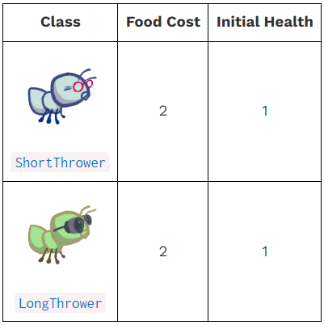

使用以下命令解锁本题：

```shell
python3 ok -q 04 -u --local
```

过程如下：

```shell
=====================================================================
Assignment: Project 3: Ants Vs. SomeBees
OK, version v1.18.1
=====================================================================

~~~~~~~~~~~~~~~~~~~~~~~~~~~~~~~~~~~~~~~~~~~~~~~~~~~~~~~~~~~~~~~~~~~~~
Unlocking tests

At each "? ", type what you would expect the output to be.
Type exit() to quit

---------------------------------------------------------------------
Problem 4 > Suite 1 > Case 1
(cases remaining: 25)

Q: What class do ShortThrower and LongThrower inherit from?
Choose the number of the correct choice:
0) Bee
1) ShortThrower
2) ThrowerAnt
3) LongThrower
? 2
-- OK! --

---------------------------------------------------------------------
Problem 4 > Suite 1 > Case 2
(cases remaining: 24)

Q: What constraint does a regular ThrowerAnt have on its throwing distance?
Choose the number of the correct choice:
0) There is no restriction on how far a regular ThrowerAnt can throw
1) A regular ThrowerAnt can only attack Bees at most 3 places away
2) A regular ThrowerAnt can only attack Bees at most 5 places away
3) A regular ThrowerAnt can only attack Bees at least 3 places away
? 0
-- OK! --

---------------------------------------------------------------------
Problem 4 > Suite 1 > Case 3
(cases remaining: 23)

Q: What constraint does a LongThrower have on its throwing distance?
Choose the number of the correct choice:
0) A LongThrower can only attack Bees at most 5 places away
1) There is no restriction on how far a LongThrower can throw
2) A LongThrower can only attack Bees at least 5 places away
3) A LongThrower can only attack Bees at least 3 places away
? 2
-- OK! --

---------------------------------------------------------------------
Problem 4 > Suite 1 > Case 4
(cases remaining: 22)

Q: What constraint does a ShortThrower have on its throwing distance?
Choose the number of the correct choice:
0) A ShortThrower can only attack Bees at most 5 places away
1) A ShortThrower can only attack Bees at least 3 places away
2) There is no restriction on how far a ShortThrower can throw
3) A ShortThrower can only attack Bees at most 3 places away
? 3
-- OK! --

---------------------------------------------------------------------
Problem 4 > Suite 1 > Case 5
(cases remaining: 21)

Q: With the addition of these new ThrowerAnt subclasses, we must modify
our definition of nearest_bee. Now what Bee should ThrowerAnts throw
at?
Choose the number of the correct choice:
0) The closest Bee behind it within range
1) Any Bee within range
2) The closest Bee in front of it within range
3) Any Bee in its current Place
? 2
-- OK! --

---------------------------------------------------------------------
Problem 4 > Suite 2 > Case 1
(cases remaining: 20)

>>> from ants import *
>>> beehive, layout = Hive(AssaultPlan()), dry_layout
>>> dimensions = (1, 9)
>>> gamestate = GameState(None, beehive, ant_types(), layout, dimensions)
>>> #
>>> # Testing Long/ShortThrower parameters
>>> ShortThrower.food_cost
? 2
-- OK! --

>>> LongThrower.food_cost
? 2
-- OK! --

>>> short_t = ShortThrower()
>>> long_t = LongThrower()
>>> short_t.health
? 1
-- OK! --

>>> long_t.health
? 1
-- OK! --

---------------------------------------------------------------------
OK! All cases for Problem 4 unlocked.

Cannot backup when running ok with --local.
```

实现代码如下：

```shell
class ThrowerAnt(Ant):
    """ThrowerAnt throws a leaf each turn at the nearest Bee in its range."""

    name = 'Thrower'
    implemented = True
    damage = 1
    # ADD/OVERRIDE CLASS ATTRIBUTES HERE
    food_cost = 3
    min_range = 0
    max_range = float('inf')

    def nearest_bee(self, beehive):
        """Return the nearest Bee in a Place that is not the HIVE (beehive), connected to
        the ThrowerAnt's Place by following entrances.

        This method returns None if there is no such Bee (or none in range).
        """
        # BEGIN Problem 3 and 4
        place = self.place
        cnt = 0
        
        while True:
            # if place.is_hive():
            if place is beehive:
                return None
            
            if place.bees and\
                self.min_range <= cnt <= self.max_range:
                return bee_selector(place.bees)
            
            place = place.entrance
            cnt += 1
        # END Problem 3 and 4
```

```python
class ShortThrower(ThrowerAnt):
    """A ThrowerAnt that only throws leaves at Bees at most 3 places away."""

    name = 'Short'
    food_cost = 2
    # OVERRIDE CLASS ATTRIBUTES HERE
    min_range = 0
    max_range = 3
    # BEGIN Problem 4
    implemented = True   # Change to True to view in the GUI
    # END Problem 4
```

```python
class LongThrower(ThrowerAnt):
    """A ThrowerAnt that only throws leaves at Bees at least 5 places away."""

    name = 'Long'
    food_cost = 2
    # OVERRIDE CLASS ATTRIBUTES HERE
    min_range = 5
    max_range = float('inf')
    # BEGIN Problem 4
    implemented = True   # Change to True to view in the GUI
    # END Problem 4
```

### Problem 5 (3 pt)

本题要求实现`Ant`的一个子类`FireAnt`，当收到伤害时会反击敌人（反击伤害就是受到的伤害），死亡时，对所在区块的敌人造成一次伤害。

实现思路如下：

- 重载`Ant`类的`reduce_health`方法，先对本区块中所有敌人进行攻击（攻击伤害就是受到的伤害），再调用父类的`reduce_health`方法，若受到伤害后死亡，攻击伤害会增加`self.damage`的大小。

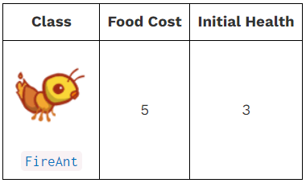

使用以下命令解锁本题：

```shell
python3 ok -q 05 -u --local
```

过程如下：

```shell
=====================================================================
Assignment: Project 3: Ants Vs. SomeBees
OK, version v1.18.1
=====================================================================

~~~~~~~~~~~~~~~~~~~~~~~~~~~~~~~~~~~~~~~~~~~~~~~~~~~~~~~~~~~~~~~~~~~~~
Unlocking tests

At each "? ", type what you would expect the output to be.
Type exit() to quit

---------------------------------------------------------------------
Problem 5 > Suite 1 > Case 1
(cases remaining: 16)

Q: How can you obtain the current place of a FireAnt?
Choose the number of the correct choice:
0) By calling the FireAnt constructor
1) By accessing the place instance attribute, which is the name of
   some Place object
2) By accessing the place instance attribute, which is a Place object
3) By calling the Place constructor, passing in the FireAnt instance
? 2
-- OK! --

---------------------------------------------------------------------
Problem 5 > Suite 1 > Case 2
(cases remaining: 15)

Q: How can you obtain all of the Bees currently in a given place?
Choose the number of the correct choice:
0) By calling the Bee constructor, passing in the place instance
1) By accessing the bees instance attribute, which is a dictionary of
   Bee objects
2) By calling the add_insect method on the place instance
3) By accessing the bees instance attribute, which is a list of Bee
   objects
? 3
-- OK! --

---------------------------------------------------------------------
Problem 5 > Suite 1 > Case 3
(cases remaining: 14)

Q: Can you iterate over a list while mutating it?
Choose the number of the correct choice:
0) Yes, you can mutate a list while iterating over it with no problems
1) Yes, but you should iterate over a copy of the list to avoid skipping
   elements
2) No, Python doesn't allow list mutation on a list that is being
   iterated through
? 1
-- OK! --

---------------------------------------------------------------------
Problem 5 > Suite 2 > Case 1
(cases remaining: 13)

>>> from ants import *
>>> beehive, layout = Hive(AssaultPlan()), dry_layout
>>> dimensions = (1, 9)
>>> gamestate = GameState(None, beehive, ant_types(), layout, dimensions)
>>> #
>>> # Testing FireAnt parameters
>>> fire = FireAnt()
>>> FireAnt.food_cost
? 5
-- OK! --

>>> fire.health
? 3
-- OK! --

---------------------------------------------------------------------
Problem 5 > Suite 2 > Case 2
(cases remaining: 12)

-- Already unlocked --

---------------------------------------------------------------------
Problem 5 > Suite 2 > Case 3
(cases remaining: 11)

>>> from ants import *
>>> beehive, layout = Hive(AssaultPlan()), dry_layout
>>> dimensions = (1, 9)
>>> gamestate = GameState(None, beehive, ant_types(), layout, dimensions)
>>> #
>>> # Testing fire does damage to all Bees in its Place
>>> place = gamestate.places['tunnel_0_4']
>>> fire = FireAnt(health=1)
>>> place.add_insect(fire)        # Add a FireAnt with 1 health
>>> place.add_insect(Bee(3))      # Add a Bee with 3 health
>>> place.add_insect(Bee(5))      # Add a Bee with 5 health
>>> len(place.bees)               # How many bees are there?
? 2
-- OK! --

>>> place.bees[0].action(gamestate)  # The first Bee attacks FireAnt
>>> fire.health
? 0
-- OK! --

>>> fire.place is None
? False
-- Not quite. Try again! --

? True
-- OK! --

>>> len(place.bees)               # How many bees are left?
? 2
-- Not quite. Try again! --

? 1
-- OK! --

>>> place.bees[0].health           # What is the health of the remaining Bee?
? 1
-- OK! --

---------------------------------------------------------------------
Problem 5 > Suite 2 > Case 4
(cases remaining: 10)

>>> from ants import *
>>> beehive, layout = Hive(AssaultPlan()), dry_layout
>>> dimensions = (1, 9)
>>> gamestate = GameState(None, beehive, ant_types(), layout, dimensions)
>>> #
>>> place = gamestate.places['tunnel_0_4']
>>> ant = FireAnt(1)           # Create a FireAnt with 1 health
>>> place.add_insect(ant)      # Add a FireAnt to place
>>> ant.place is place
? True
-- OK! --

>>> place.remove_insect(ant)   # Remove FireAnt from place
>>> ant.place is place         # Is the ant's place still that place?
? None
-- Not quite. Try again! --

? False
-- OK! --

---------------------------------------------------------------------

---------------------------------------------------------------------
OK! All cases for Problem 5 unlocked.

Cannot backup when running ok with --local.
```

实现代码如下：

```shell
class FireAnt(Ant):
    """FireAnt cooks any Bee in its Place when it expires."""

    name = 'Fire'
    damage = 3
    food_cost = 5
    # OVERRIDE CLASS ATTRIBUTES HERE
    # BEGIN Problem 5
    implemented = True   # Change to True to view in the GUI
    # END Problem 5

    def __init__(self, health=3):
        """Create an Ant with a HEALTH quantity."""
        super().__init__(health)

    def reduce_health(self, amount):
        """Reduce health by AMOUNT, and remove the FireAnt from its place if it
        has no health remaining.

        Make sure to reduce the health of each bee in the current place, and apply
        the additional damage if the fire ant dies.
        """
        # BEGIN Problem 5
        "*** YOUR CODE HERE ***"
        place = self.place
        
        total_damage = amount

        if self.health <= amount:
            total_damage += self.damage

        for bee in list(place.bees):
            bee.reduce_health(total_damage)

        super().reduce_health(amount)
        # END Problem 5
```

## Phase 3: More Ants!

### Problem 6 (2 pt)

本题要求实现`Ant`的一个子类`WallAnt`。

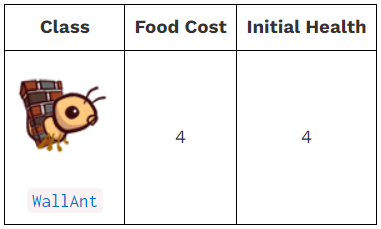

使用以下命令解锁本题：

```shell
python3 ok -q 06 -u --local
```

过程如下：

```shell
=====================================================================
Assignment: Project 3: Ants Vs. SomeBees
OK, version v1.18.1
=====================================================================

~~~~~~~~~~~~~~~~~~~~~~~~~~~~~~~~~~~~~~~~~~~~~~~~~~~~~~~~~~~~~~~~~~~~~
Unlocking tests

At each "? ", type what you would expect the output to be.
Type exit() to quit

---------------------------------------------------------------------
Problem 6 > Suite 1 > Case 1
(cases remaining: 8)

Q: What class does WallAnt inherit from?
Choose the number of the correct choice:
0) The WallAnt class does not inherit from any class
1) ThrowerAnt
2) Ant
3) HungryAnt
? 2
-- OK! --

---------------------------------------------------------------------
Problem 6 > Suite 1 > Case 2
(cases remaining: 7)

Q: What is a WallAnt's action?
Choose the number of the correct choice:
0) A WallAnt attacks all the Bees in its place each turn
1) A WallAnt increases its own health by 1 each turn
2) A WallAnt reduces its own health by 1 each turn
3) A WallAnt takes no action each turn
? 3
-- OK! --

---------------------------------------------------------------------
Problem 6 > Suite 1 > Case 3
(cases remaining: 6)

Q: Where do Ant subclasses inherit the action method from?
Choose the number of the correct choice:
0) Ant subclasses inherit the action method from the Ant class
1) Ant subclasses inherit the action method from the Insect class
2) Ant subclasses do not inherit the action method from any class
? 1
-- OK! --

---------------------------------------------------------------------
Problem 6 > Suite 1 > Case 4
(cases remaining: 5)

Q: If a subclass of Ant does not override the action method, what is the
default action?
Choose the number of the correct choice:
0) Move to the next place
1) Nothing
2) Reduce the health of all Bees in its place
3) Throw a leaf at the nearest Bee
? 1
-- OK! --

---------------------------------------------------------------------
Problem 6 > Suite 2 > Case 1
(cases remaining: 4)

>>> from ants import *
>>> # Testing WallAnt parameters
>>> wall = WallAnt()
>>> wall.name
? 'Wall'
-- OK! --

>>> wall.health
? 4
-- OK! --

>>> # `health` should not be a class attribute
>>> not hasattr(WallAnt, 'health') # hasattr checks if the WallAnt class has a class attribute called 'health'
? True
-- OK! --

>>> WallAnt.food_cost
? 4
-- OK! --

---------------------------------------------------------------------
OK! All cases for Problem 6 unlocked.

Cannot backup when running ok with --local.
```

实现代码如下：

```python
# BEGIN Problem 6
# The WallAnt class
class WallAnt(Ant):
    name = 'Wall'
    implemented = True
    food_cost = 4

    def __init__(self, health = 4):
        super().__init__(health)
# END Problem 6
```

### Problem 7 (3 pt)

本题要求实现`Ant`的一个子类`HungryAnt`。

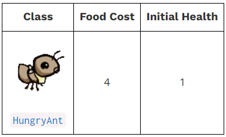

使用以下命令解锁本题：

```shell
python3 ok -q 07 -u --local
```

过程如下：

```shell
=====================================================================
Assignment: Project 3: Ants Vs. SomeBees
OK, version v1.18.1
=====================================================================

~~~~~~~~~~~~~~~~~~~~~~~~~~~~~~~~~~~~~~~~~~~~~~~~~~~~~~~~~~~~~~~~~~~~~
Unlocking tests

At each "? ", type what you would expect the output to be.
Type exit() to quit

---------------------------------------------------------------------
Problem 7 > Suite 1 > Case 1
(cases remaining: 14)

Q: Should chewing be an instance or class attribute? Why?
Choose the number of the correct choice:
0) class, all HungryAnt instances in the game chew simultaneously
1) instance, all HungryAnt instances in the game chew simultaneously
2) instance, each HungryAnt instance chews independently of other
   HungryAnt instances
3) class, each HungryAnt instance chews independently of other
   HungryAnt instances
? 2
-- OK! --

---------------------------------------------------------------------
Problem 7 > Suite 1 > Case 2
(cases remaining: 13)

Q: When is a HungryAnt able to eat a Bee?
Choose the number of the correct choice:
0) Whenever a Bee is in its place
1) When it is chewing, i.e. when its chewing attribute is at least 1
2) Each turn
3) When it is not chewing, i.e. when its chewing attribute is 0
? 3
-- OK! --

---------------------------------------------------------------------
Problem 7 > Suite 1 > Case 3
(cases remaining: 12)

Q: When a HungryAnt is able to eat, which Bee does it eat?
Choose the number of the correct choice:
0) The closest Bee behind it
1) The closest Bee in either direction
2) A random Bee in the same place as itself
3) The closest Bee in front of it
? 2
-- OK! --

---------------------------------------------------------------------
Problem 7 > Suite 2 > Case 1
(cases remaining: 11)

>>> from ants import *
>>> beehive, layout = Hive(AssaultPlan()), dry_layout
>>> dimensions = (1, 9)
>>> gamestate = GameState(None, beehive, ant_types(), layout, dimensions)
>>> #
>>> # Testing HungryAnt parameters
>>> hungry = HungryAnt()
>>> HungryAnt.food_cost
? 4
-- OK! --

>>> hungry.health
? 1
-- OK! --

---------------------------------------------------------------------
Problem 7 > Suite 2 > Case 2
(cases remaining: 10)

-- Already unlocked --

---------------------------------------------------------------------
Problem 7 > Suite 2 > Case 3
(cases remaining: 9)

>>> from ants import *
>>> beehive, layout = Hive(AssaultPlan()), dry_layout
>>> dimensions = (1, 9)
>>> gamestate = GameState(None, beehive, ant_types(), layout, dimensions)
>>> #
>>> # Testing HungryAnt eats and chews
>>> hungry = HungryAnt()
>>> bee1 = Bee(1000)              # A Bee with 1000 health
>>> place = gamestate.places["tunnel_0_0"]
>>> place.add_insect(hungry)
>>> place.add_insect(bee1)         # Add the Bee to the same place as HungryAnt
>>> hungry.action(gamestate)
>>> bee1.health
? 0
-- OK! --

>>> bee2 = Bee(1)                 # A Bee with 1 health
>>> place.add_insect(bee2)
>>> for _ in range(3):
...     hungry.action(gamestate)     # Digesting...not eating
>>> bee2.health
? 1
-- OK! --

>>> hungry.action(gamestate)
>>> bee2.health
? 0
-- OK! --

---------------------------------------------------------------------
OK! All cases for Problem 7 unlocked.

Cannot backup when running ok with --local.
```

实现代码如下：

```python
# BEGIN Problem 7
# The HungryAnt Class
class HungryAnt(Ant):
    name = 'Hungry'
    implemented = True
    food_cost = 4
    chew_duration = 3

    def __init__(self, health = 1):
        super().__init__(health)
        self.chewing = 0

    def action(self, gamestate):
        if self.chewing != 0:
            self.chewing -= 1
        else:
            bees = self.place.bees
            if bees:
                bee = bee_selector(bees)
                bee.reduce_health(bee.health)
                self.chewing = HungryAnt.chew_duration
# END Problem 7
```

### Problem 8 (3 pt)

本题要求实现`Ant`的一个子类`ContainerAnt`，再实现`ContainerAnt`的一个子类`BodyguardAnt`。

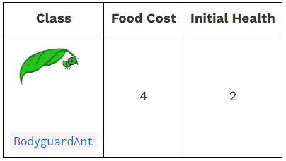

使用以下命令解锁本题：

```shell
python3 ok -q 08 -u --local
```

过程如下：

```shell
=====================================================================
Assignment: Project 3: Ants Vs. SomeBees
OK, version v1.18.1
=====================================================================

~~~~~~~~~~~~~~~~~~~~~~~~~~~~~~~~~~~~~~~~~~~~~~~~~~~~~~~~~~~~~~~~~~~~~
Unlocking tests

At each "? ", type what you would expect the output to be.
Type exit() to quit

---------------------------------------------------------------------
Problem 8 > Suite 1 > Case 1
(cases remaining: 18)

Q: Which Ant does a BodyguardAnt guard?
Choose the number of the correct choice:
0) All the Ant instances in the gamestate
1) The Ant instance in the place closest to its own place
2) The Ant instance that is in the same place as itself
3) A random Ant instance in the gamestate
? 2
-- OK! --

---------------------------------------------------------------------
Problem 8 > Suite 1 > Case 2
(cases remaining: 17)

Q: How does a BodyguardAnt guard its ant?
Choose the number of the correct choice:
0) By allowing Bees to pass without attacking
1) By attacking Bees that try to attack it
2) By increasing the ant's health
3) By protecting the ant from Bees and allowing it to perform its original action
? 3
-- OK! --

---------------------------------------------------------------------
Problem 8 > Suite 1 > Case 3
(cases remaining: 16)

Q: Where is the ant contained by a BodyguardAnt stored?
Choose the number of the correct choice:
0) In its place's ant instance attribute
1) Nowhere, a BodyguardAnt has no knowledge of the ant that it's protecting
2) In the BodyguardAnt's contained_ant instance attribute
3) In the BodyguardAnt's contained_ant class attribute
? 2
-- OK! --

---------------------------------------------------------------------
Problem 8 > Suite 1 > Case 4
(cases remaining: 15)

Q: When can a second Ant be added to a place that already contains an Ant?
Choose the number of the correct choice:
0) When both Ant instances are containers
1) When exactly one of the Ant instances is a container and the
   container ant does not already contain another ant
2) There can never be two Ant instances in the same place
3) When exactly one of the Ant instances is a container
? 1
-- OK! --

---------------------------------------------------------------------
Problem 8 > Suite 1 > Case 5
(cases remaining: 14)

Q: If two Ants occupy the same Place, what is stored in that place's ant
instance attribute?
Choose the number of the correct choice:
0) The Ant being contained
1) Whichever Ant was placed there first
2) The container Ant
3) A list containing both Ants
? 1
-- Not quite. Try again! --

Choose the number of the correct choice:
0) The Ant being contained
1) Whichever Ant was placed there first
2) The container Ant
3) A list containing both Ants
? 2
-- OK! --

---------------------------------------------------------------------
Problem 8 > Suite 2 > Case 1
(cases remaining: 13)

>>> from ants import *
>>> # Testing BodyguardAnt parameters
>>> bodyguard = BodyguardAnt()
>>> BodyguardAnt.food_cost
? 4
-- OK! --

>>> bodyguard.health
? 2
-- OK! --

---------------------------------------------------------------------
OK! All cases for Problem 8 unlocked.

Cannot backup when running ok with --local.
```

实现代码如下：

```python
class Ant(Insect):
    def add_to(self, place):
        if place.ant is None:
            place.ant = self
            Insect.add_to(self, place)
        else:
            # BEGIN Problem 8
            ant = place.ant
            assert ant.can_contain(self) or\
                    self.can_contain(place.ant),\
                        "Two ants in {0}".format(place.name)

            if ant.can_contain(self):
                ant.contain_ant(self)
            elif self.can_contain(ant):
                self.contain_ant(ant)
                place.ant = self

            Insect.add_to(self, place)
            # END Problem 8
```

```python
class ContainerAnt(Ant):
        def can_contain(self, other):
        # BEGIN Problem 8
        "*** YOUR CODE HERE ***"
        if not self.contained_ant and\
            not other.is_container():
            return True
        # END Problem 8

    def contain_ant(self, ant):
        # BEGIN Problem 8
        "*** YOUR CODE HERE ***"
        if self.can_contain(ant):
            self.contained_ant = ant
        # END Problem 8
        
        def action(self, gamestate):
        # BEGIN Problem 8
        "*** YOUR CODE HERE ***"
        if self.contained_ant:
            self.contained_ant.action(gamestate)
        # END Problem 8
```

```python
class BodyguardAnt(ContainerAnt):
    """BodyguardAnt provides protection to other Ants."""

    name = 'Bodyguard'
    food_cost = 4
    # OVERRIDE CLASS ATTRIBUTES HERE
    # BEGIN Problem 8
    implemented = True   # Change to True to view in the GUI
    def __init__(self, health=2):
        super().__init__(health)
    # END Problem 8
```

### Problem 9 (1 pt)

本题要求实现`ContainerAnt`的一个子类`TankAnt`。

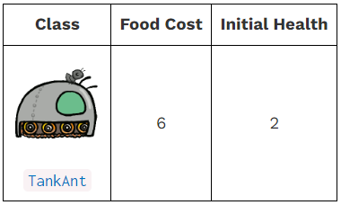


使用以下命令解锁本题：

```shell
python3 ok -q 09 -u --local
```

过程如下：

```shell
=====================================================================
Assignment: Project 3: Ants Vs. SomeBees
OK, version v1.18.1
=====================================================================

~~~~~~~~~~~~~~~~~~~~~~~~~~~~~~~~~~~~~~~~~~~~~~~~~~~~~~~~~~~~~~~~~~~~~
Unlocking tests

At each "? ", type what you would expect the output to be.
Type exit() to quit

---------------------------------------------------------------------
Problem 9 > Suite 1 > Case 1
(cases remaining: 13)

Q: Besides costing more to place, what is the only difference between a
TankAnt and a BodyguardAnt?
Choose the number of the correct choice:
0) A TankAnt increases the damage of the ant it contains
1) A TankAnt has greater health than a BodyguardAnt
2) A TankAnt does damage to all Bees in its place each turn
3) A TankAnt can contain multiple ants
? 2
-- OK! --

---------------------------------------------------------------------
Problem 9 > Suite 2 > Case 1
(cases remaining: 12)

>>> from ants_plans import *
>>> from ants import *
>>> beehive, layout = Hive(make_test_assault_plan()), dry_layout
>>> dimensions = (1, 9)
>>> gamestate = GameState(None, beehive, ant_types(), layout, dimensions)
>>> #
>>> # Testing TankAnt parameters
>>> TankAnt.food_cost
? 6
-- OK! --

>>> TankAnt.damage
? 1
-- OK! --

>>> tank = TankAnt()
>>> tank.health
? 2
-- OK! --

---------------------------------------------------------------------
OK! All cases for Problem 9 unlocked.

Cannot backup when running ok with --local.
```

本实验中很重要的一点：如果遍历可迭代对象时修改了可迭代对象，可能会导致迭代出错。

迭代可迭代对象的拷贝可以解决这个问题。（`list`或者`l[:]`）

实现代码如下：

```python
# BEGIN Problem 9
# The TankAnt class
class TankAnt(ContainerAnt):
    name = 'Tank'
    food_cost = 6
    implemented = True
    damage = 1

    def __init__(self, health=2):
        super().__init__(health)
    
    def action(self, gamestate):
        for bee in list(self.place.bees):
            bee.reduce_health(self.damage)
        super().action(gamestate)
# END Problem 9
```

## Phase 4: Water and Might

### Problem 10 (2 pt)

使用如下命令进行解锁测试：

```python
python3 ok -q 10 -u --local
```

过程如下：

```python
=====================================================================
Assignment: Project 3: Ants Vs. SomeBees
OK, version v1.18.1
=====================================================================

~~~~~~~~~~~~~~~~~~~~~~~~~~~~~~~~~~~~~~~~~~~~~~~~~~~~~~~~~~~~~~~~~~~~~
Unlocking tests

At each "? ", type what you would expect the output to be.
Type exit() to quit

---------------------------------------------------------------------
Problem 10 > Suite 1 > Case 1
(cases remaining: 8)

Q: What happens when an insect is added to a Water Place?
Choose the number of the correct choice:
0) The insect goes for a swim.
1) The insect's health is reduced to 0.
2) If the insect is not watersafe, its health is reduced to 0.
   Otherwise, nothing happens.
3) Nothing happens.
? 2
-- OK! --

---------------------------------------------------------------------
Problem 10 > Suite 1 > Case 2
(cases remaining: 7)

Q: What type of attribute should "is_watersafe" be?
Choose the number of the correct choice:
0) instance, the is_watersafe attribute depends on the given place of an ant
1) class, all ants should be watersafe
2) instance, the is_watersafe attribute depends on the amount of health a given ant has left
3) class, all ants of a subclass should either be watersafe or not
? 3
-- OK! --

---------------------------------------------------------------------
Problem 10 > Suite 1 > Case 3
(cases remaining: 6)

Q: What method deals damage to an Insect and removes it from its place
if its health reaches 0?
Choose the number of the correct choice:
0) sting, in the Bee class
1) remove_ant, in the GameState class
2) reduce_health, in the Insect class
3) remove_insect, in the Place class
? 2
-- OK! --

---------------------------------------------------------------------
OK! All cases for Problem 10 unlocked.

Cannot backup when running ok with --local.
```

实现代码如下：

注意，蜜蜂是会飞的，所以`Bee`类要重载`is_watersafe`为`True`。

```python
class Water(Place):
    """Water is a place that can only hold watersafe insects."""

    def add_insect(self, insect):
        """Add an Insect to this place. If the insect is not watersafe, reduce
        its health to 0."""
        # BEGIN Problem 10
        "*** YOUR CODE HERE ***"
        super().add_insect(insect)
        if not insect.is_watersafe:
            insect.reduce_health(insect.health)
        # END Problem 10
```

```python
class Bee(Insect):
    """A Bee moves from place to place, following exits and stinging ants."""

    name = 'Bee'
    damage = 1
    # OVERRIDE CLASS ATTRIBUTES HERE
    is_watersafe = True
```

### Problem 11 (2 pt)

实现`ThrowerAnt`类的一个子类`ScubaAnt`，能够潜水。

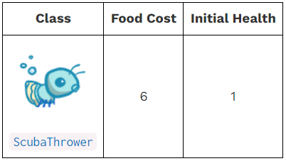

使用如下命令进行解锁测试：

```python
python3 ok -q 11 -u --local
```

过程如下：

```python
=====================================================================
Assignment: Project 3: Ants Vs. SomeBees
OK, version v1.18.1
=====================================================================

~~~~~~~~~~~~~~~~~~~~~~~~~~~~~~~~~~~~~~~~~~~~~~~~~~~~~~~~~~~~~~~~~~~~~
Unlocking tests

At each "? ", type what you would expect the output to be.
Type exit() to quit

---------------------------------------------------------------------
Problem 11 > Suite 1 > Case 1
(cases remaining: 9)

Q: How is a ScubaThrower different from a regular ThrowerAnt?
Choose the number of the correct choice:
0) It is not watersafe, so its health will be reduced to 0 when it is
   placed in a Water Place
1) It throws water pellets instead of leaves
2) It is watersafe, so its health won't be reduced to 0 when it is
   placed in a Water Place
? 2
-- OK! --

---------------------------------------------------------------------
Problem 11 > Suite 1 > Case 2
(cases remaining: 8)

Q: Which inherited attributes and/or methods should ScubaThrower
override?
Choose the number of the correct choice:
0) is_watersafe, action
1) name, nearest_bee, is_watersafe
2) food_cost, action, damage
3) name, is_watersafe, food_cost
? 3
-- OK! --

---------------------------------------------------------------------
Problem 11 > Suite 2 > Case 1
(cases remaining: 7)

>>> from ants import *
>>> # Testing ScubaThrower parameters
>>> scuba = ScubaThrower()
>>> ScubaThrower.food_cost
? 6
-- OK! --

>>> scuba.health
? 1
-- OK! --

---------------------------------------------------------------------
Problem 11 > Suite 3 > Case 1
(cases remaining: 6)

>>> from ants import *
>>> beehive, layout = Hive(AssaultPlan()), dry_layout
>>> dimensions = (1, 9)
>>> gamestate = GameState(None, beehive, ant_types(), layout, dimensions)
>>> #
>>> # Testing if ScubaThrower is watersafe
>>> water = Water('Water')
>>> ant = ScubaThrower()
>>> water.add_insect(ant)
>>> ant.place is water
? True
-- OK! --

>>> ant.health
? 1
-- OK! --

---------------------------------------------------------------------
Problem 11 > Suite 3 > Case 2
(cases remaining: 5)

>>> from ants import *
>>> beehive, layout = Hive(AssaultPlan()), dry_layout
>>> dimensions = (1, 9)
>>> gamestate = GameState(None, beehive, ant_types(), layout, dimensions)
>>> #
>>> # Testing that ThrowerAnt is not watersafe
>>> water = Water('Water')
>>> ant = ThrowerAnt()
>>> water.add_insect(ant)
>>> ant.place is water
? True
-- Not quite. Try again! --

? False
-- OK! --

>>> ant.health
? 0
-- OK! --

---------------------------------------------------------------------
OK! All cases for Problem 11 unlocked.

Cannot backup when running ok with --local.
```

实现代码如下：

```python
# BEGIN Problem 11
# The ScubaThrower class
class ScubaThrower(ThrowerAnt):
    name = 'Scuba'
    implemented = True
    food_cost = 6
    is_watersafe = True
# END Problem 11
```

### Extra Credit (2 pt)

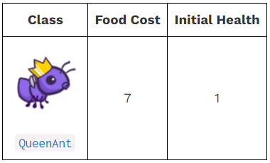

使用如下命令进行解锁测试：

```python
python3 ok -q EC -u --local
```

过程如下：

```python
=====================================================================
Assignment: Project 3: Ants Vs. SomeBees
OK, version v1.18.1
=====================================================================

~~~~~~~~~~~~~~~~~~~~~~~~~~~~~~~~~~~~~~~~~~~~~~~~~~~~~~~~~~~~~~~~~~~~~
Unlocking tests

At each "? ", type what you would expect the output to be.
Type exit() to quit

---------------------------------------------------------------------
Problem EC > Suite 1 > Case 1
(cases remaining: 18)

Q: What class does QueenAnt inherit from?
Choose the number of the correct choice:
0) GameState
1) Ant
2) ScubaThrower
3) Insect
? 2
-- OK! --

---------------------------------------------------------------------
Problem EC > Suite 1 > Case 2
(cases remaining: 17)

Q: Which QueenAnt instance is the true QueenAnt?
Choose the number of the correct choice:
0) All QueenAnt instances are true QueenAnts
1) The second QueenAnt that is instantiated
2) The most recent QueenAnt that is instantiated
3) The first QueenAnt that is instantiated
? 3
-- OK! --

---------------------------------------------------------------------
Problem EC > Suite 1 > Case 3
(cases remaining: 16)

Q: What happens to any QueenAnt instance that is instantiated after the
first one?
Choose the number of the correct choice:
0) The health of the first QueenAnt is reduced to 0
1) It doubles the damage of all the ants behind it
2) Its health is reduced to 0 upon taking its first action
3) Nothing, the game ends
? 2
-- OK! --

---------------------------------------------------------------------
Problem EC > Suite 1 > Case 4
(cases remaining: 15)

Q: What does the true QueenAnt do each turn?
Choose the number of the correct choice:
0) Doubles the damage of all the ants in front of her (that haven't
   already been doubled)
1) Attacks the nearest bee and doubles the damage of all the ants
   behind her (that haven't already been doubled)
2) Doubles the damage of all the ants in the colony (that haven't
   already been doubled)
3) Doubles the damage of all the ants behind her (that haven't
   already been doubled)
? 3
-- Not quite. Try again! --

Choose the number of the correct choice:
0) Doubles the damage of all the ants in front of her (that haven't
   already been doubled)
1) Attacks the nearest bee and doubles the damage of all the ants
   behind her (that haven't already been doubled)
2) Doubles the damage of all the ants in the colony (that haven't
   already been doubled)
3) Doubles the damage of all the ants behind her (that haven't
   already been doubled)
? 0
-- Not quite. Try again! --

Choose the number of the correct choice:
0) Doubles the damage of all the ants in front of her (that haven't
   already been doubled)
1) Attacks the nearest bee and doubles the damage of all the ants
   behind her (that haven't already been doubled)
2) Doubles the damage of all the ants in the colony (that haven't
   already been doubled)
3) Doubles the damage of all the ants behind her (that haven't
   already been doubled)
? 1
-- OK! --

---------------------------------------------------------------------
Problem EC > Suite 1 > Case 5
(cases remaining: 14)

Q: Under what circumstances do Bees win the game?
Choose the number of the correct choice:
0) If there are no ants left in the colony
1) If a Bee attacks the true QueenAnt
2) If a Bee reaches the end of a tunnel or the true QueenAnt dies
3) If an imposter QueenAnt is placed in the colony
? 2
-- OK! --

---------------------------------------------------------------------
Problem EC > Suite 2 > Case 1
(cases remaining: 13)

>>> from ants import *
>>> # Testing QueenAnt parameters
>>> QueenAnt.food_cost
? 7
-- OK! --

>>> queen = QueenAnt()
>>> queen.health
? 1
-- OK! --

---------------------------------------------------------------------
OK! All cases for Problem EC unlocked.

Cannot backup when running ok with --local.
```

实现代码如下：

```python
# BEGIN Problem EC
class QueenAnt(ScubaThrower):  # You should change this line
# END Problem EC
    """The Queen of the colony. The game is over if a bee enters her place."""

    name = 'Queen'
    food_cost = 7
    # OVERRIDE CLASS ATTRIBUTES HERE
    queen_ant = None
    # BEGIN Problem EC
    implemented = True   # Change to True to view in the GUI
    # END Problem EC

    def __init__(self, health=1):
        # BEGIN Problem EC
        "*** YOUR CODE HERE ***"
        super().__init__(health)
        self.buffed = True
        if not QueenAnt.queen_ant:
            QueenAnt.queen_ant = self
        # END Problem EC

    def action(self, gamestate):
        """A queen ant throws a leaf, but also doubles the damage of ants
        in her tunnel.

        Impostor queens do only one thing: reduce their own health to 0.
        """
        # BEGIN Problem EC
        "*** YOUR CODE HERE ***"
        if QueenAnt.queen_ant is not self:
            self.reduce_health(self.health)
        else:
            super().action(gamestate)
            place = self.place.exit
            
            while place:
                ant = place.ant

                if ant:
                    ant.buff()
                    if ant.is_container() and\
                        ant.contained_ant:
                        ant.contained_ant.buff()
                place = place.exit
        # END Problem EC

    def reduce_health(self, amount):
        """Reduce health by AMOUNT, and if the True QueenAnt has no health
        remaining, signal the end of the game.
        """
        # BEGIN Problem EC
        "*** YOUR CODE HERE ***"
        super().reduce_health(amount)
        if self.health <= 0 and\
            QueenAnt.queen_ant is self:
            bees_win()
        # END Problem EC
```

```python
class Ant(Insect):
    def buff(self):
        """Double this ants's damage, if it has not already been buffed."""
        # BEGIN Problem EC
        "*** YOUR CODE HERE ***"
        if not self.buffed:
            self.buffed = True
            self.damage *= 2
        # END Problem EC
```

## 最终测试

使用如下命令对上述题目进行测试：

```python
python3 ok --score --local
```

结果如下：

```shell
=====================================================================
Assignment: Project 3: Ants Vs. SomeBees
OK, version v1.18.1
=====================================================================

~~~~~~~~~~~~~~~~~~~~~~~~~~~~~~~~~~~~~~~~~~~~~~~~~~~~~~~~~~~~~~~~~~~~~
Scoring tests

---------------------------------------------------------------------
Problem 0
    Passed: 1
    Failed: 0
[ooooooooook] 100.0% passed

---------------------------------------------------------------------
Problem 1
    Passed: 1
    Failed: 0
[ooooooooook] 100.0% passed

---------------------------------------------------------------------
Problem 2
    Passed: 1
    Failed: 0
[ooooooooook] 100.0% passed

---------------------------------------------------------------------
Problem 3
    Passed: 1
    Failed: 0
[ooooooooook] 100.0% passed

---------------------------------------------------------------------
Problem 4
    Passed: 3
    Failed: 0
[ooooooooook] 100.0% passed

---------------------------------------------------------------------
Problem 5
    Passed: 2
    Failed: 0
[ooooooooook] 100.0% passed

---------------------------------------------------------------------
Problem 6
    Passed: 2
    Failed: 0
[ooooooooook] 100.0% passed

---------------------------------------------------------------------
Problem 7
    Passed: 2
    Failed: 0
[ooooooooook] 100.0% passed

---------------------------------------------------------------------
Problem 8
    Passed: 3
    Failed: 0
[ooooooooook] 100.0% passed

---------------------------------------------------------------------
Problem 9
    Passed: 3
    Failed: 0
[ooooooooook] 100.0% passed

---------------------------------------------------------------------
Problem 10
    Passed: 2
    Failed: 0
[ooooooooook] 100.0% passed

---------------------------------------------------------------------
Problem 11
    Passed: 3
    Failed: 0
[ooooooooook] 100.0% passed

---------------------------------------------------------------------
Problem EC
    Passed: 3
    Failed: 0
[ooooooooook] 100.0% passed

---------------------------------------------------------------------
Point breakdown
    Problem 0: 0.0/0
    Problem 1: 1.0/1
    Problem 2: 2.0/2
    Problem 3: 2.0/2
    Problem 4: 3.0/3
    Problem 5: 3.0/3
    Problem 6: 2.0/2
    Problem 7: 3.0/3
    Problem 8: 3.0/3
    Problem 9: 1.0/1
    Problem 10: 2.0/2
    Problem 11: 2.0/2
    Problem EC: 2.0/2

Score:
    Total: 26.0

Cannot backup when running ok with --local.
```

## Optional Problems

### Optional Problem 1

实现`Ant`类的子类`NinjaAnt`类。

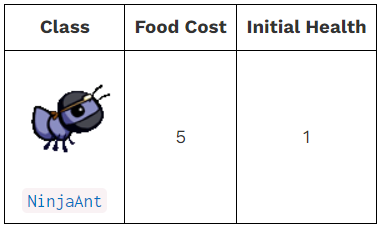

使用如下命令进行解锁测试：

```python
python3 ok -q optional1 -u --local
```

过程如下：

```python
=====================================================================
Assignment: Project 3: Ants Vs. SomeBees
OK, version v1.18.1
=====================================================================

~~~~~~~~~~~~~~~~~~~~~~~~~~~~~~~~~~~~~~~~~~~~~~~~~~~~~~~~~~~~~~~~~~~~~
Unlocking tests

At each "? ", type what you would expect the output to be.
Type exit() to quit

---------------------------------------------------------------------
Problem Optional 1 > Suite 1 > Case 1
(cases remaining: 15)

Q: Which Ant types have a blocks_path attribute?
Choose the number of the correct choice:
0) All Ant types except for NinjaAnt have a blocks_path attribute
1) Only the NinjaAnt has a blocks_path attribute
2) All Ant types have a blocks_path attribute that is inherited from
   the Ant superclass
3) None of the Ant subclasses have a blocks_path attribute
? 1
-- Not quite. Try again! --

Choose the number of the correct choice:
0) All Ant types except for NinjaAnt have a blocks_path attribute
1) Only the NinjaAnt has a blocks_path attribute
2) All Ant types have a blocks_path attribute that is inherited from
   the Ant superclass
3) None of the Ant subclasses have a blocks_path attribute
? 2
-- OK! --

---------------------------------------------------------------------
Problem Optional 1 > Suite 1 > Case 2
(cases remaining: 14)

Q: What is the value of blocks_path for each Ant subclass?
Choose the number of the correct choice:
0) blocks_path is False for all Ants
1) blocks_path is False for every Ant subclass except NinjaAnt
2) blocks_path is True for all Ants
3) blocks_path is True for every Ant subclass except NinjaAnt
? 3
-- OK! --

---------------------------------------------------------------------
Problem Optional 1 > Suite 1 > Case 3
(cases remaining: 13)

Q: When is the path of a Bee blocked?
Choose the number of the correct choice:
0) When there is not an NinjaAnt in the Bee's place
1) When there are no Ants in the Bee's place
2) When there is an Ant in the Bee's place
3) When there is an Ant whose blocks_path attribute is True in the
   Bee's place
? 3
-- OK! --

---------------------------------------------------------------------
Problem Optional 1 > Suite 1 > Case 4
(cases remaining: 12)

Q: What does a NinjaAnt do to each Bee that flies in its place?
Choose the number of the correct choice:
0) Nothing, the NinjaAnt doesn't damage Bees
1) Reduces the Bee's health by the NinjaAnt's damage attribute
2) Blocks the Bee's path
3) Reduces the Bee's health to 0
? 1
-- OK! --

---------------------------------------------------------------------
Problem Optional 1 > Suite 2 > Case 1
(cases remaining: 11)

>>> from ants import *
>>> beehive, layout = Hive(AssaultPlan()), dry_layout
>>> dimensions = (1, 9)
>>> gamestate = GameState(None, beehive, ant_types(), layout, dimensions)
>>> #
>>> # Testing NinjaAnt parameters
>>> ninja = NinjaAnt()
>>> ninja.health
? 1
-- OK! --

>>> NinjaAnt.food_cost
? 5
-- OK! --

---------------------------------------------------------------------
Problem Optional 1 > Suite 2 > Case 2
(cases remaining: 10)

>>> from ants import *
>>> beehive, layout = Hive(AssaultPlan()), dry_layout
>>> dimensions = (1, 9)
>>> gamestate = GameState(None, beehive, ant_types(), layout, dimensions)
>>> #
>>> # Testing blocks_path
>>> NinjaAnt.blocks_path
? False
-- OK! --

>>> HungryAnt.blocks_path
? True
-- OK! --

>>> FireAnt.blocks_path
? True
-- OK! --

---------------------------------------------------------------------
Problem Optional 1 > Suite 2 > Case 3
(cases remaining: 9)

>>> from ants import *
>>> beehive, layout = Hive(AssaultPlan()), dry_layout
>>> dimensions = (1, 9)
>>> gamestate = GameState(None, beehive, ant_types(), layout, dimensions)
>>> #
>>> # Testing NinjaAnts do not block bees
>>> p0 = gamestate.places["tunnel_0_0"]
>>> p1 = gamestate.places["tunnel_0_1"]  # p0 is p1's exit
>>> bee = Bee(2)
>>> ninja = NinjaAnt()
>>> thrower = ThrowerAnt()
>>> p0.add_insect(thrower)            # Add ThrowerAnt to p0
>>> p1.add_insect(bee)
>>> p1.add_insect(ninja)              # Add the Bee and NinjaAnt to p1
>>> bee.action(gamestate)
>>> bee.place is ninja.place          # Did NinjaAnt block the Bee from moving?
? False
-- OK! --

>>> bee.place is p0
? True
-- OK! --

>>> ninja.health
? 1
-- OK! --

>>> bee.action(gamestate)
>>> bee.place is p0                   # Did ThrowerAnt block the Bee from moving?
? True
-- OK! --

---------------------------------------------------------------------
Problem Optional 1 > Suite 2 > Case 4
(cases remaining: 8)

>>> from ants import *
>>> beehive, layout = Hive(AssaultPlan()), dry_layout
>>> dimensions = (1, 9)
>>> gamestate = GameState(None, beehive, ant_types(), layout, dimensions)
>>> #
>>> # Testing non-blocking ants do not block bees
>>> p0 = gamestate.places["tunnel_0_0"]
>>> p1 = gamestate.places["tunnel_0_1"]  # p0 is p1's exit
>>> bee = Bee(2)
>>> ninja_fire = FireAnt(1)
>>> ninja_fire.blocks_path = False
>>> thrower = ThrowerAnt()
>>> p0.add_insect(thrower)            # Add ThrowerAnt to p0
>>> p1.add_insect(bee)
>>> p1.add_insect(ninja_fire)              # Add the Bee and NinjaAnt to p1
>>> bee.action(gamestate)
>>> bee.place is ninja_fire.place          # Did the "ninjaish" FireAnt block the Bee from moving?
? False
-- OK! --

>>> bee.place is p0
? True
-- OK! --

>>> ninja_fire.health
? 1
-- OK! --

>>> bee.action(gamestate)
>>> bee.place is p0                   # Did ThrowerAnt block the Bee from moving?
? True
-- OK! --

---------------------------------------------------------------------

>>> from ants import *
>>> NinjaAnt.implemented
? True
-- OK! --

---------------------------------------------------------------------
OK! All cases for Problem Optional 1 unlocked.

Cannot backup when running ok with --local.
```

实现代码如下：

```python
class NinjaAnt(Ant):
    """NinjaAnt does not block the path and damages all bees in its place.
    This class is optional.
    """

    name = 'Ninja'
    damage = 1
    food_cost = 5
    blocks_path = False
    # OVERRIDE CLASS ATTRIBUTES HERE
    # BEGIN Problem Optional 1
    implemented = True   # Change to True to view in the GUI
    # END Problem Optional 1

    def action(self, gamestate):
        # BEGIN Problem Optional 1
        "*** YOUR CODE HERE ***"
        place = self.place

        for bee in list(place.bees):
            bee.reduce_health(self.damage)
        # END Problem Optional 1
```

```python
class Bee(Insect):
    def blocked(self):
        """Return True if this Bee cannot advance to the next Place."""
        # Special handling for NinjaAnt
        # BEGIN Problem Optional 1
        return self.place.ant is not None and\
            self.place.ant.blocks_path
        # END Problem Optional 1
```

```python
class Ant(Insect):
    # ADD CLASS ATTRIBUTES HERE
    blocks_path = True
```

使用如下命令可以进行测试：

```shell
python3 ok -q optional1 --local
```

结果如下：

```shell
=====================================================================
Assignment: Project 3: Ants Vs. SomeBees
OK, version v1.18.1
=====================================================================

~~~~~~~~~~~~~~~~~~~~~~~~~~~~~~~~~~~~~~~~~~~~~~~~~~~~~~~~~~~~~~~~~~~~~
Running tests

---------------------------------------------------------------------
Test summary
    15 test cases passed! No cases failed.

Cannot backup when running ok with --local.
```

### Optional Problem 2

实现`ThrowerAnt`类的两个子类`SlowThrower`和`ScaryThrower`类。

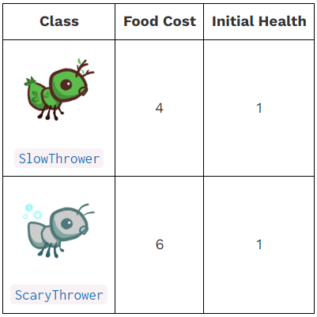

使用如下命令进行解锁测试：

```python
python3 ok -q optional2 -u --local
```

过程如下：

```python
=====================================================================
Assignment: Project 3: Ants Vs. SomeBees
OK, version v1.18.1
=====================================================================

~~~~~~~~~~~~~~~~~~~~~~~~~~~~~~~~~~~~~~~~~~~~~~~~~~~~~~~~~~~~~~~~~~~~~
Unlocking tests

At each "? ", type what you would expect the output to be.
Type exit() to quit

---------------------------------------------------------------------
Problem Optional 2 > Suite 1 > Case 1
(cases remaining: 10)

>>> from ants import *
>>> beehive, layout = Hive(AssaultPlan()), dry_layout
>>> dimensions = (1, 9)
>>> gamestate = GameState(None, beehive, ant_types(), layout, dimensions)
>>> # Testing status parameters
>>> slow = SlowThrower()
>>> scary = ScaryThrower()
>>> SlowThrower.food_cost
? 4
-- OK! --

>>> ScaryThrower.food_cost
? 6
-- OK! --

>>> slow.health
? 1
-- OK! --

>>> scary.health
? 1
-- OK! --

---------------------------------------------------------------------
Problem Optional 2 > Suite 1 > Case 2
(cases remaining: 9)

>>> from ants import *
>>> beehive, layout = Hive(AssaultPlan()), dry_layout
>>> dimensions = (1, 9)
>>> gamestate = GameState(None, beehive, ant_types(), layout, dimensions)
>>> # Testing Slow
>>> slow = SlowThrower()
>>> bee = Bee(3)
>>> gamestate.places["tunnel_0_0"].add_insect(slow)
>>> gamestate.places["tunnel_0_4"].add_insect(bee)
>>> slow.action(gamestate)
>>> gamestate.time = 1
>>> bee.action(gamestate)
>>> bee.place.name # SlowThrower should cause slowness on odd turns
? tunnel_0_4
-- Not quite. Try again! --

? "tunnel_0_4"
-- OK! --

>>> gamestate.time += 1
>>> bee.action(gamestate)
>>> bee.place.name # SlowThrower should cause slowness on odd turns
? "tunnel_0_3"
-- OK! --

>>> for _ in range(3):
...    gamestate.time += 1
...    bee.action(gamestate)
>>> bee.place.name
? "tunnel_0_1"
-- OK! --

---------------------------------------------------------------------
Problem Optional 2 > Suite 1 > Case 3
(cases remaining: 8)

>>> from ants import *
>>> beehive, layout = Hive(AssaultPlan()), dry_layout
>>> dimensions = (1, 9)
>>> gamestate = GameState(None, beehive, ant_types(), layout, dimensions)
>>> # Testing Scare
>>> scary = ScaryThrower()
>>> bee = Bee(3)
>>> gamestate.places["tunnel_0_0"].add_insect(scary)
>>> gamestate.places["tunnel_0_4"].add_insect(bee)
>>> scary.action(gamestate)
>>> bee.action(gamestate)
>>> bee.place.name # ScaryThrower should scare for two turns
? "tunnel_0_5"
-- OK! --

>>> bee.action(gamestate)
>>> bee.place.name # ScaryThrower should scare for two turns
? "tunnel_0_6"
-- OK! --

>>> bee.action(gamestate)
>>> bee.place.name
? "tunnel_0_5"
-- OK! --

---------------------------------------------------------------------
Problem Optional 2 > Suite 1 > Case 4
(cases remaining: 7)

>>> from ants import *
>>> beehive, layout = Hive(AssaultPlan()), dry_layout
>>> dimensions = (1, 9)
>>> gamestate = GameState(None, beehive, ant_types(), layout, dimensions)
>>> # Scary stings an ant
>>> scary = ScaryThrower()
>>> harvester = HarvesterAnt()
>>> bee = Bee(3)
>>> gamestate.places["tunnel_0_0"].add_insect(scary)
>>> gamestate.places["tunnel_0_4"].add_insect(bee)
>>> gamestate.places["tunnel_0_5"].add_insect(harvester)
>>> scary.action(gamestate)
>>> bee.action(gamestate)
>>> bee.place.name # ScaryThrower should scare for two turns
? "tunnel_0_5"
-- OK! --

>>> harvester.health
? 1
-- OK! --

>>> bee.action(gamestate)
>>> harvester.health
? 1
-- Not quite. Try again! --

? 0
-- OK! --

---------------------------------------------------------------------
Problem Optional 2 > Suite 1 > Case 10
(cases remaining: 1)

>>> from ants import *
>>> beehive, layout = Hive(AssaultPlan()), dry_layout
>>> dimensions = (1, 9)
>>> gamestate = GameState(None, beehive, ant_types(), layout, dimensions)
>>> ScaryThrower.implemented
? True
-- OK! --

>>> SlowThrower.implemented
? True
-- OK! --

---------------------------------------------------------------------
OK! All cases for Problem Optional 2 unlocked.

Cannot backup when running ok with --local.
```

实现代码如下：

```python

```

### Optional Problem 3

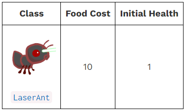

使用如下命令进行解锁测试：

```python
python3 ok -q optional3 -u --local
```

过程如下：

```python
```

实现代码如下：

```python

```
